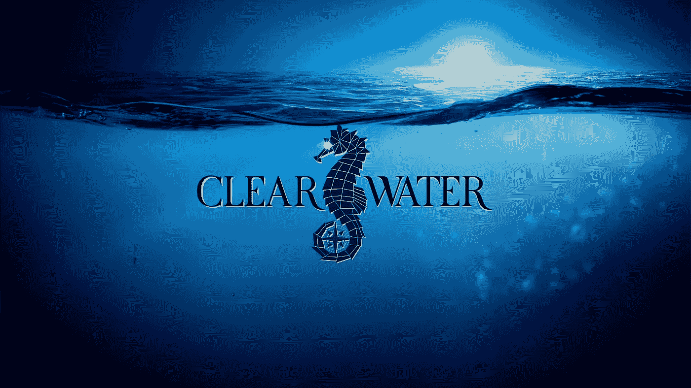
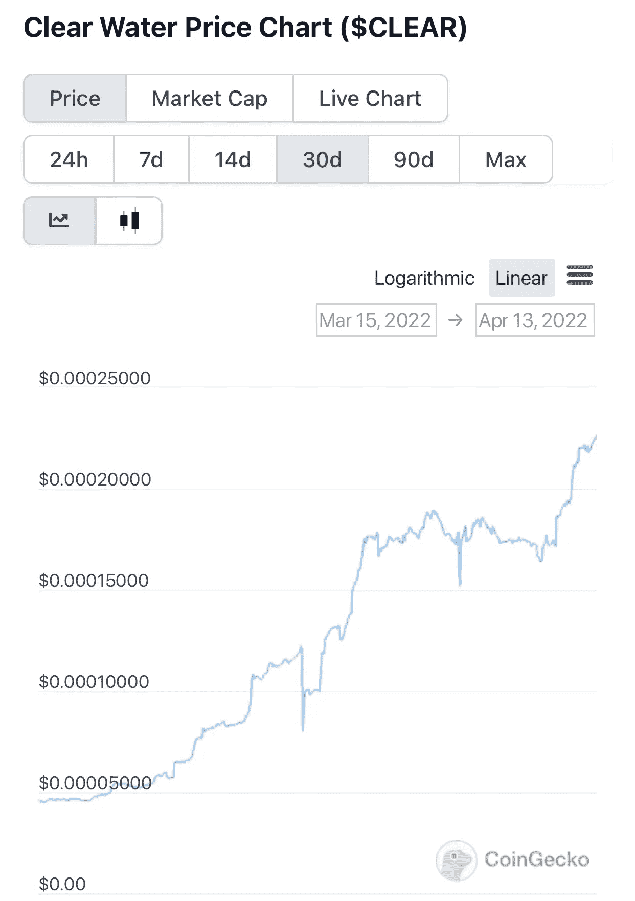
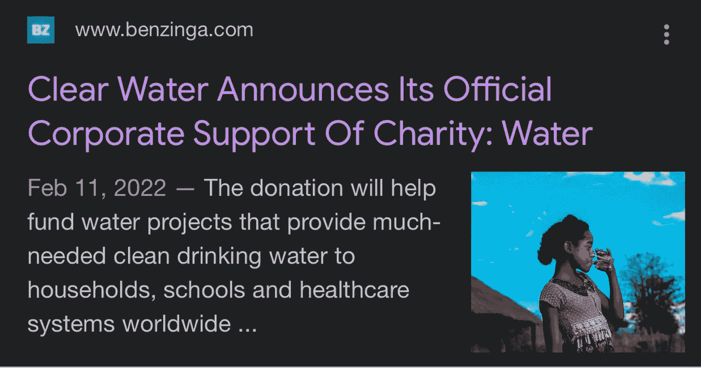

# 加密货币:垂死与繁荣

> 原文：<https://medium.com/coinmonks/cryptocurrency-the-dying-vs-the-thriving-b6064d6970b5?source=collection_archive---------16----------------------->

在本文发表时，市场上有超过 12，000 种加密货币。有些人对投资哪个领域感到困惑。我明白了。另外，这是我第一次在媒体上发表文章。不要停止阅读。这就更好了…

想象一下，你去最近的杂货店，会发现有 12，000 种不同品牌的面包摆在一条没有尽头的过道上。你把一个最便宜的面包扔进你的手推车，然后继续前进。那天晚上晚些时候，你真的想吃一个 Nutella 三明治(一个很棒，两个更好)。也就是说，直到你看到那个看起来很有趣的绿色东西在你的面包片上搭了一个帐篷。这不是食用色素，也不是……你两岁的儿子杰克，在你看《办公室》的时候没有拿你的面包做蜡笔快乐。

霉菌。这是一件事。

它变质了。它入侵了。*扔出去*。你以后会感谢我的。

说到加密货币，你必须自己做研究。当你急着去托儿所接杰克时，不要去买密码。慢慢逛吧。杰克可以走回家。

开玩笑的。

不要只是拿起你看到的第一个密码或某个完全陌生的人推荐的密码(他们可能是顶级公司的卧底推销员)。

让我们回到面包上。很奇怪，我知道。但是听我说完。我有一个观点。

12000 种不同品牌的面包。大部分都是有狗脸的装饰包装。杰克喜欢它们。但最终，人们意识到大多数面包几乎总是不新鲜的，偶尔人们会带回家一条那种时髦的绿色面包。关于面包的消息传开了。人们不再买那种面包了。那面包是坏的。那面包抢了人们的钱。那种面包给了人们许多不眠之夜。它也让人在浴室里呆上几个小时。

那个有趣、可爱的包装是个谎言。最终，那种面包被一种新的品牌所取代，因为没有人再买另一种品牌了。包装看起来太相似了，面包看起来和尝起来没有什么不同。它只是有一个不同的名字。循环再次重复。亚达亚达。

聪明的人会买有着让顾客开心历史的过期面包。聪明人投资长期加密货币，这些货币具有显著的现实效用*，没有可预见的到期日*，合法的创始人露面，以及超越标准(500 个持有人/网站上线/Coingecko 上市)简单性的完成历史路线图。聪明人自己做研究。*聪明人不会拿面包霉碰运气。除非你喜欢那种东西。*

继续前进。

现在，有几个迷因硬币/代币在加密领域做得非常好。这些都是离群值。但并不是每个迷因令牌都能达到那样的高度。当项目创始人发现他们没有同等水平的宣传或社区支持时，项目就完蛋了。这种情况每天都会发生在项目中。随着这些项目的死亡，投资者的大部分血汗钱也随之而去。有很多投资者持有并等待收益，这样他们就可以购买 PS3。然后是 PS4。现在，PS5。但是他们在诈骗项目上的投资和亏本出售时剩余的投资甚至不能再为他们的 PS2 遥控器购买替换充电器。很悲哀。老实说，这是不可接受的。我们作为加密货币社区的整体必须做得更好。

迷因时代正在消失。百万富翁不再是“一夜之间”产生的。相反，人们早上醒来发现他们投资的项目的流动性在他们睡觉的时候被抽干了。这不是一个恶梦。这就是现实生活。

只有强大的加密货币才能生存下来，我所说的强大是指那些具有实际效用的项目，让它们在人群中脱颖而出。相信我……在假期前的最后一个工作日，加密空间比纽约高峰时段的火车还要拥挤。当火车呼啸而过时，你甚至可以看到人们紧紧抓住火车的外侧。我可能夸张，也可能不夸张。

顶级加密货币有繁荣的习惯。他们为世人所知。他们的市值可以买下一整批路虎，有些人可能可以买下世界上每一家路虎经销商好几倍。那里有钱可赚。

但新的小型加密货币可以赚更多的钱，它们具有独特的效用、强大的创始团队、紧密团结的社区，以及在路线图上检查合法目标的习惯。

# **清水企业**

以 [*清水*](https://www.clearwaterclw.com/) 为例。

[Website](http://www.clearwaterclw.com)

*清水*2 月 7 日上线。在一些早期投资者抛售并离开之前，它在推出后就达到了 200 万美元的市值。价格稳定下来了。社区依然强大。创始人实现了路线图目标，并积极参与 Telegram 社区。现在，两个月后，*清水*自推出以来上涨了 1000%。如果你看看 3 月初以来的图表，你会看到一些只有在市值高得多的成熟加密货币中才会看到的东西:

更高的价格稳定性。

蘸酱几乎立刻就被填满了。绝大多数投资者都没有卖出。事实上，他们定期增加投资。每天都有新的投资者加入。如果你偶然发现*清水的* [电报频道](http://t.me/clearwaterclw)，你会看到投资者的一些常用语:

*“开发者交付”*

原因如下…

清水是一种创新的三部门加密货币，由现实世界的问题驱动。一部分是加密，一部分是商业，一部分是慈善。

## **业务**

该公司正在开发铝制瓶装饮料生产线，其第一条生产线预计将于今年第三季度上市，比计划提前了几个月。你会问，为什么是铝瓶？因为污染是一种东西。许多地方的政府已经禁止使用塑料。预计这一趋势在近期和长期内会迅速升级。清水公司将在竞争中脱颖而出，原因有几个:

据说产品设计(尚未发布)独特而诱人，足以让人想从箱子里拿出 *Clear Water 的*产品，而不是展示在旁边的另一个品牌的产品。扭转瓶可重复灌装数次。难道你不想带着一瓶不是基本的，看起来不像是为了快速销售而大量生产的酒吗？对于那些走在公园里，没有可爱的狗来帮助你开始和那个“金发辣妹”交谈的男士们，试着随身携带一瓶清水。我等不及要听你明年的蜜月了。

Clear Water 的创始人正在削减他们的利润点，以使产品比竞争对手更实惠。来吧伙计们。谁会这么做？

在 12，000 多种加密货币中，哪种加密货币具有像清水公司的商业用途？污染和气候变化是目前世界上最热门的话题，相信我，它们只会越来越热。清水行业正在进入的市场是巨大的。作为一个整体，清水的潜力同样巨大。而对于那些进入股市或进入加密货币有奖励的人， [*清水*](https://www.clearwaterclw.com/) 将以公司利润的 5%作为“分红”奖励加密货币持有人。这还不是清水公司向其持有人提供的全部回报(继续阅读)。

需要说明的是，从技术上来说，清水并不是一条面包，但它很可能会把面包带到你的餐桌上(就像杂货店过道里的 DYOR)。

## **慈善**

[*清水公司的*](https://www.clearwaterclw.com/) 慈善部门专注于海洋清洁工作，并以地下水井、水泵系统、水管系统和家用过滤器等形式向国际上有需要的社区提供清洁饮用水。*清水*在发布仅 4 天后就向非营利组织慈善:水捐赠了 1 万美元([在此阅读文章](https://www.benzinga.com/markets/cryptocurrency/22/02/25580816/clear-water-announces-its-official-corporate-support-of-charity-water))。这 1 万美元捐给了乌干达一个有 225 人的社区，用于地下水井修复项目。 [*Clear Water*](https://www.clearwaterclw.com/) 此后又进行了一次捐赠，将为大约 60 多个人长期提供清洁饮用水。

[Read full article…](https://www.benzinga.com/markets/cryptocurrency/22/02/25580816/clear-water-announces-its-official-corporate-support-of-charity-water)

*“开发者交付”*

## **加密货币**

加密货币本身总共有 10 亿枚代币。其中 50%在发射前就被烧掉了。在本文发表时，清水公司可投资的代币不到 6 亿。随着这个数字的减少，每个代币的价格会增加。我们现在都知道这是怎么回事了。

开发人员钱包处于授权时间表中，这些令牌将用于项目的利益(即赌注奖励)。LP 被锁定(享受你整夜的睡眠)。很快就能下注代币了。[清水](https://www.clearwaterclw.com/)的加密货币部门也将于今年进入 Q2 NFT 市场。可能会有路线图中没有提到的惊喜。

买卖有 10%的交易费。4%归 LP，2%归慈善/营销，2%归 BNB 奖励计划的持有者，2%归开发者。这篇文章发表时的市值是 110 万英镑。

迷因代币不再能让百万富翁“一夜暴富”。少数人赢了。大多数人都输了。你可能最好买已经刮开并被指定为“失败者”的彩票。

但是像 [*清水*](https://www.clearwaterclw.com/) 这样的合法商业用途加密货币有可能以更加稳定和健康的方式让你赚到改变生活的钱，同时让你能够参与急需的现实世界的变化。

清水公司的口号是“今天就投资”。拯救明天。”

伴随这一口号的是创始人自己的实际时间投资，他们每天都与投资者积极接触。他们不是在电话另一端的没有面孔的机器人。他们有心脏。他们有灵魂。这里…我会证明给你看。

正如一位创始人在一次现场采访中所说…

> “…你大概可以在 5-10 秒内转过身，手里拿着干净的水。很多人都没有。数百万人没有这种能力。他们每天都在受苦。他们的孩子生病了。他们的孩子正在死去…因为他们没有水。我猜今天之前你们很多人都不知道。我猜你们很多人不知道有这么多人…这么多人在受苦。我们可以有所作为。你和我，我们可以有所作为。我们可以让他们的生活变得更好。我们可以拯救他们的生命。
> 
> 你能对自己说，你觉得生活 100%充实吗？你能说你从未想过…外面还有更多吗？这个星球，这个宇宙，在这个宇宙之外…当我们还在这个星球上，当我们还有一口气在我们肺里的时候，我们应该做一些别的事情。
> 
> 不仅仅是要工作。不仅仅是晚上去酒吧喝几杯。不仅仅是回家坐在沙发上看电视。
> 
> …外面还有别的东西吗？一定有，对吧？我们只有这一次生命。一定有更多的东西。我告诉你确实有。拯救生命。清理这个星球。尽我们所能成为最好的人。
> 
> 我们的孩子将在什么样的世界中成长？我们的孙子？现在是我们做出改变的时候了，这样他们就不会留下一个烂摊子。我们必须从某个地方开始，我们在 2 月 7 日就开始了。我们是来改变世界的。我请求你和我们一起去。"

它们不是靠电力运行的。

清水不是你在杂货店买的那种五颜六色的面包。清水是你直接从面包师那里买来的新鲜出炉的面包，放在你家的餐桌上。

[www.clearwaterclw.com](http://www.clearwaterclw.com)

t.me/clearwaterclw

【twitter.com/clearwaterclw 

## **在投资加密货币之前，一定要做好自己的研究。**

[硬币和密码](https://medium.com/u/fffbcf90a5c9?source=post_page-----b6064d6970b5--------------------------------)

[维塔利克·布特林](https://medium.com/u/587a00dbce51?source=post_page-----b6064d6970b5--------------------------------)

特伦特·拉平斯基

[琳达·谢](https://medium.com/u/514b75d4b762?source=post_page-----b6064d6970b5--------------------------------)

> 加入 Coinmonks [电报频道](https://t.me/coincodecap)和 [Youtube 频道](https://www.youtube.com/c/coinmonks/videos)了解加密交易和投资

# 另外，阅读

*   [在美国如何使用 BitMEX？](https://coincodecap.com/use-bitmex-in-usa) | [BitMEX 评论](https://coincodecap.com/bitmex-review)
*   [最佳期货交易信号](https://coincodecap.com/futures-trading-signals) | [流动性交易所评论](https://coincodecap.com/liquid-exchange-review)
*   [南非的加密交易所](https://coincodecap.com/crypto-exchanges-in-south-africa) | [BitMEX 加密信号](https://coincodecap.com/bitmex-crypto-signals)
*   [MoonXBT 副本交易](https://coincodecap.com/moonxbt-copy-trading) | [阿联酋的加密钱包](https://coincodecap.com/crypto-wallets-in-uae)
*   [雷米塔诺评论](https://coincodecap.com/remitano-review)|[1 英寸协议指南](https://coincodecap.com/1inch) | [购买 Floki](https://coincodecap.com/buy-floki-inu-token)