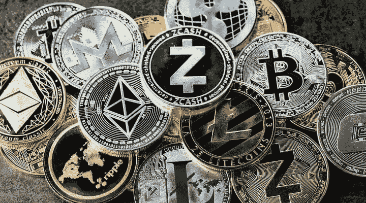

# 加密货币，新油井？赶上飞机！

> 原文：<https://medium.com/coinmonks/cryptocurrency-the-new-oil-well-catch-the-flight-822ea3c820b9?source=collection_archive---------71----------------------->

人类历史上第一次，任何一个有电话和互联网连接的人都有了“钥匙”，可以加入像埃隆·马斯克、比尔·盖茨和马克·库班这样的亿万富翁，在福布斯杂志所谓的“有史以来最大的财富转移”中成倍增加金钱。

**下面的信是关于你如何在 2021 年安全地使用比特币和其他更小的加密硬币来增加你的钱…即使你不知道“硬币”是什么意思**

**此外，还能获得一份神圣的 10 枚加密硬币名单，这份名单可能会产生 50-100 倍的回报。**

你身边有一群知识渊博的朋友，他们在加密市场方面有丰富的知识，可以帮你度过难关，这可能是一种福气，但在这一点上，从我将要向你展示的内容中接触到加密市场的专业经验是神圣的。这种专业知识向您展示了从初级水平到更高产量的详细过程。

一场史诗般的财富运动和转移正在世界上发生，这是有史以来第一次，任何人都可以参与进来…

***“…不管你的肤色，你说的语言，你的国籍，甚至你现在有多少钱…”***

你可能会认为投资比特币为时已晚，但这更多的是寻找和研究有目的的硬币，这些硬币将进入市场，给你带来巨大的投资回报(意味着投资回报)。

这教你如何研究它们，寻找什么迹象，并尽早发现它们，这可以让你非常富有。

正如你可能已经知道的，还有其他的硬币，事实上有数百种，是为不同的目标市场和不同的商业领域而创造的。

现在，游戏玩家、能源市场、金融市场、法律/合同/合规部门、人工智能(AI)等领域几乎都有加密货币。

而这些硬币，在很多情况下都产生了超过 10 万的投资回报率！

**硬币喜欢:**

*   币安硬币(BNB)公司获得了 430，779.75%的投资回报率
*   以太坊(ETH)的回报率为 279，843%
*   Ripple (XRP)获得了 36，000%的投资回报率
*   Litecoin (LTC)的投资回报率为 5，100%

更多的硬币获得了惊人的回报。

**但关键在于…尽早发现并购买它们…**

加密货币正在编织到这个世界的结构中，因为这可以被视为比特币和其他加密资产已经被美国政府合法化，进入市场的竞争非常快。像 Paypal 和 Visa 这样的公司已经在他们提供的服务中加入了通过比特币进行支付和接收支付的功能。

换句话说，比特币和加密货币将继续存在。

我是说……每个人和他们的朋友都加入进来拿他们的那份，

你为什么不也是？

但正如我之前提到的，大多数人不知道它是如何工作的，也不知道你可以购买比特币或任何你想要的加密货币的一部分。

**真相:**

他们不知道去哪里买或者保管，也不知道什么时候买，什么时候卖。

更糟糕的是，大多数新人们在错误的时间向比特币投入了太多的资金，或者选择了错误的硬币，然后产生了巨大的损失，并哭着说除了他们以外，其他人都变得富有了。

你能做的最糟糕的事情就是把钱投资在比特币和加密资产上，同时试图自己解决所有问题。

比特币和加密资产可能不稳定，你永远不应该投入超出你承受能力的资金。

但更重要的是，你要知道安全和负责任地投资多少到 crypto，何时这样做，何时出售，因为这是任何想投资 crypto 的人想要创造财富所需要的关键信息。

为了帮助做到这一点，我向你们展示了 ***加密货币财富建设者蓝图***

《加密货币财富构建者蓝图》是一套循序渐进的教学视频，它分解了你需要知道的关于比特币和其他加密货币的一切——它是什么，如何购买，何时购买，如何保护它，以及何时出售它——一切。这是一本必读的书，你应该现在就去看看！！。[https://cutt.ly/HSS7Gvw](https://cutt.ly/HSS7Gvw)

我还想告诉你另一种方法来为你自己创造被动收入。这是通过加入 hotforex，这是完全免费的，我花了时间放下每一步，你可以在这里为自己做这个[https://affiliatinghf.carrd.co/](https://affiliatinghf.carrd.co/)

我的主要目标是让人们意识到那些可以塑造和改变我们生活的机会。这些是其中的一些，仔细考虑一下(如果你必须这样做的话)，但是我要说的是，你应该立即采取行动抓住这些机会。祝福。

> 加入 Coinmonks [电报频道](https://t.me/coincodecap)和 [Youtube 频道](https://www.youtube.com/c/coinmonks/videos)了解加密交易和投资

# 另外，阅读

*   [如何在 FTX 交易所交易期货](https://coincodecap.com/ftx-futures-trading) | [OKEx vs 币安](https://coincodecap.com/okex-vs-binance)
*   [CoinLoan 评论](https://coincodecap.com/coinloan-review) | [YouHodler 评论](/coinmonks/youhodler-4-easy-ways-to-make-money-98969b9689f2) | [BlockFi 评论](https://coincodecap.com/blockfi-review)
*   [XT.COM 评论](https://coincodecap.com/profittradingapp-for-binance) | [币安评论](https://coincodecap.com/xt-com-review)
*   [SmithBot 评论](https://coincodecap.com/smithbot-review) | [4 款最佳免费开源交易机器人](https://coincodecap.com/free-open-source-trading-bots)
*   [比特币基地僵尸工具](/coinmonks/coinbase-bots-ac6359e897f3) | [AscendEX 审查](/coinmonks/ascendex-review-53e829cf75fa) | [OKEx 交易僵尸工具](/coinmonks/okex-trading-bots-234920f61e60)