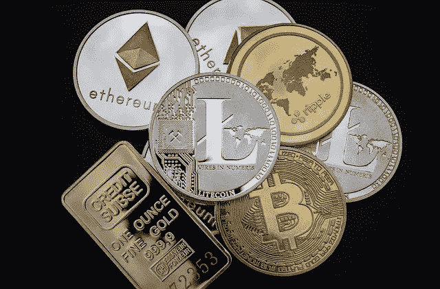

# 加密货币——货币的终极进化

> 原文：<https://medium.com/coinmonks/cryptocurrency-the-ultimate-evolution-of-money-96113c9a623a?source=collection_archive---------28----------------------->

一般来说，货币对人和经济一直很重要，货币表现出与那个时代和经济的技术发展密切相关的形式的历史。

货币是现代最重要的发明，在历史上经历了很多过程，并在表现方式和形式上有所演变。

在我们深入研究货币的历史之前，我们必须首先明确定义货币是什么。

> 金钱这个词可以有很多意思，在我们的日常生活中有不同的含义。然而，简单地说，货币是任何被普遍接受作为支付、清偿债务和其他商业义务的交换媒介的东西。

# **金钱史**

我们所知道的现代货币已经经历了一个漫长的演变过程，以适应当前的社会技术水平，从物物交换体系到商品货币，从金属货币到第一枚硬币的发明和硬币的持续使用，再到纸币到法定货币的采用。

## 易货系统

现代经济学之父亚当·斯密试图证明货币不是由政府创造的，市场(经济)先于国家存在。在文明出现之前，社会中的个人专门从事不同的工艺和劳动形式，因此必须相互依赖才能获得生存所需的物品。

这就产生了易货制度，也称为“易货贸易”制度，在这种制度下，个人通过交换公认有价值的货物来交换货物或支付服务费用。但是这一体系受到了双重需求的阻碍，这意味着为了物物交换的成功进行，双方都必须拥有对方想要的东西。

> *例如，肖恩想准备晚餐，他有一套锅，但没有米饭，同时，他的邻居约翰有一些装米饭的袋子，但需要一个金属锅。约翰和肖恩都可以进行易货贸易，用一些大米换一个金属罐子。*

它最终导致个人积累商品——也称为商品货币——人们认为没有人可以拒绝，如阿拉斯加的动物毛皮，尼日利亚的盐，美国的烟草，东非的牛，泰国的贝壳等。这些物品不仅用于购买商品，还用于支付婚姻、债务、罚款等。

虽然物物交换制度相当有效，但它也存在许多局限性，如难以储存财富、没有共同的价值衡量标准、需要满足需求、某些商品的不可分割性等。

## 金属货币

一旦社会中的贸易量增加，货币的一些有用的特征就逐渐变得更加明显，而这些特征是易货制度所不能完全消除的。例如，盐携带起来很重，会液化，所以不便于携带，甚至不耐用。鲸鱼的牙齿很难一分为二，所以不容易被分割。贝壳在任何海滩都可以捡，所以不稀缺。这导致了金属货币的发明。

金属货币是由金、银、铜等贵金属铸造而成的。第一套圆盘形金属硬币是在公元 7 世纪左右在吕底亚王国发明的，硬币的两面都有印记，后来被全世界采用。

> 铸币厂:创造货币的设施。

金属硬币解决了易货体系的大部分问题，但金属硬币的成功很快带来了诱惑，因为主权国家很快意识到，通过减少硬币或在混合中加入更便宜的贱金属，他们可以通过流通价值低于面值的贬值货币来赚更多的钱。

## 钞票

然而，金属硬币也有其他限制，它们非常重，难以携带和移动，运输它们进行大额购买很困难，它们很容易被盗，并且有许多伪造品。

由于这些缺点，银行在 16 世纪和 17 世纪的英格兰发展起来，那里的商人保存黄金和白银，并得到一份签字的声明，表明存了多少钱。

当商人需要买东西时，这些银行对账单可以签字转让给另一个人。这导致了纸币的发展，如银行对账单作为交换媒介。

第一张欧洲纸币由斯托克霍姆银行发行，取代了铜板作为交换媒介。受伦敦金匠大获成功的鼓舞，银行开始发行名为“*纸币*的纸币，这种纸币像今天政府发行的货币一样快速流通。

使用私人商业银行发行的纸币作为法定货币，逐渐被各国政府授权和控制发行的纸币所取代，这些纸币就是今天的法定货币。

在美国历史的早期，该国的货币是由黄金支持的(在某些情况下，是由白银支持的)。然而，以联邦黄金支撑美元的金本位制在 1971 年彻底终结，当时美国停止向外国政府发行黄金以换取美元。

# 加密货币时代

随着世界进入数字货币时代，纸币的发明和采用带来了更多的创新。世界已经变得数字化，这导致使用虚拟卡进行数字化交易，但仍然通过中央机构进行，这证明需要更多时间来完成交易，以及世界不同地区的交易便利性问题。

所有这一切都随着 2008 年比特币的引入而改变，当时假名中本聪发布了开创性的纸质比特币:点对点电子现金系统。

比特币的发明使得在几分钟内从世界任何地方进行交易变得更加容易，而不需要中央政府或第三方。

比特币提供了一种无信任、无许可和分散的交易方式，无需银行收费和国际交易的低费用交易费用，即可实现移动和安全的交易。

随着时间的推移，随着越来越多的个人采用比特币和区块链技术的创新，密码货币市场已经增长到超过 12 亿美元。

比特币的引入彻底改变了世界各地的交易方式，使世界真正成为一个地球村。多亏了区块链技术，人们现在可以毫不费力地从世界任何地方支付商品和服务的费用。