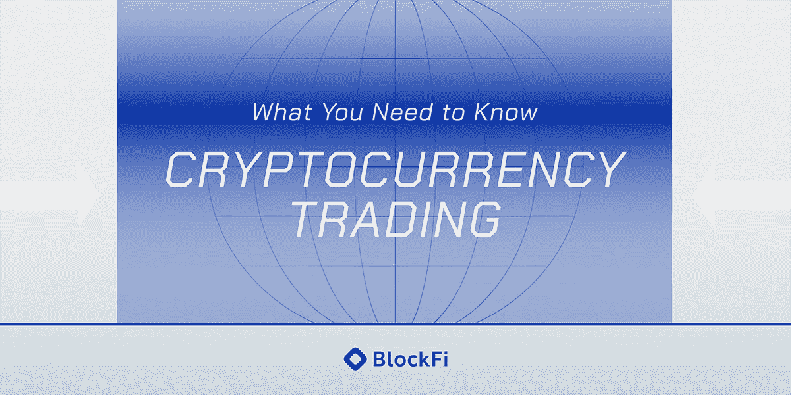

# 加密货币交易

> 原文：<https://medium.com/coinmonks/cryptocurrency-trading-cac8742a792a?source=collection_archive---------69----------------------->

你听说过加密货币交易吗？让我们稍微探讨一下这个话题。

## 什么是加密货币交易？

加密货币交易是金融数字资产的买卖。

# 加密货币交易中的基本术语

1.市场——买方和卖方交易某种资产的虚拟空间。比如说；比特币市场、以太坊市场等。

2.市场对-在市场中买卖的数字资产称为市场对。比如说；

BTC/USDT——比特币可以用美元买卖。这里的市场是比特币市场。

USDT/BTC——可以用比特币购买美元。这里的市场是 USDT。

BTC/USDT 是一对市场搭档。

3.图表-资产价格变动的历史图形表示。

4.烛台-它是一根蜡烛，代表一段时间内资产的价格运动。

5.价格-你希望购买一项资产的点。

6.金额-您希望购买或出售多少资产。比如说；1 BTC

7.百分比-你希望购买的资产的数量。比如说；5%的资金购买 BTC

# 加密交易风格

1.当日交易——在同一天内买卖一项资产。

2.刷单——快速交易资产以获取短期利润。

3.摇摆交易——交易者持有的头寸是中短期的。可能几天到几个月。

4.区间交易

5.日内交易

6.头寸交易

7.套利。

# 加密货币交易的风险

“最大的风险是不冒任何风险。在一个瞬息万变的世界里，唯一肯定会失败的策略就是不冒险”——马克·扎克伯格

1.密码市场的高波动性

2.黑客和网络盗窃

3.一些加密资产的低流动性

4.私钥的错误处理或破坏

5.缺乏法规

6.点对点交易风险

7.税法

8.货币兑换风险

9.不受监管的交易所(欺诈性交易所)

# 一些风险管理技巧

1.分散你的投资组合。不要把你所有的资金都投资在一项资产上。加密市场是不稳定的，这样做可以减少你交易时的损失。

2.不要忽视止损和止盈订单。

3.广泛研究你想交易的加密资产。

4.不要炒作交易。

5.与信誉良好的加密货币交易所进行交易。

6.在进行交易之前，了解你的风险承受能力。风险容忍度是交易时你能忍受损失的金额。个人净资产和可用风险资本可以用来评估这一点。

# 如何开始

1.获得足够的区块链和加密货币知识。DABA 的“交易和赚钱”在线课程是一个很好的工具。

2.对上市加密货币进行基础和技术分析。这有助于确定哪种加密货币最适合交易。

3.通过信誉良好的交易所购买加密货币，如币安、Okex、Bybit、Coin market、Bittrex、Coin base 等。

4.开始交易。

# 结论

交易更多的是心理作用，而不是买卖。”——克里斯·阿尼

关注社交媒体句柄，下次再见！！！

LinkedIn: Naomi Ndukwe

Twitter: 1NaomiNdukwe

脸书:内奥米·恩杜克韦

> 加入 Coinmonks [电报频道](https://t.me/coincodecap)和 [Youtube 频道](https://www.youtube.com/c/coinmonks/videos)了解加密交易和投资