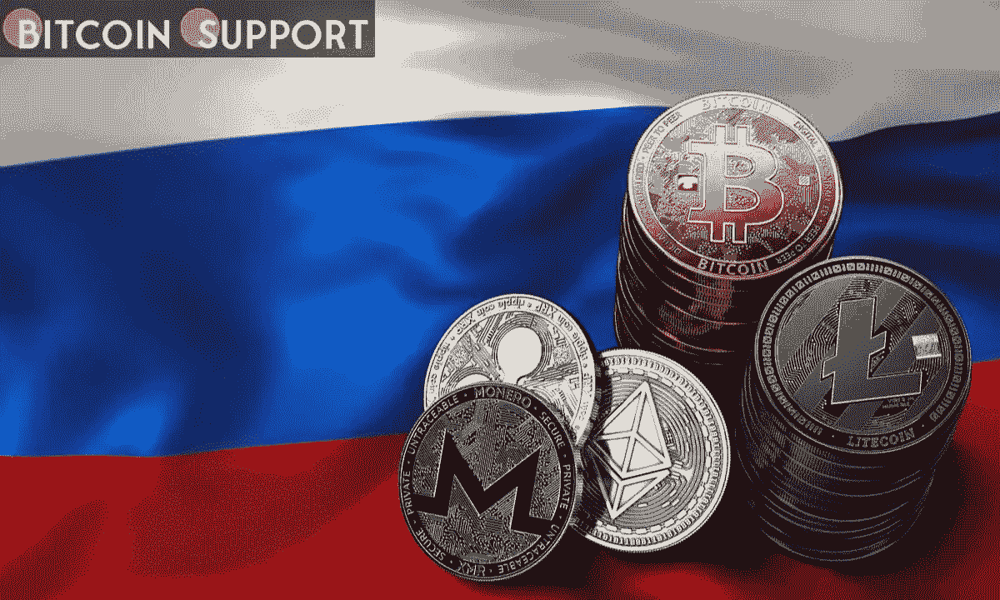

# 随着莫斯科证券交易所开盘，俄罗斯卢布的加密货币交易再次下跌，但摩擦增加

> 原文：<https://medium.com/coinmonks/cryptocurrency-trading-in-the-russian-ruble-falls-once-more-as-the-moscow-stock-exchange-opens-but-87197f983e53?source=collection_archive---------50----------------------->

**Visit our website:-** [**https://bitcoinsupports.com/**](https://bitcoinsupports.com/)

俄罗斯入侵乌克兰后，莫斯科股市在关闭一个月后于周四重新开盘。与此同时，在最大的国际交易所币安，使用俄罗斯卢布(RUB)的加密交易活动继续下降。俄罗斯股市今天自 2 月 25 日以来首次开盘，这是俄罗斯对乌克兰开战的第二天，导致莫斯科交易所的股票价格暴跌。

截至世界协调时周四 10 点 25 分，莫斯科交易所俄罗斯指数当天上涨 4.85%(相对于其 2 月 25 日的收盘价)。

另外值得一提的是，俄罗斯股市计价的俄罗斯卢布在股市休市期间兑美元下跌了 14%。然而，自 3 月 7 日以来，卢布兑美元汇率已上涨 56%。

今天，只有 33 家俄罗斯企业开始交易。名单上的重要公司包括俄罗斯天然气工业股份公司，俄罗斯石油和天然气公司，俄罗斯储蓄银行，以及俄罗斯航空公司。为了减少股票抛售，政府实施了各种不同寻常的禁令和限制，包括禁止卖空和禁止离岸交易。

[https://twitter.com/coinmamba/status/1506898834693238784](https://twitter.com/coinmamba/status/1506898834693238784)

与此同时，有传言称俄罗斯政府可能通过购买股票来干预市场，以防止价格暴跌。此前，俄罗斯总理米哈伊尔·米舒斯金 3 月 1 日宣布，该国国家财富基金将在年底前购买价值 1 万亿卢布的俄罗斯股票。然而，俄罗斯政府和中央银行都没有证实在这上面花了钱。在今天进行实时交易的 33 家公司中，商品生产商的增幅最大，他们通常受益于以高价向国外出口产品。

[https://twitter.com/JakeCordell/status/1506899010757480453](https://twitter.com/JakeCordell/status/1506899010757480453)

**加密货币交易仍在下跌**

虽然俄罗斯投资者的股市关闭了一个月，但加密货币交易仍然开放。自从 3 月 7 日在 24 小时内达到 506 BTC 的战时高点以来，币安 BTC/卢布市场的交易量急剧下降。该市场是促进比特币(BTC)和俄罗斯卢布(USDT)交易的最大国际交易所。本周三，币安 BTC/RUB 的 24 小时成交量为 BTC 47，远低于 BTC 168 的 20 天移动平均线。周三，USDT/RUB 市场出现了类似的情况，USDT 24 小时交易量为 689 万英镑。这一数字是 USDT 1206 万的 20 天移动平均数的近一半，比 3 月 7 日 USDT 3719 万的战时高峰大幅下降。

在币安，BTC 和 USDT 的售价分别为 42747 美元和 0.994 美元，其中 BTC 售价为 42747 美元，USDT 售价为 0.994 美元。在币安，BTC 与 USDT 在同一时间(世界协调时 10:25)的交易价格为 43，000 美元。
**访问我们的网站:-**[**https://bitcoinsupports.com/**](https://bitcoinsupports.com/)

**免责声明:以上为作者观点，不应视为投资建议。读者应该自己做研究。**

> 加入 Coinmonks [电报频道](https://t.me/coincodecap)和 [Youtube 频道](https://www.youtube.com/c/coinmonks/videos)了解加密交易和投资

# 另外，阅读

*   [SmithBot 评论](https://coincodecap.com/smithbot-review) | [4 款最佳免费开源交易机器人](https://coincodecap.com/free-open-source-trading-bots)
*   [杠杆令牌](/coinmonks/leveraged-token-3f5257808b22) | [最佳密码交易所](/coinmonks/crypto-exchange-dd2f9d6f3769) | [Paxful 点评](/coinmonks/paxful-review-4daf2354ab70)
*   [加密套利](/coinmonks/crypto-arbitrage-guide-how-to-make-money-as-a-beginner-62bfe5c868f6)指南| [如何做空比特币](/coinmonks/how-to-short-bitcoin-568a2d0b4ae5)
*   [币安期货交易](https://coincodecap.com/binance-futures-trading)|[3 comas vs Mudrex vs eToro](https://coincodecap.com/mudrex-3commas-etoro)
*   [如何购买 Monero](https://coincodecap.com/buy-monero) | [IDEX 评论](https://coincodecap.com/idex-review) | [BitKan 交易机器人](https://coincodecap.com/bitkan-trading-bot)
*   [尤霍德勒 vs 科恩洛 vs 霍德诺特](/coinmonks/youhodler-vs-coinloan-vs-hodlnaut-b1050acde55a) | [Cryptohopper vs 哈斯博特](https://coincodecap.com/cryptohopper-vs-haasbot)