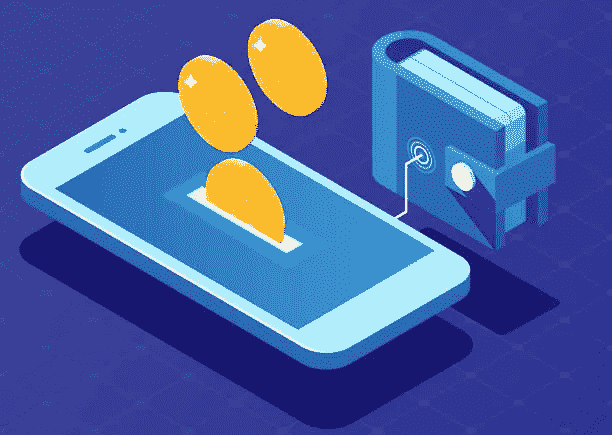
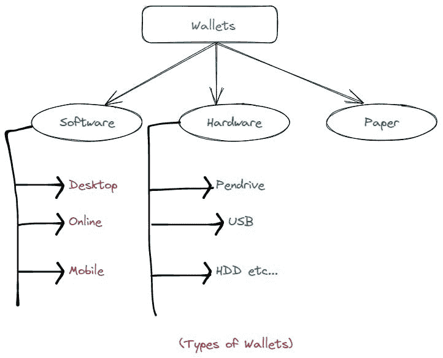
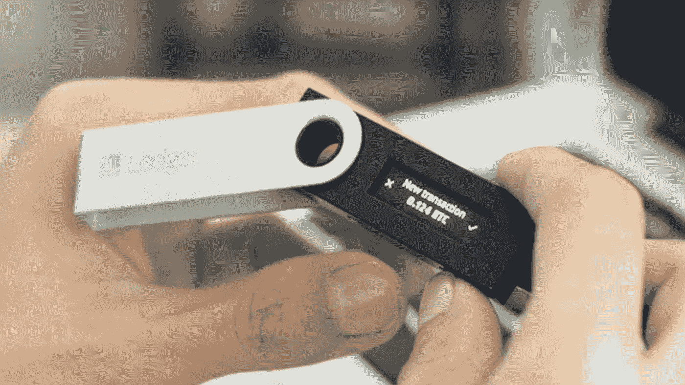
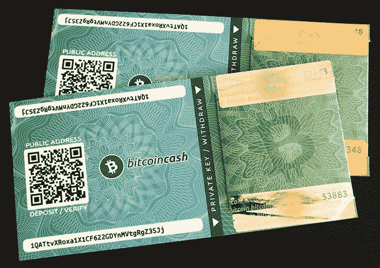

# 加密货币钱包及其类型

> 原文：<https://medium.com/coinmonks/cryptocurrency-wallet-and-its-types-846b42d063b3?source=collection_archive---------70----------------------->

**嘿伙计们，**

希望一切都好。

**太好了！**

**今天我提出了一个新的话题，即加密货币钱包。我们将会看到有多少种钱包，以及它们是如何存放的。**

那么，我们开始吧:)

在开始之前，我假设你们都知道一些关于加密货币和区块链的基础知识。如果没有，请从 [*这里*](https://sarojb.medium.com/) 了解一些基础知识

**爽！**

你们都知道什么是钱包吧？

*当然是萨罗吉！因为我们都有钱，为了存起来，我们需要一个钱包。*

没错！

阿雅，我们都知道，我们把实物货币储存在钱包里。你有没有想过，数字货币或加密货币是如何存储的？

**让我们探索一下，如何**

你可能听说过*比特币*存放在钱包里。如果这是真的，那么如果你复制你的钱包，你将拥有双倍的比特币。显然，你不可能拥有这样的数字货币。所以不，比特币不存在钱包里。

**那么，比特币都存放在哪里呢？**

嗯，比特币的所有权记录在比特币的区块链上，正如我们所知，这个数据库复制在世界各地的 10，000 多台计算机上，包含有史以来的每一笔比特币交易。比特币钱包存储私钥(不是比特币！)而且他们的软件可以让钱包很容易地看到他们控制了多少硬币并进行支付。

有什么想法吗？

**太好了！我为你高兴:)**

现在，让我们看看有多少种类型的钱包可用于加密货币。

如上图所示，比特币钱包有 3 种类型

1.  **软件钱包**
2.  **硬件钱包**
3.  **纸钱包**

让我们一个一个的去探索。

1.**软件钱包**

软件钱包是什么，但他们可以是一些钱包软件或移动应用程序，也可以是桌面应用程序。比特币钱包是至少可以

*   创建新的比特币地址并存储相应的私钥
*   向希望向您付款的人显示您的地址。
*   显示你的地址中有多少比特币。
*   进行比特币支付。

软件钱包很容易使用，你可以使用手机应用程序、软件或网站来访问它们。但是，这些存储大量比特币不太安全。因为，如你所知，应用程序或软件可以被黑客入侵。

软件钱包的一些例子是

*   [blockchain.info](http://blockchain.info/)
*   银金矿
*   Jaxx
*   面包钱包等。

**2。硬件钱包**

有时比特币钱包也可以有硬件组件。私钥存储在称为小型手持设备的芯片中。硬件钱包不过是，它们就像 Pendrive 或 SSD，我们可以在其中存储比特币的密钥。这些比软件钱包更安全。

但是，在将比特币地址存储到硬件钱包之前，我们需要确保地址和密钥是加密的。否则，如果我们丢失了设备，那么任何人都可以访问我们的数据。两个流行的硬件钱包被称为 *Trezor* 和*莱杰纳米*。

**3。纸质钱包**

这些不过是典型的纸张，我们在上面打印比特币的地址和密钥。这些也比软件钱包更安全。纸质钱包用于存储大量比特币。同样，我们需要加密比特币的地址和密钥，然后将它们存储在纸质钱包中，因为这些可能会被窃取。

等待等待…还没完成！

比特币或加密货币钱包也有 2 种。

**这些是冷库和热库。**

短语“ ***冷存储*** ”是将那些私钥保存在离线介质上，比如一张纸或者一台没有连接到互联网的计算机。

而一个 ***热钱包*** 就是不需要人工干预就可以签约和广播交易的钱包。控制许多比特币的交易所需要管理大量的比特币支付，它们通常有一个热门钱包，控制着它们比特币总量的一小部分。

**是啊，我们到此结束这个话题！**

我确信，你对我们如何存储比特币及其类型有所了解。

**牛逼！**

一会儿见，带着一篇全新的文章。

> 加入 Coinmonks [电报频道](https://t.me/coincodecap)和 [Youtube 频道](https://www.youtube.com/c/coinmonks/videos)了解加密交易和投资

# 另外，阅读

*   [5 款最佳加密交易终端](https://coincodecap.com/crypto-trading-terminals) | [最佳 DeFi 应用](https://coincodecap.com/best-defi-apps)
*   [比特币基地 vs 瓦济克斯](https://coincodecap.com/coinbase-vs-wazirx) | [比特鲁点评](https://coincodecap.com/bitrue-review) | [波洛涅克斯 vs 比特鲁](https://coincodecap.com/poloniex-vs-bittrex)
*   [德国最佳加密交易所](https://coincodecap.com/crypto-exchanges-in-germany) | [Arbitrum:第二层解决方案](https://coincodecap.com/arbitrum)
*   [币安交易机器人](/coinmonks/binance-trading-bots-d0d57bb62c4c) | [OKEx 评论](/coinmonks/okex-review-6b369304110f) | [阿塔尼评论](https://coincodecap.com/atani-review)
*   [最佳加密交易信号电报](/coinmonks/best-crypto-signals-telegram-5785cdbc4b2b) | [MoonXBT 评论](/coinmonks/moonxbt-review-6e4ab26d037)
*   [如何在 Bitbns 上购买柴犬(SHIB)币？](https://coincodecap.com/buy-shiba-bitbns) | [购买弗洛基](https://coincodecap.com/buy-floki-inu-token)