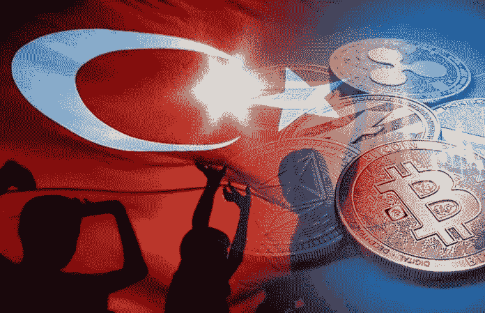
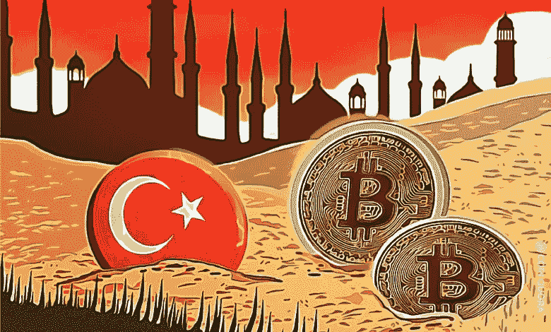

# 土耳其的加密货币浪潮

> 原文：<https://medium.com/coinmonks/cryptocurrency-wave-in-turkey-f5ba2978b8d0?source=collection_archive---------51----------------------->

# 火鸡

故事最初发表于[https://koop360.com/blog/cryptocurrency-wave-in-turkey/](https://koop360.com/blog/cryptocurrency-wave-in-turkey/)

> *随着交易所涉足土耳其，土耳其碰巧经历了对加密货币兴趣的复苏。从线下营销到人口统计，甚至货币贬值，所有 8400 万土耳其人都有足够的动机签署新的交易所。*

***然而，据了解，土耳其恰好是***[***ku coin***](https://www.kucoin.com/)***增长最快的五大市场之一。***

Bitfinex 恰好是世界上最大的加密货币交易所之一，该交易所最近宣布计划将其业务扩展到土耳其 T21。它碰巧看到了拟议的加密货币法，该法将有助于为加密货币的概念提供一个位置，以这种方式支持失败的土耳其货币。

进入土耳其的全球交易所恰好引起关注。在土耳其市场，一种流行的方式是签署电视广告、广告牌广告和一些主要的赞助。然而，在土耳其，提出法人实体是强制性的。一些官方权威人士评论说，在实现品牌知名度方面，互联网和社交媒体相当不够。然而，根据欧洲新闻编辑的说法，关于土耳其制造的加密货币浪潮的当地专业知识是由于全球交易所。该编辑进一步强调了这样一个说法，即像伊斯坦布尔这样的城市恰好是商业中心，因为它在每个角落都有一个来自当地顶级加密交易所的广告牌。

使用数字营销工具的数字业务正在成为任何主流市场的互联网事物之一。这就是为什么巨大的数字品牌，包括推特、网飞，开始使用报纸、广告牌或其他线下营销方式来扩大他们的受众。随着数字幼稚和年轻的人口，人们可以预期接触到线下和线上营销。由于这个原因，加密货币的使用在 2021 年不知何故飙升了 11 倍。

此外，土耳其货币购买力的下降助长了加密货币的火。比特币的概念恰好创下了该货币的历史新高。不知何故，这是一种巧合，在同一年，当土耳其里拉碰巧连续点击时，土耳其密码的使用量显著增加。

**结论**

此外，加密货币的概念恰好是土耳其人口中受欢迎的资产类别之一。部分原因是人们碰巧经历的土耳其里拉的价值波动。当谈到吸引土耳其广大的零售人口时，你不能迟到。随着美联储预测的货币政策运动，比特币和其他加密货币的价格碰巧呈下降趋势。因此，随着全球利益的到来，该国最终接受了加密货币，碰巧经历了更具参与性的金融体系和货币自由。

> 交易新手？试试[密码交易机器人](/coinmonks/crypto-trading-bot-c2ffce8acb2a)或者[复制交易](/coinmonks/top-10-crypto-copy-trading-platforms-for-beginners-d0c37c7d698c)