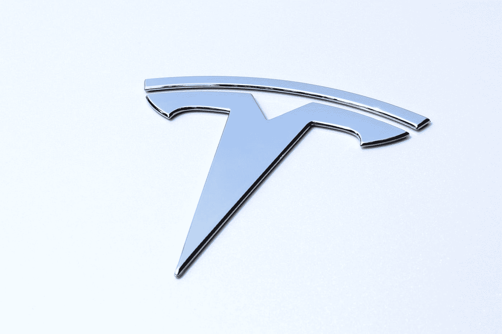

# 加密货币的第一步:“比特币的故事”——第二部分

> 原文：<https://medium.com/coinmonks/cryptocurrencys-first-step-a-bitcoin-story-part-two-ac68c89cc67e?source=collection_archive---------84----------------------->

你好:)

It 是加密货币第二章的曙光。今天我要给大家介绍一下从 2016 年到现在发生的问题。

Photo by [André François McKenzie](https://unsplash.com/@silverhousehd?utm_source=medium&utm_medium=referral) on [Unsplash](https://unsplash.com?utm_source=medium&utm_medium=referral)

**2016** : ICO 诞生。

为了便于解释 ICO，你可以把它想象成在交易所上市前的一次购买。*(有 ico，ido，ieo，但是关于他们的故事我会分别整理！)*

还有，2016 年还有一件事，就是 Bitfinex 被黑导致 12 万比特币丢失。

Photo by [Ilya Pavlov](https://unsplash.com/@ilyapavlov?utm_source=medium&utm_medium=referral) on [Unsplash](https://unsplash.com?utm_source=medium&utm_medium=referral)

此后，价格持续下跌，并一点点上涨，直到年底，达到 900 美元。

> (另外，Dao 黑客事件发生在那一年的 6 月，这对于来说也很重要，而且与以太坊有关，所以我会有不同的准备。)

那一年，共和党人唐纳德·特朗普当选总统。

Photo by [Sean Ferigan](https://unsplash.com/@seanferiganphotography?utm_source=medium&utm_medium=referral) on [Unsplash](https://unsplash.com?utm_source=medium&utm_medium=referral)

**2017 年**:随着加密货币通过巨大的市场增长飙升，比特币经历了最好的一年，简单解释一下:

*   5 月份成交价 1000 美元→2000 美元，12 月 5 日 19345.491335 美元。
*   随着投资者、政府、经济学家和几个机构谈论比特币，比特币竞争开始了。
*   4 月 1 日:日本政府启动执行修订后的《资金结算法》，开始注册为加密货币兑换公司。
*   戴作为稳定币引入的 DEX 诞生了。
*   7 月 14 日:加密货币交易所币安成立。
*   11 月 29 日:BTC 价格突破 1 万美元。
*   12 月 8 日:BTC 价格打破 2500 万韩元的纪录。
*   12 月 17 日:CME 比特币期货交易在美国开始。

Photo by [Kanchanara](https://unsplash.com/@kanchanara?utm_source=medium&utm_medium=referral) on [Unsplash](https://unsplash.com?utm_source=medium&utm_medium=referral)

然而，

**2018** :比特币达到 73%的荒谬跌幅，正因为如此:

*   比特币 1 月公布规定(脸书宣布禁止加密货币广告)
*   第三代区块链出现(EOS，Cardano，Phantom 等。)
*   谷歌宣布禁止在推特上发布加密货币广告。
*   瑞典和亚利桑那州开始征收比特币税。
*   Fintech 公司占 15%。

Photo by Samara Malkin on Crypto Currency News

**2019** :比特币反弹，从此到达大幅上涨的开端。

背后，

*   3 月 15 日:日本《金融商法》和《资金结算法》修正案获得内阁会议通过，比特币等加密货币的名称改为“加密资产”。
*   6 月 21 日:金融行动特别工作组(FATF)宣布一项关于加密货币监管的建议。
*   它是一个旨在防止 FATF 在全球范围内洗钱和资助恐怖组织的组织，有 37 个成员国。
*   7 月 8 日:宣布计划在中国发行 CBDC(数字货币)。

随着新冠肺炎的开始，比特币价格将在 2020 年末再次飙升，掩盖了变好的预期。

*   3 月 12 日:比特币最大暴跌；所谓的“黑色星期四”的产生
*   5 月 12 日:比特币第三个半衰期将挖矿补偿从 12.5BTC 降至 6.25BTC。
*   8 月:Microstrategy，第一家购买比特币的未上市公司。
*   10 月 21 日:美国 PayPal 宣布推出加密货币支付。
*   11 月 3 日:6965.72 美元起步，下跌至 19157.16 美元。
*   12 月 16 日:BTC 价格突破 2 万美元，打破三年来的最高纪录，总市值约 517 万亿韩元。

最近一次是在 2021 年，

Photo by [Manny Becerra](https://unsplash.com/@mannyb?utm_source=medium&utm_medium=referral) on [Unsplash](https://unsplash.com?utm_source=medium&utm_medium=referral)

*   2 月:特斯拉以 15 亿美元购买了约 1.79 万亿韩元的比特币。
*   4 月 14 日:美国硬币基地在纳斯达克发布。
*   5 月 12 日:特斯拉宣布暂停接受比特币支付。
*   6 月 9 日:比特币成为萨尔瓦多官方法定货币。
*   10 月 15 日:美国 SEC 首批比特币期货 ETF 申请已获批准。

> 你今天学习做得很好！
> 
> 从下一篇帖子开始，我将从 2022 年开始定期更新事件。