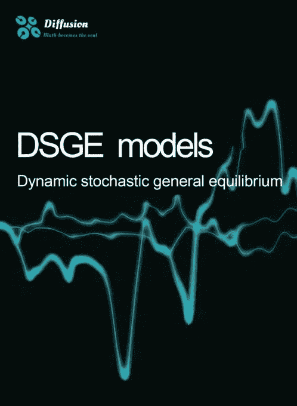

# 秘密经济学

> 原文：<https://medium.com/coinmonks/cryptoeconomics-a584d22deddf?source=collection_archive---------7----------------------->

近年来，加密货币的崛起速度惊人，这在传统金融界引起了混乱，传统金融对加密货币的态度也在不断变化。自 2009 年比特币诞生以来，华尔街银行一直在回避比特币。，摩根大通首席执行官杰米·戴蒙曾威胁要解雇任何买卖这种数字货币的交易员。

然而，客户的兴趣和比特币极高的市值动摇了许多银行家，摩根士丹利(Morgan Stanley)向其客户提供了一款比特币信托产品，摩根大通(JPMorgan Chase)也在开发一款类似的产品。据报道，高盛(Goldman Sachs)去年 3 月宣布重新推出其加密货币交易部门，并宣布计划进军加密货币托管，为私人财富客户提供更多押注加密货币价格的手段。

高盛充当了老练的机构投资者如何应对市场变化的灯塔。从去年开始，我们已经看到更多的传统金融公司接受并对加密货币感兴趣，高盛的加入是该领域成熟的又一标志。

虽然业内公认的比特币第二轮牛市是由这些机构直接支撑的，但是加密货币的特殊性和不可预测性往往让专业的金融机构很苦恼，以为就像一个机构投资者说的，我们投资了莫名其妙暴涨百倍的加密货币，但是说不定下个月他就一文不值了。是的，绝大多数加密货币都没有逻辑。原因是加密货币的经济体系本身缺乏科学性。

事实上，有一种可能性是，由于传统的金融资产评估方法在加密货币领域不再适用，传统经济学无法合理解释目前正在发生的事情。

并且由于意识的天然对立，即集中金融市场和分散金融的兴起，一定的知识壁垒，区块链技术，智能合约等。使得传统金融从业者难以快速投入加密货币专业研究。

在批量样本分析中，市场是否是牛市，是否有投资，是否受到影响者的喜欢，在哪些交易所上市，技术的应用会有多广泛，发行总量有多少，等等很多因素都会影响加密货币。价格的存在是合理的。扩散道提出的密码经济学将影响加密货币的一系列因素抽象为影响加密货币市场表现的不变因素。

以下是 diffsuiondao 数字经济的三个要素

1、扩散系数

简单来说，就是有效货币持有地址数量的增加率，但这个增加率不可能每次都是指数式的稳定增加，所以我们用复合增长率，相当于全国居民数量的增加。虽然这和我们常说的持有地址数量很像，但是如果你有时间看白皮书，你就会明白本质的区别。

2、调用因素

所有 ERC20 令牌实际上都是智能合约。使用它们的人越多，交易越多，调用合同的次数就越多。但是为了增加活跃度，可能会有很多虚假的电话。例如，项目方可从雇主处借入 1 亿美元的代币，以锁定 TVL 锁价值。利用技术进行大量虚假交易，虚假调度吸引民间用户进场后，1 亿美元资金被抽回，返还给雇主，导致散户被切断资金来源。这种作恶的成本很低，他的目的是吸引他人存入资金和代币。调用本身确实很难成本化，因为所有的调用和事务都需要燃料，也就是手续费，以防止技术欺诈和女巫攻击。所以真实活跃的通话数据对于一个生态系统来说是极其重要的。

3、注意要素

加密货币，其实它的价格形成的一个很重要的因素就是有多少人在关注这个代币。比如 DOGE 没想法没技术。他把它发出去模仿加密货币。没想到他会变成这么大的生态，为什么？因为关注的元素，因为大家都在关注他，讨论他，骂他，支持他，研究他，最后利用他。据说关注度会直接决定代币的价格。如果今天只有一万个人值比特币，那么比特币就不会有这样的市值。

三要素描述了生态发展如何，是一个指标图。扩散道的模型包括但不仅仅由这三个要素组成。

Diffsiondao 采用了新凯恩斯主义的 DSGE 模型

新凯恩斯主义经济学，也译作第二代新凯恩斯主义经济学，是诞生于上世纪七八十年代，至今仍在发展的宏观经济理论。与传统凯恩斯经济学和第一代新凯恩斯经济学只在“价格刚性”的假设下进行分析相比，它将“为什么价格是刚性的”作为分析对象引入宏观经济分析领域。第二代新凯恩斯经济学是新凯恩斯学派的继承者，与第二代新古典经济学形成竞争关系。

第二代新凯恩斯主义经济学的主要特征是基于工资粘性和价格粘性的分析。它假设名义工资和产品价格可以调整，但调整速度很慢。此外，它采用了第二代新古典经济学。经济学的分析框架。

第二代新凯恩斯主义经济学与第一代新凯恩斯主义经济学的区别在于，第二代新凯恩斯主义经济学寻求更多的微观基础。在第二代新凯恩斯主义经济学中，之前预先假设的东西被进一步微观深化，使得逻辑更加完整。

DSGE 是动态随机一般均衡(Dynamic random General Equilibrium)模型的英文缩写，即宏观经济模型是跨期动态的，具有随机不确定性，从一般均衡的角度分析经济(Korinek，2017)。然而，首字母缩略词 DSGE 受到概念的限制，其传统内涵比其字面意义要窄得多。

动态意味着经济主体存在于多个时期，并根据生命周期做出最优决策。从字面上理解，多期是指两个或两个以上时期的生命周期，所以既包括两个时期，也包括无限期。那么，一个具有两期动态的随机一般均衡模型不能称为 DSGE 模型吗？

传统的 DSGE 模型通常被理解为无限动态，即无限生存的典型经济主体，因为在某些方面，无限比两个时期更简单(两个时期是不对称的)。但这也带来了两个问题:近似算法的偏差，以及宏观和微观的不一致。

随机意味着宏观经济模型需要考虑不确定性。传统的 DSGE 模型通过引入外生冲击——生产率冲击——来解释不确定性，也就是说，将随机变量引入确定性模型。Farmer (2017)指出，这种方法与理性预期的概念不一致，因为人们必须认识到我们生活的世界(模型经济)是随机的。

一般均衡意味着宏观经济模型自下而上地建立在坚实的微观基础上。个体经济主体的行为是在市场出清/资源约束下优化目标函数的结果。但是一些 DSGE 模式——国有企业——并不遵循完美的一般均衡环境。

在传统经济思维的主导下，扩散道通过大量的样本分析，分离出三个可以直接量化的要素，作为生态经济的变化因素。扩散道白皮书中的详细公式在此不再赘述。

通过智能合约完成经济体系的构建:然后实现承诺下的最优货币政策。通过制度的动态调整，实现居民福利最大化，通货膨胀最小化。

> 加入 Coinmonks [电报频道](https://t.me/coincodecap)和 [Youtube 频道](https://www.youtube.com/c/coinmonks/videos)了解加密交易和投资

# 另外，阅读

*   [南非的加密交易所](https://coincodecap.com/crypto-exchanges-in-south-africa) | [BitMEX 加密信号](https://coincodecap.com/bitmex-crypto-signals)
*   [MoonXBT 副本交易](https://coincodecap.com/moonxbt-copy-trading) | [阿联酋的加密钱包](https://coincodecap.com/crypto-wallets-in-uae)
*   [雷米塔诺审查](https://coincodecap.com/remitano-review)|[1 英寸协议指南](https://coincodecap.com/1inch)
*   [iTop VPN 审查](https://coincodecap.com/itop-vpn-review) | [曼陀罗交易所审查](https://coincodecap.com/mandala-exchange-review)
*   [40 个最佳电报频道](https://coincodecap.com/best-telegram-channels) | [喜美元评论](https://coincodecap.com/hi-dollar-review)
*   [折叠 App 审核](https://coincodecap.com/fold-app-review) | [StealthEX 审核](/coinmonks/stealthex-review-396c67309988) | [Stormgain 审核](https://coincodecap.com/stormgain-review)