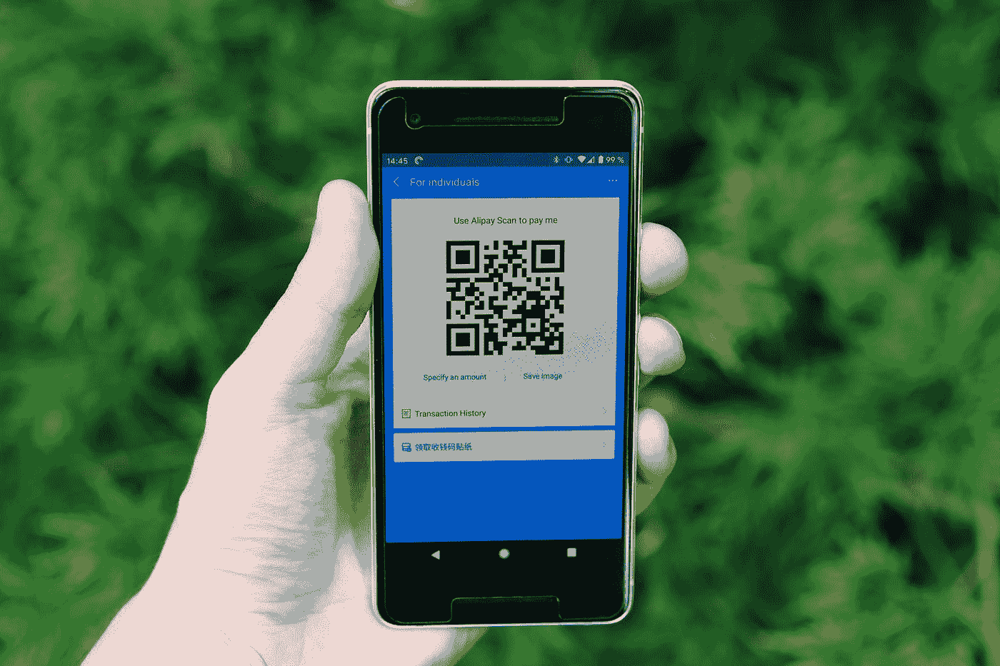

# 2022 年及以后的金融机构密码

> 原文：<https://medium.com/coinmonks/cryptofication-of-financial-institutions-in-2022-and-beyond-e07393a0c2a6?source=collection_archive---------14----------------------->

自从新冠肺炎·疫情风靡全球以来，各行各业和整个生活都发生了许多重大变化。然而，甚至在疫情会议之前，由于技术创新的增加，金融业已经经历了混乱。值得注意的方面包括增加数字支付、区块链技术和增加使用密码货币。

Photo by [Jievani Weerasinghe](https://unsplash.com/@jievani?utm_source=medium&utm_medium=referral) on [Unsplash](https://unsplash.com?utm_source=medium&utm_medium=referral)

因此，各大银行、央行和监管机构一再对上述趋势做出积极和消极的反应。准确地说，近年来的隐货币问题对传统的金融体系，即银行和央行来说并不是一个“好消息”。然而，这些年来，这个故事一直在变化。此外，同期密码货币市场也有了巨大的增长。

***一瞥***

让我们先看看密码货币和金融机构之间的关系。

其中一种引人注目的密码货币是比特币，它从 2009 年 1 月就已经存在了。多年来，这种密码货币的价值一直在增长，数百万人已经接受了它。据估计，有超过 1800 万的比特币在流通。此外，[统计数据](https://www.statista.com/statistics/1202503/global-cryptocurrency-user-base/)显示，从 2018 年到 2020 年，各种密码货币的全球用户基础显著增长了近 190%。总的来说，这是密码市场每天都在增长的明显迹象。

Photo by [Adam Nir](https://unsplash.com/@adamnir?utm_source=medium&utm_medium=referral) on [Unsplash](https://unsplash.com?utm_source=medium&utm_medium=referral)

另一方面，我们不能忽视银行在金融生态系统和经济中的作用。那么，银行对密码货币问题的反应如何？起初，金融机构对密码货币非常怀疑。例如，2014 年，摩根大通(JP MORGAN Chase)首席执行官杰米戴蒙(Jamie Dimon)认为比特币是一种糟糕的价值存储选择。

此外，大多数政府和央行都反对密码货币。例如，在 2021 年，中国宣布所有加密货币交易都是非法的。此外，2017 年，新西兰代州长格兰特·斯潘塞在接受新西兰电视台采访时警告人们不要投资比特币，并认为这是一个投机泡沫。

不管政府和金融机构的看法如何，密码货币市场仍在增长。最近，一些银行已经意识到，为了跟上竞争，密码相关的服务在他们的投资组合中是必不可少的。美国银行业的一家大公司，如摩根大通，已经发明了一种数字硬币(JPM 币)，并为其富有的管理客户提供密码资金。

Photo by [Markus Winkler](https://unsplash.com/@markuswinkler?utm_source=medium&utm_medium=referral) on [Unsplash](https://unsplash.com?utm_source=medium&utm_medium=referral)

此外，中央银行已经启动了拥有其数字货币的项目，即中央银行数字货币(CBDC)。中国人民银行、尼日利亚央行、巴哈马央行、东加勒比央行和津巴布韦央行是央行探索数字货币的最佳范例。萨尔瓦多走得更远，将比特币列为法定货币。

**是什么加速了金融机构对加密货币的采用？**

如上所述，随着时间的推移，加密市场和传统金融机构之间的紧张关系已经发生了变化，银行对加密货币的采用也在不断发展。以下是一些因素/方面:

***需求增加***

随着需求的增加，有关加密市场的增长和教育也在增加。那是显而易见的。

加密货币的采用正在大幅增长。据 Tripple A 称，截至 2021 年，约有 3 亿加密用户，全球已有超过 18，000 家企业接受加密货币支付。特斯拉是一家接受加密货币的企业，特别是某些商品的 Dogecoin。

此外，Crypto.com 于 2022 年 1 月发布的另一份报告显示，到今年年底，加密用户有可能达到 10 亿。

美国的一些银行，如 Ally Bank 和 Chime Bank，分别允许通过 Ally Bank 借记卡和 Paxful 购买比特币。此外，英国的 Wirex、Bankera 和 Revolut 等各种银行现在都在向他们的客户提供加密货币友好服务。

PayPal 等金融服务提供商现在允许用户购买、出售和结算加密货币。

***恐惧***

区块链技术正在彻底改变金融业，它建立了新的金融流程和服务基础设施。因此，传统的金融生态系统发生了深刻的中断。

Photo by [Hitesh Choudhary](https://unsplash.com/@hiteshchoudhary?utm_source=medium&utm_medium=referral) on [Unsplash](https://unsplash.com?utm_source=medium&utm_medium=referral)

加密货币依赖于去中心化的区块链技术。因此，人们担心加密市场可能/将切断央行与经济之间的联系。

出于这个原因，金融机构正在采用加密友好的机制来帮助他们保持竞争力和相关性。

我们期望什么？前途如何？

如果各国央行和其他金融机构不采用加密货币，它们会跟上对加密货币日益增长的需求吗？这是房间里的大象！一些银行可能会将加密友好服务添加到他们的投资组合中，尽管加密货币仍被禁止。此外，更多的企业可能会接受商品和服务的加密支付。

那么，crypto 会成为一个自由王国吗？这将取决于全球不同国家的监管清晰度，尤其是发达国家。监管清晰是目前大多数金融机构不愿采用加密货币的原因之一。此外，法定货币正在贬值的国家可以考虑采用加密货币。

最后，我们可以预计，大多数央行将推出数字货币。然而，对加密货币的需求不太可能因为 CBDCs 的影响而减少。为什么？两者都是在不同领域运行的数字货币，即比特币、以太坊、Dogecoin 等加密货币是去中心化的，而 CBDCs 是集中化的。

此外，加密用户和爱好者可能不会考虑数字货币，因为他们的加密投资和交易依赖于波动性和匿名性。这是密码市场的一个特征。

你有什么看法？你怎么想呢?

> 加入 Coinmonks [电报频道](https://t.me/coincodecap)和 [Youtube 频道](https://www.youtube.com/c/coinmonks/videos)了解加密交易和投资

## 也阅读

 [## 杠杆代币[多头代币]终极指南

### 杠杆化令牌是具有杠杆化风险敞口的 ERC20 令牌，不考虑保证金、要求、管理…

medium.com](/coinmonks/leveraged-token-3f5257808b22)  [## 最佳加密交易所| 2022 年十大加密货币交易所| CoinCodeCap

### 哪一个是最好的加密交换？在本文中，我们将根据多种加密货币列出 10 大加密货币交易所

coincodecap.com](https://coincodecap.com/crypto-exchange)  [## 2022 年最佳加密交换平台| CoinCodeCap

### 随着时间的推移，我们大多数人将转向 dex 以获得更好的安全性和隐私。因此。在这里，我们将讨论…

coincodecap.com](https://coincodecap.com/best-swap-platforms)  [## 10 大最佳在线赌场|赢得并赢取免费 BTC 2022 | CoinCodeCap

### 接收、支付和赚取加密货币| |有各种各样的最佳在线赌场可供选择，有可能…

coincodecap.com](https://coincodecap.com/best-online-casinos)  [## 2021 年最佳加密借贷平台| 6 大比特币借贷平台

### 获得比特币和其他加密货币的最佳贷款利率

medium.com](/coinmonks/top-5-crypto-lending-platforms-in-2020-that-you-need-to-know-a1b675cec3fa)  [## 2021 年 6 大最佳硬件钱包|顶级加密硬件钱包[更新]

### 最好的加密货币硬件钱包是绝对必要的。我们将在 NGRAVE、Ledger Nano X 和…

medium.com](/coinmonks/the-best-cryptocurrency-hardware-wallets-of-2020-e28b1c124069)  [## 加密交易机器人——19 款最佳免费加密交易机器人

### 2022 年币安、比特币基地、库币和其他密码交易所的最佳密码交易机器人。四进制，位间隙…

medium.com](/coinmonks/crypto-trading-bot-c2ffce8acb2a)  [## 最佳 4 个加密交易信号电报通道

### 这是乏味的找到正确的加密交易信号提供商。因此，在本文中，我们将讨论最好的…

medium.com](/coinmonks/best-crypto-signals-telegram-5785cdbc4b2b)