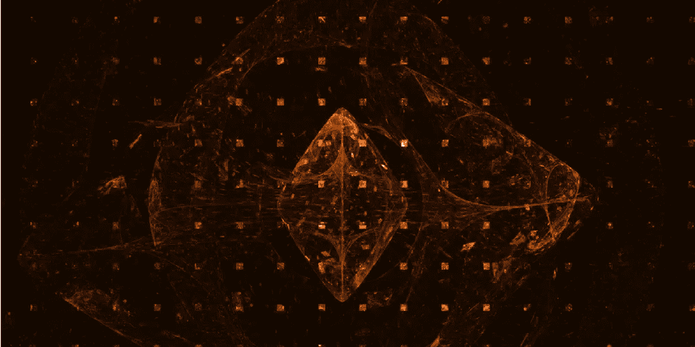

# 对加密、公钥和私钥的简单解释

> 原文：<https://medium.com/coinmonks/cryptography-public-keys-and-private-keys-a3d50d73ba89?source=collection_archive---------45----------------------->

## 仔细研究密码学、公钥和私钥，以及它们与比特币和其他加密货币的关系。

*本文原帖*[*【NOAH.com】*](http://noah.com/)*。NOAH 是一款用于全球支付和赚取比特币和 stablecoins 利息的一体化货币应用程序。报名候补* [*这里*](https://mandrillapp.com/track/click/30895797/noah.com?p=eyJzIjoianNhRFBvdkV6c3BFY2JCTjZtcHcxSjlYN3dVIiwidiI6MSwicCI6IntcInVcIjozMDg5NTc5NyxcInZcIjoxLFwidXJsXCI6XCJodHRwczpcXFwvXFxcL25vYWguY29tXFxcLz9yZWZlcnJhbD00Y3pia2Z2JnJlZlNvdXJjZT1jb3B5XCIsXCJpZFwiOlwiYmM2OTFmYmVhMGVhNGRiOWIyMzc1Y2JlMzI4OGI0ZmJcIixcInVybF9pZHNcIjpbXCI0ZTUwMzQwOTI2NTBkMDBlZWIxM2Q1NzM1NWNjNTg4YTExYTgwOGEzXCJdfSJ9) *。*

一般来说，加密技术是一种保护信息(如消息)不被预期接收者之外的任何人读取或接收的技术。公钥加密是一种允许用户通过不安全的通道(如 internet)进行安全通信的加密类型。一种广泛实施的加密方案是*非对称密钥加密，*使用公钥和私钥。

公钥密码在日常生活中有许多应用。例如，各种 internet 协议使用公钥加密来加密数据，如 HTTP 中的安全套接字层(SSL)和 web 浏览器中的 HTTPS。更值得注意的是，在加密领域，比特币使用公钥加密技术来签署和验证交易。

公钥加密之所以如此特殊，是因为每个公钥(任何人都知道)只匹配一个私钥(只有其所有者知道)。把它想象成一个保险箱。每个人都可以看到盒子在哪里(公钥)，但只有你有权使用密钥(私钥)来打开它并取回你的资产(比特币)。

公钥加密设计的一个关键部分是如何生成密钥。公钥是从私钥生成的*，并且要求在数学上相关，这使得根据某人的公钥猜测其私钥几乎是不可能的。在比特币的情况下，椭圆曲线数字签名算法(ECDSA)从私钥生成公钥。*

> 交易新手？试试[加密交易机器人](/coinmonks/crypto-trading-bot-c2ffce8acb2a)或者[复制交易](/coinmonks/top-10-crypto-copy-trading-platforms-for-beginners-d0c37c7d698c)

# 在交易中如何使用密钥？

每当有人想发送比特币交易时，他们都会用自己的私钥对交易数据进行“数字签名”，然后通过比特币网络广播这一签名交易。然后，通过参考发送者的公钥(同样，它在数学上与发送者的私钥相关)来验证交易。

例如，如果 Alice 想要向 Bob 发送比特币交易，她将需要他的公钥，并使用她的私钥来“签署”交易。因为 Alice 用她的私钥对事务进行签名，所以 Bob 可以检查 Alice 的公钥，并验证事务是否来自 Alice。

例如，如果 Bob 的公钥是:

> 036 b 17 C1 d 7 a 0003 ab 53 da 5733 c 565 de 401 b 9d 71 e 7 ca 0 DFB 51 EFD 4183 a5 F4 CD 0 cf 3

然后，Alice 将使用 Bob 的公钥创建一个事务。Alice 将用她的私钥签署该交易，并将其加密发送给 Bob。

有很多技术细节使这个工作。尽管如此，当你分解它时，所有重要的是公钥加密形成了比特币交易的基石，只允许私钥的所有者将比特币发送到另一个人的地址。

# TL；博士？

*   比特币使用公钥加密进行交易。
*   任何人都知道公钥。
*   私钥是安全的，只有钱包主人知道(如果有人知道你的私钥，他们就可以访问你的比特币)。
*   公钥是由私钥通过算法生成的，关系在数学上是相关的。
*   从数学上讲，根据某人的公钥来猜测他们的私钥是不可能的。
*   要发送比特币，你需要接收方的比特币地址，该地址来自他们的公钥，并使用你的私钥对你的交易进行签名。

杰克逊·里昆是一名编剧、文案和密码爱好者。杰克逊的写作集中在心理健康、性、药物史、加密货币等方面。

你可以在[推特](http://twitter.com/jacksonrickun)和 [Instagram](https://www.instagram.com/jacksonrickun/) 上关注他。

*免责声明:我是 NOAH 的一名活跃的文案和内容作者。以上并非投资建议，仅供参考。*