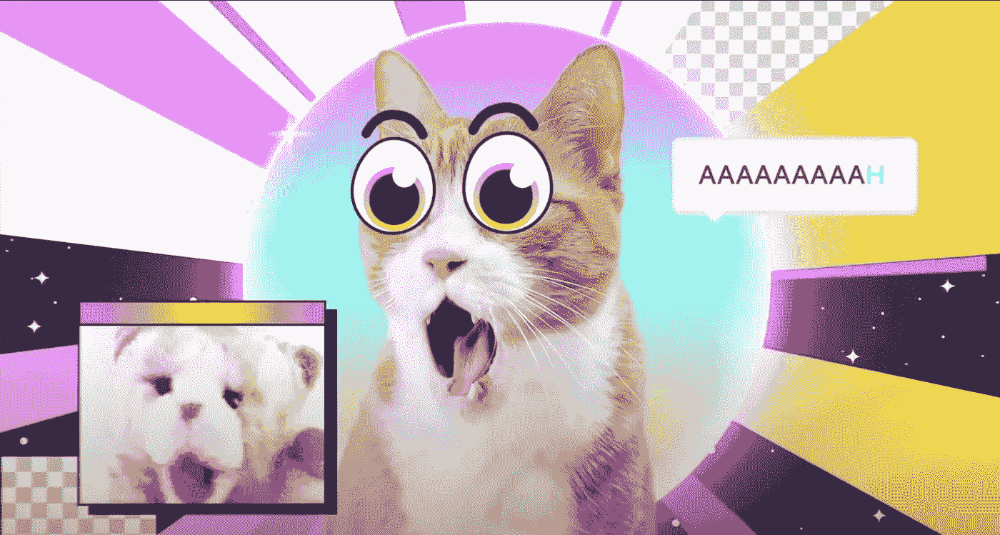

# crypto kitty——崩溃的先兆

> 原文：<https://medium.com/coinmonks/cryptokitty-the-harbinger-of-crash-b1180f5c32aa?source=collection_archive---------14----------------------->

关于 NFT 的经济，隐猫教会了我们什么

每当我被问到不可替代的代币时，我都会讲“crypto kitty——崩溃的先兆”的故事

这个故事是为每一个想了解数码收藏品或想投资非数码收藏品的人而写的。我真的认为理解这个故事很重要。

在 2021 年第一季度，[超过 20 亿美元被用于非功能性医疗服务](https://www.thewrap.com/nft-market-surges-2100-to-2-billion-in-q1-sales/)。这比上一季度增长了约 2000%。这些数字令人印象深刻，从商业角度来看，我们可能会将此解读为我们都应该投资数字收藏品的信号，对吗？请继续阅读。

This is a visualization of my analysis.

我们今天所说的 NFT 其实并不新鲜。2017 年[隐猫](https://www.cryptokitties.co/)诞生。一家名为 [AxiomZen](https://www.axiomzen.com/) 的加拿大公司在[以太坊](https://ethereum.org/en/)区块链上生成了 [50k 个唯一的 Cryptokitties](https://ico.li/cryptokitties/) 。可以说，他们是第一批“主流非功能性测试”。每个 Cryptokitty 由 [12 个特征定义，即所谓的“属性”](https://en.wikipedia.org/wiki/CryptoKitties)。这些 5 万只小猫然后被卖给交易和饲养它们的用户。它们产生了新一代进化的隐猫，然后又可以出售或繁殖。这听起来像是一个休闲游戏，但在 2017 年至 2019 年期间，加密市场变得疯狂，人们在这方面投入了数百万元。

这款游戏吸引了大量玩家，他们愿意为此支付真金白银。许多小猫的售价约为 2 万美元，而“创世纪”小猫的售价达到创纪录的 10 万美元。

高价出售的数码小猫吸引了大量媒体的关注，并吸引了大量新的游戏参与者。结果游戏人气暴涨。炒作只持续了几个星期，从那以后游戏玩家的数量稳步下降。

有一篇引人入胜的论文 Cryptokitties:“[Cryptokitties 交易网解析:第一个 Bockchain 游戏狂潮的兴衰](https://www.frontiersin.org/articles/10.3389/fphy.2021.631665/full)”。作者指出了市场受欢迎程度快速下降的 4 个主要原因。供需平衡被打破，利润出现系统性损失，贫富差距显著，最后是区块链基础设施本身的局限性。

# 供需平衡的打破

在野生扩张阶段，大量玩家涌入网络，导致短时间内产生大量小猫。自 2017 年 12 月 4 日以来，新推出的小猫数量远远超过了每天售出的小猫数量，导致市场上仍可买到的小猫数量大幅增加。小猫市场已经从卖方市场转变为买方市场。小猫的销售成功率也下降了，周转时间越来越长。

**利润损失怎么办？**

加密货币没有固定的价值，完全由市场供求来估价。由于小猫的供应远远超过需求，小猫的价格急剧下降。利润是游戏玩家继续玩游戏的重要动机。如果出售小猫的收入低于成本，玩家的兴奋感将会消退甚至消失。游戏玩家选择 Cryptokitties 是因为收藏品预计会随着时间的推移而增值。相反，价格下降导致利润损失。

**然后就是“贫富差距”。**

玩家通过出售和租借小猫赚钱。在游戏中，富有和贫穷的猫主人之间的差异扩大了，就像在现实生活中一样。少数参与者从游戏中获得了大部分利润，而大多数玩家几乎一无所获。由于收入差距的扩大，大多数玩家的游戏体验已经恶化，他们已经稳步退出游戏。

**最后:区块链的局限性**

加密货币不可预测的价格使得区块链的交易非常不稳定。监管智能合约的运行成本几乎是不可能的。乙醚价格爆炸的时候，玩 CryptoKitties 的成本大幅增加。除了价格，以太坊中还有等待时间和竞价机制，这迫使玩家有时要等几个小时，直到他们的交易最终被处理。

Cryptokitties 是一个你很少听到的术语。然而，每个人都在谈论不可替代的令牌，或 NFT。每天，到处都是关于为非功能性测试投入荒谬资金的新闻。由于高需求，可用收藏品的数量增加了，现在每个人都在生产 NFT，因为…这就是游戏的工作方式…我们知道游戏将如何结束。NFT 被誉为下一个大事件……但这是真的吗？

Cryptokitty 的故事告诉我们一些关于密码收藏品市场的波动性和缺乏稳定性的事情。我们知道,“价值”是由稀缺性定义的，也就是说，只要有第二个人愿意付钱，我们写入区块链的任何垃圾都是有价值的。交易加密收藏品纯粹是投机性的，这些资产根本没有实际用途。最后，所有这一切都是一场游戏，Cryptokitty 会准确地告诉我们谁会赢。她是“崩溃的先兆”。

但是你觉得隐猫和 NFT 怎么样？下面评论里讨论一下吧。

不要误解我，我实际上是 NFT 的忠实粉丝，但是我相信我们今天使用它们的方式是错误的。关注我，了解更多关于 NFTs 的未来可能会是什么样子。

加入我在 YouTube 上的 [InnovationEngineer 社区](https://www.youtube.com/channel/UC8Rudb2QADNXcEURU-H9iYA)，了解更多关于 NFT、加密、区块链和 Web3 的未来。

保持牛逼！

> 加入 Coinmonks [电报频道](https://t.me/coincodecap)和 [Youtube 频道](https://www.youtube.com/c/coinmonks/videos)了解加密交易和投资

# 另外，阅读

*   [Bookmap 评论](https://coincodecap.com/bookmap-review-2021-best-trading-software) | [美国 5 大最佳加密交易所](https://coincodecap.com/crypto-exchange-usa)
*   [如何在 FTX 交易所交易期货](https://coincodecap.com/ftx-futures-trading) | [OKEx vs 币安](https://coincodecap.com/okex-vs-binance)
*   [CoinLoan 审查](https://coincodecap.com/coinloan-review) | [YouHodler 审查](/coinmonks/youhodler-4-easy-ways-to-make-money-98969b9689f2) | [BlockFi 审查](https://coincodecap.com/blockfi-review)
*   XT.COM 评论 | [币安评论](https://coincodecap.com/xt-com-review)
*   [SmithBot 评论](https://coincodecap.com/smithbot-review) | [4 款最佳免费开源交易机器人](https://coincodecap.com/free-open-source-trading-bots)
*   [比特币基地僵尸程序](/coinmonks/coinbase-bots-ac6359e897f3) | [AscendEX 审查](/coinmonks/ascendex-review-53e829cf75fa) | [OKEx 交易僵尸程序](/coinmonks/okex-trading-bots-234920f61e60)