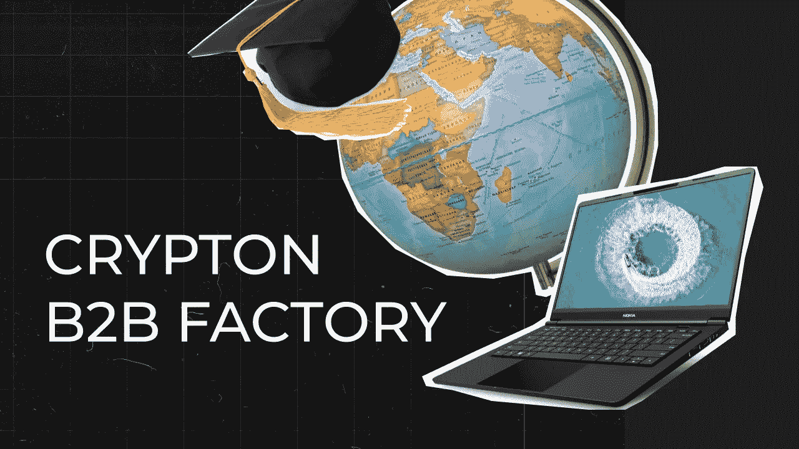

# Crypton 工厂 B2B

> 原文：<https://medium.com/coinmonks/crypton-factory-b2b-d5997ae271ff?source=collection_archive---------67----------------------->

正如你们大多数人所知，2021 年我们启动了 [Crypton Factory](https://factory.crypton.studio) 实习计划，对区块链开发领域的程序员进行再培训，并保证获得一份工作机会:要么在 [Crypton Studio](https://crypton.studio) 工作，搬到泰国，要么去一家欧洲合作公司工作，搬到我们在拉托维亚的办公室。

此外，我们为区块链公司的开发人员实施定制的再培训计划。

## 提供哪些领域的培训？

这完全取决于你的要求。我们可以组织:

*   *管理或行政* *课程*。

比如项目经理，分析师，设计师。

*   *开发课程。*

比如智能合约开发者，flutter，go。

*   *泛泛而谈地扎扎实实地谈这个或那个区块链。*

## 我们要教什么？

我们将专业地满足您的所有需求。接受我们的培训后，您的员工将会学到:

*   灵活适应变化
*   与区块链合作
*   做出非常规且可行的决策
*   看到自我发展的增长点

## 课程有多长时间？

它可以是一周的强化课程，也可以是 1-2 个月的完整课程。这取决于你的需求。

## 学习形式是什么？

讲座，有截止日期的实际任务，与 Crypton Studio 当前技术负责人的磋商。

## 为什么是我们？

Crypton Studio 进入国际市场已超过 6 年，是欧洲最大的区块链公司。我们从经验中了解到，找到一个有价值的区块链开发者很难，适应密码行业永无止境的变化就更难了。所以我们创建了 Crypton 工厂，现在我们自己培训开发人员！

[联系我们订购:)](https://t.me/elenasolidity)