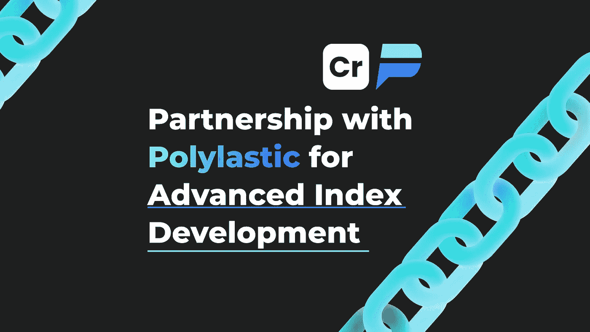

# Crypton Studio 很高兴宣布与 Polylastic 合作开发高级索引

> 原文：<https://medium.com/coinmonks/crypton-studio-is-pleased-to-announce-a-partnership-with-polylastic-for-advanced-index-development-cebe0416a18e?source=collection_archive---------70----------------------->

[Polylastic](https://medium.com/u/5cf14b881f98?source=post_page-----cebe0416a18e--------------------------------) 是一个数字金融指数，旨在提供加密货币市场中最好的指数。该指数基于由赌注者的数量以及代币的市值衡量的社区支持的价值来加权。

这种新颖的机制使他们能够抓住技术创新和社区力量。Polylastic 将跟踪具有大量使用和需求的项目，以及那些显示出充满活力的社区和对持续发展的承诺的项目。де

***我们，***Crypton Studio 的团队将提供一个专门的团队来协助确保 Polylastic indices 不仅在功能和用户体验方面，而且在安全性方面达到最高标准。

Crypton Studio 非常感谢并乐意与 Polylastic 合作。我们希望这将尽可能富有成效。

网址:[https://polylastic.io/](https://polylastic.io/)

其他链接:[https://linktr.ee/polylastic](https://linktr.ee/polylastic)

> 加入 Coinmonks [电报频道](https://t.me/coincodecap)和 [Youtube 频道](https://www.youtube.com/c/coinmonks/videos)了解加密交易和投资

# 另外，阅读

*   [比诺莫评论](https://coincodecap.com/binomo-review) | [斯多葛派 vs 3Commas vs TradeSanta](https://coincodecap.com/stoic-vs-3commas-vs-tradesanta)
*   [Capital.com 评论](https://coincodecap.com/capital-com-review) | [香港的加密借贷平台](https://coincodecap.com/crypto-lending-hong-kong)
*   [如何在 Uniswap 上交换加密？](https://coincodecap.com/swap-crypto-on-uniswap) | [A-Ads 评论](https://coincodecap.com/a-ads-review)
*   [WazirX vs CoinDCX vs bit bns](/coinmonks/wazirx-vs-coindcx-vs-bitbns-149f4f19a2f1)|[block fi vs coin loan vs Nexo](/coinmonks/blockfi-vs-coinloan-vs-nexo-cb624635230d)
*   [本地比特币审核](/coinmonks/localbitcoins-review-6cc001c6ed56) | [加密货币储蓄账户](https://coincodecap.com/cryptocurrency-savings-accounts)
*   [什么是保证金交易](https://coincodecap.com/margin-trading) | [美元成本平均法](https://coincodecap.com/dca)
*   [支持卡审核](https://coincodecap.com/uphold-card-review) | [信任钱包 vs 元掩码](https://coincodecap.com/trust-wallet-vs-metamask)