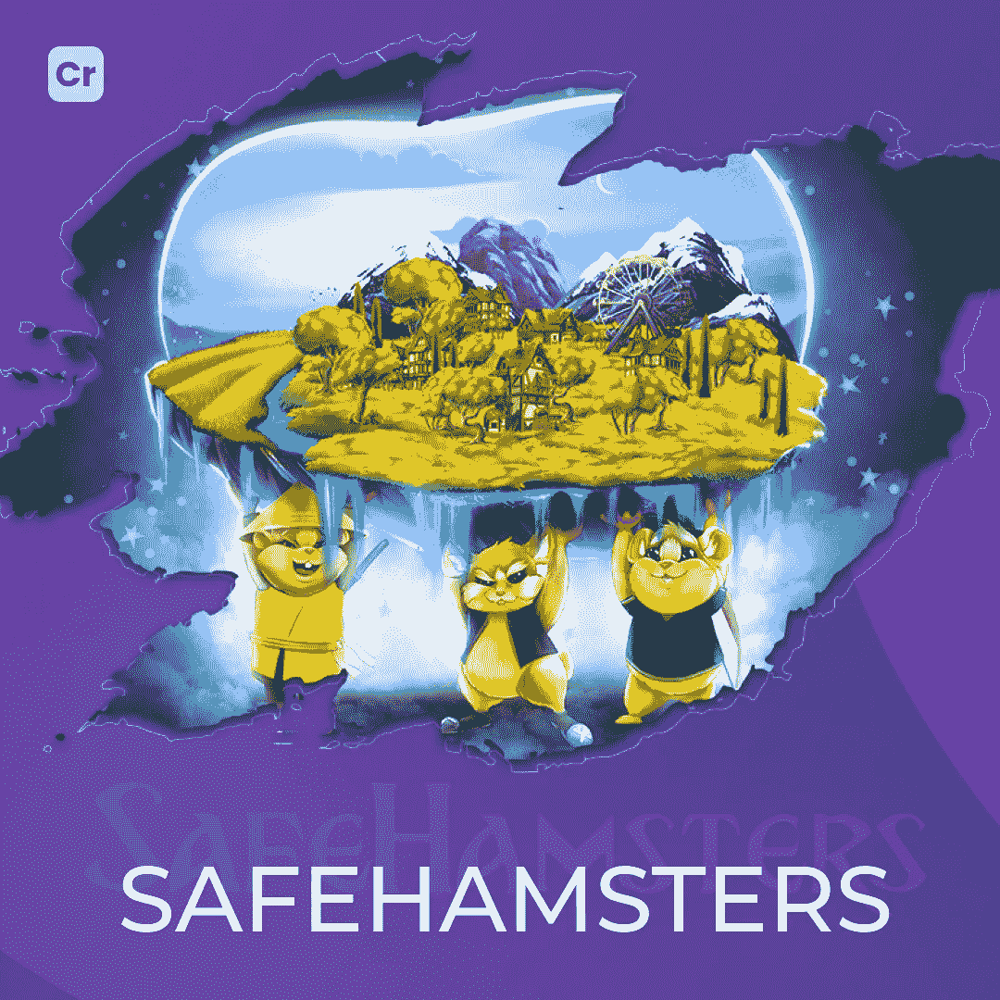

# Crypton 工作室的项目

> 原文：<https://medium.com/coinmonks/crypton-studios-project-3137df51bf15?source=collection_archive---------71----------------------->

你好！我们决定告诉你更多关于我们项目的事情。让我们从安全仓鼠开始。

[Safehamsters](https://safehamsters.io) 是一款基于区块链的多人冒险游戏。

客户的任务是开发一个适合整个区块链生态系统的网站:一个交换者、一座桥梁和一个市场。

这个项目是在很短的时间内在 BNB 区块链从零开始创建的。

[Crypton Studio](https://crypton.studio) 的工作是开发智能合约，使用户能够为平台代币及其交易提供流动性。Crypton Studio 还开发了 NFTs 市场，用于在区块链生态系统中交易不可替代的代币。建造了连接 BSC 和 HECO 区块链的跨链桥。

总而言之，一堆技术:

用户界面—网络

框架— Vue 3、Web3

编程语言—打字稿、可靠性

在[我们的网站](https://crypton.studio)上阅读[关于 Crypton 工作室工作的完整文章](https://crypton.studio/blog/SafeHamsters)。

> 加入 Coinmonks [电报频道](https://t.me/coincodecap)和 [Youtube 频道](https://www.youtube.com/c/coinmonks/videos)了解加密交易和投资

# 另外，阅读

*   [MXC 交易所评论](/coinmonks/mxc-exchange-review-3af0ec1cba8c) | [Pionex vs 币安](https://coincodecap.com/pionex-vs-binance) | [Pionex 套利机器人](https://coincodecap.com/pionex-arbitrage-bot)
*   [我的密码交易经验](/coinmonks/my-experience-with-crypto-copy-trading-d6feb2ce3ac5) | [比特币基地评论](/coinmonks/coinbase-review-6ef4e0f56064)
*   [CoinFLEX 评论](https://coincodecap.com/coinflex-review) | [AEX 交易所评论](https://coincodecap.com/aex-exchange-review) | [UPbit 评论](https://coincodecap.com/upbit-review)
*   [AscendEx 保证金交易](https://coincodecap.com/ascendex-margin-trading) | [Bitfinex 赌注](https://coincodecap.com/bitfinex-staking) | [bitFlyer 点评](https://coincodecap.com/bitflyer-review)
*   [麻雀交换评论](https://coincodecap.com/sparrow-exchange-review) | [纳什交换评论](https://coincodecap.com/nash-exchange-review)