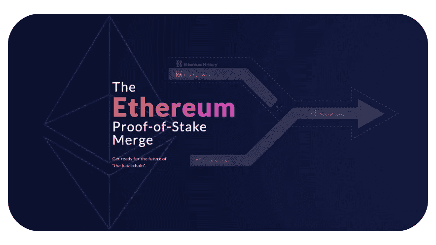
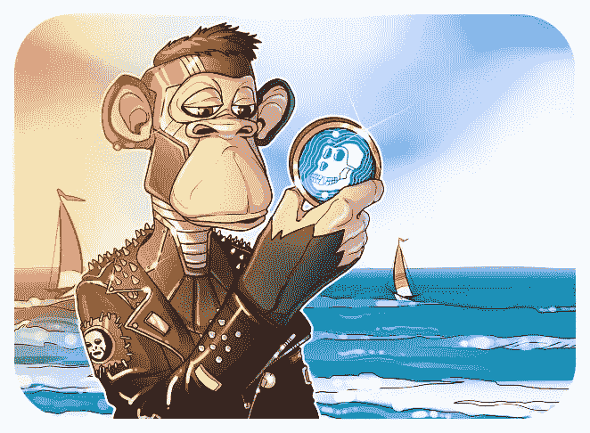
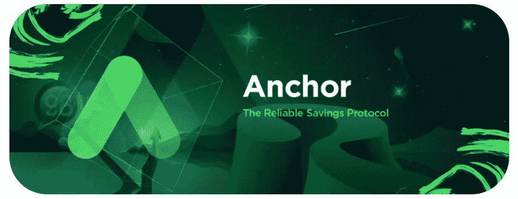
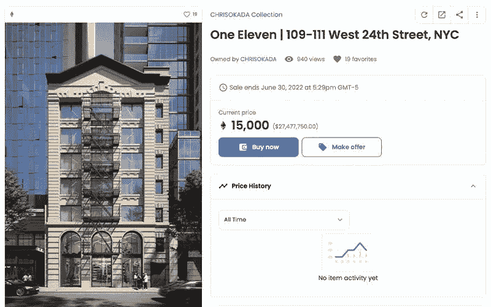
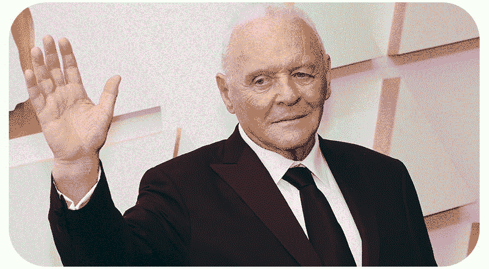

# 2022 年 6 月 9 日的“加密新闻”新闻摘要

> 原文：<https://medium.com/coinmonks/cryptonews-news-summary-for-09-06-2022-bc49cc332da5?source=collection_archive---------16----------------------->

## 简要介绍区块链工业的主要新闻

由于 Ropsten 测试网络合并，✔️以太坊离 Eth2 更近了一步

**周三晚上，以太坊与 Ropsten 测试网络成功合并，使世界上最大的区块链智能合约更接近成为一个利益证明(PoS)网络。**

以太坊最古老的测试网络之一 Ropsten 已经成功地将工作证明(PoW)执行层与 PoS 信标链合并。

此次合并是 [Eth2](https://ethereum.org/en/upgrades/) 升级的一个重大里程碑， [Ropsten](https://ropsten.etherscan.io/) 是 Beacon Chain 与主要以太坊网络合并之前的最后一批测试网络之一，预计将于 8 月初推出。

PoW 需要处理能力和能量来测试网络，而 PoS 网络由将加密货币放入网络的节点来测试。

向 Eth2 的迁移有望显著提高网络效率，使以太坊社区的成员能够解决导致费用激增的网络拥塞问题。以太坊在出版时以 1801 美元的价格易手。

✔️纽约州发布美元稳定货币发行者指南

**以对加密货币发放许可证的严格态度而闻名的纽约州金融服务局，声称是该国第一个对稳定货币发行者提出要求的监管机构。**

纽约州金融服务局(DFS)周三发布了对受 DFS 监管的实体发行的美元支持债券的监管指导。根据 DFS 的说法，这是美国第一个对稳定的硬币发行者施加这种预期的监管机构。

指南中的要求与赎回、储备和证明有关。在这些条件下，稳定币必须在每个营业日结束时用准备金全额抵押，发行人必须有赎回政策，由 DFS 事先书面批准，使持有人有权用美元赎回稳定币。

此外，发行人的准备金必须与其自有资产分开，并由美国国债或州或联邦机构的存款组成。注册会计师必须每月对准备金进行审查。

该准则仅适用于受 DFS 监管的发行人和在本州经营的有限目的信托许可证持有人。这些公司目前是 Paxos 信托公司，发行了 [Pax 美元(USDP](https://coinmarketcap.com/currencies/paxos-standard/#:~:text=USDP%20Price%20Live%20Data,trading%20volume%20of%20%2419%2C046%2C635%20USD.) )和[币安美元(BUSD](https://www.binance.com/en/busd))；双子星信托公司，[双子星美元(GUSD)](https://www.gemini.com/dollar) 的发行人；以及 GMO-Z.com 信托公司，Zytara Dollar (ZUSD) 的发行人。该准则不适用于 DFS 监管实体可能列出的其他稳定账户。

纽约州的 [BitLicense](https://en.wikipedia.org/wiki/BitLicense) ，一种 DFS 许可证，是出了名的难以获得，并且受到了纽约市长[埃里克·亚当斯](https://en.wikipedia.org/wiki/Eric_Adams)的批评。当 2015 年许可证推出时，一些加密公司搬到了其他州。DFS 计划今年将其虚拟货币团队的规模扩大两倍，作为其计划的一部分，以“消除监管过程中的延迟，确保虚拟货币部门的卓越表现。”

道投票结果:ApeCoin 留在以太坊生态系统

**经过六天的投票期，最终结果勉强显示，53.59%的**[**APE coin**](https://coinmarketcap.com/currencies/apecoin-ape/)**参与者赞成中期留在以太坊，共交付 710 万枚 APE 代币。**

ApeCoin DAO 是一个确保 ApeCoin (APE)持有者民主权利的治理系统，ApeCoin 是一种与 Bored Ape 游艇俱乐部生态系统相关的数字资产，它于 5 月 2 日发表了一份正式提案，讨论该资产是否应该留在以太坊，转而使用第二层替代方案，或者或许探索迁移其区块链。

ApeCoin 改进提案(AIP)名为“AIP-41:让 ApeCoin 留在以太坊生态系统中”，由 BAYC 2491，即 ASEC 创建，并从许多事件中汲取灵感，包括暴力切碎 [Otherdeed](https://opensea.io/collection/otherdeed) 和随后的[宇迦实验室](https://www.yuga.com/)行动。

宇迦实验室在 Otherdeeds 元类宇宙中出售土地的灾难性后果导致了对以太坊燃气费机制的财务限制的仔细检查，并促使 ApeCoin 社区的主要成员表达了他们对 ApeCoin 的固定供应合同和可扩展性潜力的担忧。

天然气战争的影响以及缺乏财务整合或完整性随后又因宇迦实验室计算不当的操纵性推文而加剧，该推文声称，“似乎很明显，ApeCoin 需要迁移到自己的网络才能适当扩展，”以及“我们希望鼓励 DAO 开始朝这个方向思考。”

尽管宇迦实验室提出了恳求，但 AIP-41 强烈反对从以太坊迁移，称“目前做出这样的决定太困难、太昂贵”，可能会伤害他们在 NFT 容量和文化采用量最大的网络中根深蒂固的存在。

> “我们，ApeCoin DAO，认为，至少目前，ApeCoin 应该留在以太坊生态系统中，而不是迁移到其他地方的 L1 网络或不受以太坊保护的侧链。”

提案总票数为 380 万赞成留在以太坊(53.59%)，330 万反对。这一结果并不是最终结果，可能会在三个月的宽限期内提交新提案时进一步考虑。

✔️锚开发商声称已警告道权关于不可接受的利率

“一开始我以为它会坏掉。”B 先生是 Anchor lending protocol 的主要开发者，他表示，该平台的设计利率仅为 3.6%，但在最后一刻改变了 20%。

据主要开发商在接受韩国媒体 JTBC 采访时表示，锚协议最初设计的利率为 3.6%，但在发布前一周，利率增加到了 20%，以吸引更多投资者。

> “我不知道它会有这么高的利率。就在发布前一周，我们开始承诺 20%，”这位在韩国报道中被称为 b 先生的员工说。我从一开始就认为它要崩溃了。(我设计的)，但是 100%崩了。"

B 先生说，该平台的设计利率仅为 3.6%，这是保持 Terra 生态系统稳定的关键因素，因为它占了 Anchor 战争基金的可用资金。

然而，B 先生报告说，在推出前一周，开发商得知计划已经改变，而是让投资者获得非常高的 20%的利率，同时在 Anchor 的协议中锁定他们的 UST Stablecoins。

JTBC 还声称收到了 Terraform Labs 开发的内部设计文件，这些文件谈到用高利率吸引投资者。

该开发商表示，在 2019 年 4 月发布前不久，它试图与 Terra Luna 创始人 Do Kwon 讨论这个问题。

> “就在上映前，我向 CEO 权斗铉建议降低利率，但他不同意。”

Terra (LUNA) 和算法稳定币 UST 的戏剧性下跌导致韩国政府在 6 月份计划创建一个新的数字资产委员会来监管该国的密码行业，负责政策准备和监督。

五月中旬，韩国国会就此问题召开听证会，会上传唤了权一行。

法庭文件显示，就在 LUNA 坠毁前几天，他解散了韩国的 Terraform Labs，之后他发现自己陷入了困境。

据报道，韩国当局还在 5 月份向 Terraform Labs 的员工发出传票，以确定是否存在故意操纵价格的行为，以及代币是否经过了适当的上市程序。

尽管如此，Terra 的联合创始人还是设法在 5 月 28 日以新名称 Terra 2.0 (Pheonix-1)重启了崩溃的网络，旨在复兴堕落的 Terra (LUNA)和 TerraUSD (UST)。

✔️ Coinbase Prime 在 Solana 网络的交易处理方面存在问题

**机构投资者经纪服务公司比特币基地 Prime 在将 SOL 加密货币转移到冷钱包方面遇到了问题，原因是上周一个漏洞导致索拉纳的网络离线。这是由蜻蜓资本管理合伙人 Hasib Qureshi 报道的。**

服务团队强调客户的资产是安全的。用户可以向现有的钱包存款，现有的堆叠者将继续获得奖励。

6 月 1 日， [Solana network](https://solana.com/) 由于处理“长期无目标交易”失败，连续四个多小时未能产生新的区块，导致共识破裂。开发人员禁用了这种类型的事务，并要求验证人员重新启动区块链。

长期非目标交易(持久交易随机数)在加密货币交易所中最受欢迎。该功能是为使用复杂的自动签名设置的令牌持有者设计的，由于这些设置，他们不能总是快速准备交易以便在区块链中注册。

例如，在两台独立设备上签署交易的托管人可能没有时间在一台区块链上完成工作。在这种情况下，正常的 Solana 网络事务会失败，但是上面的特性允许您绕过这个限制，提前脱机注销。

Solana 开发人员解释说，当采取“纠正措施”时，他们将启用长期非目标交易。该功能将在下次软件更新时激活。

✔️:纽约的一栋建筑正以 NFT 的名义出售

总部位于美国的 Okada & Company 将其首个商业地产作为 NFT 在 OpenSea 交易大厅挂牌交易，价格为 1.5 万瑞士法郎(合 27，836，400 美元)。

NFT 给予买方使用该建筑的专有权利。然而，你不能只买一个代币，就立即获得建筑物的所有权；您仍然需要执行传统的所有权转让文件来完成交易。

✔️梅赛德斯-AMG 宣布推出 NFT

一级方程式车队和 FTX 将全年免费制作 NFT“票根”，这是梅赛德斯-AMG 马来西亚国家石油公司比赛门票的艺术复制品。

在 2022 赛季的五场比赛中，大多数比赛的 2500 张免费 NFT 票根和 1000 张限量 NFT 票根将与几位艺术家合作制作。

✔️演员 Anthony Hopkins 成为了几个 NFT 的所有者

两届奥斯卡奖得主安东尼·霍普金斯已经将自己推特账户的名字改为 AHopkins.eth。根据 EtherScan 的说法，AHopkins.eth 这个域名是在 5 月份购买的，但这位演员当时还没有购买 NFT。然而，在霍普金斯公布钱包地址后，用户们给他送了一些可收藏的代币作为礼物。

霍普金斯更新了他的推特资料，写信给其他知名人士——说唱歌手[史努比·道格](https://en.wikipedia.org/wiki/Snoop_Dogg)，女演员[瑞茜·威瑟斯彭](https://en.wikipedia.org/wiki/Reese_Witherspoon)，喜剧演员兼电视主持人[吉米·法伦](https://en.wikipedia.org/wiki/Jimmy_Fallon)——帮助他决定是否购买 NFT。

***订阅*** [***斐波那契***](/@unclefibonacci) ***我来保持最新***

> 加入 coin monks[Telegram group](https://t.me/joinchat/Trz8jaxd6xEsBI4p)学习加密交易和投资