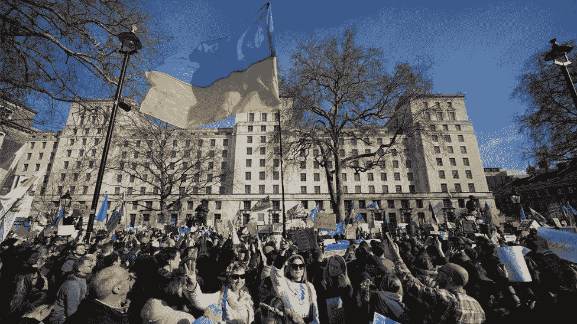
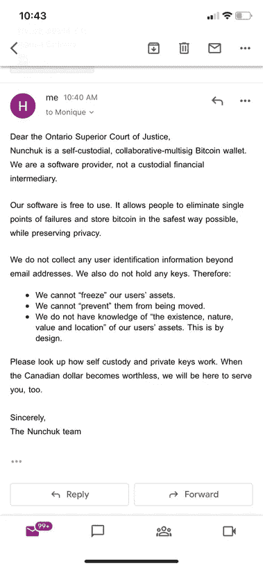
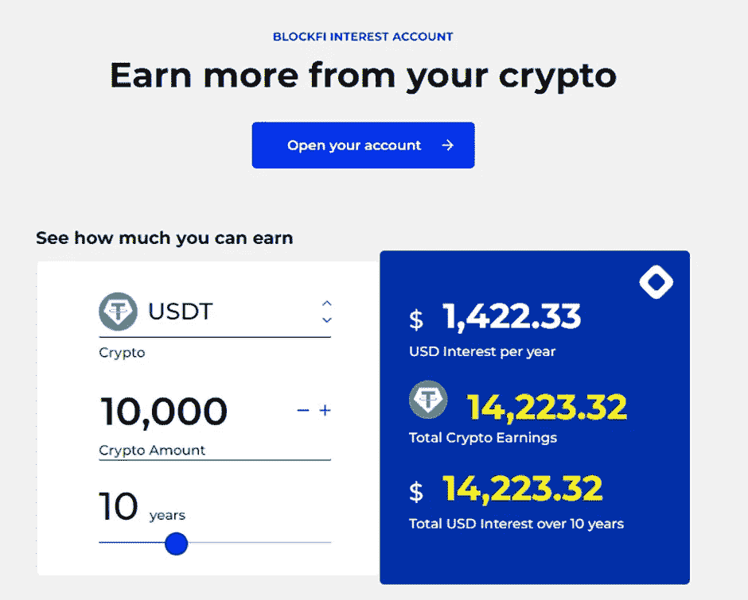

# 密码之夜——密码一周[5]

> 原文：<https://medium.com/coinmonks/cryptonight-a-week-in-crypto-5-dfc001aa0113?source=collection_archive---------17----------------------->

## (21/02–26/02)

# 市场简介

> 俄罗斯入侵乌克兰；俄罗斯军队驻扎在首都基辅、南部的奥德萨和东北部的哈尔科夫。
> 
> 西方制裁了俄罗斯个人、银行和公司，并切断了几家俄罗斯银行与 SWIFT 的联系
> 
> 受战争消息影响，俄罗斯 MOEX 指数下跌 45.7%，此后反弹 46.2%，至 2470.48 卢布，本周收跌 15.1%。
> 
> 然而，在俄罗斯入侵的消息传出后，美国股市于 2 月 24 日周四低开。以科技股为主的纳斯达克综合指数(Nasdaq Composite)本周收盘较周二开盘时上涨 2.04%。标准普尔 500 上涨 1.58%。布伦特原油本周上涨 1.89%，收于每桶 98.63 美元，此前曾短暂触及每桶 105.6 美元，为约七年来的最高水平。
> 
> 本周金价较周二下跌 1.33%
> 
> 比特币交易价格为 39，278.15 美元(截至 27/02/22)，从暴跌 34，529.45 美元中恢复，本周收盘上涨 2.45%

# 俄罗斯入侵乌克兰，市场下跌

世界上最糟糕的情况已经发生:俄罗斯入侵乌克兰。周五，乌克兰首都基辅遭到俄罗斯导弹袭击，军队抵达基辅 Obolon 区，距离市中心 9 公里。俄罗斯军队正从乌克兰北部、东部和南部入侵，试图围困重要城市。作为对此次袭击的回应，西方大国对俄罗斯个人、银行和公司实施了各种制裁，以阻止俄罗斯发动战争。

欧盟、美国及其盟友已同意切断几家俄罗斯银行与全球领先的安全金融信息服务提供商 SWIFT 的联系，以进一步将俄罗斯孤立于国际金融体系之外，同时将对欧洲的影响降至最低。有报道称，西方正在考虑冻结俄罗斯央行 6400 亿美元的外汇储备——尽管这一消息未经证实。不幸的是，这些制裁是对已经在乌克兰土地上进行的战争的反应，俄罗斯可能已经对其经济进行了压力测试，以准备像这样的制裁。

地缘政治风险和不确定性正处于历史最高水平，这给市场带来了进一步压力，市场正面临美联储更加强硬以抗击通胀的前景。俄罗斯和乌克兰之间的战争将给西方带来通胀压力。我们看到布伦特原油突破 105 美元，这是七年来的最高价格。考虑到对俄罗斯石油生产商的各种制裁，特别依赖俄罗斯天然气的国家，如德国(32%由俄罗斯供应)，将很难保持稳定的流入。因此，随着全球供应的中断，油价可能会继续上涨。在通货膨胀已经达到几十年来最高水平的时候，战争造成的通货膨胀压力将影响全球各国。考虑到美联储的量化宽松计划将在未来几周内结束，预计 3 月份将加息，他们控制通胀飙升的任务变得更加复杂。一方面，紧张的劳动力市场和 40 年来最高的通胀率正促使美联储倾向于鹰派行动，如加息并开始抛售 8.9 万亿美元的美国国债和抵押贷款支持证券。另一方面，战争的通胀压力，加上美国消费者信心的五个月低点(考虑到消费者支出占美国的近 70%，这是个问题)，可能会动摇最鹰派的美联储官员。

市场已经开始摆脱入侵的最初冲击。2 月 24 日，俄罗斯 MOEX 指数下跌 45.7%，至 1689.95 卢布，但此后已回升 46%，至 2470.48 卢布。标准普尔 500 下跌 4%，至 4119.18 美元，反弹至 4384 美元。以科技股为主的纳斯达克综合指数(Nasdaq Composite)和道琼斯工业平均指数(Dow Jones industrial average)自 24 日的本地低点以来分别上涨了 7.86%和 5.16%(使用 2 月 26 日的价格)。受战争消息影响，比特币下跌 11.88%，至 34500 美元，此后有所回升，短暂触及 40000 美元。

这让比特币何去何从？嗯，在这场地缘政治动荡中潜伏着一些宏观事件，可能会成为比特币普及的催化剂。第一个(我将在下面讨论)是特鲁多颁布紧急法案，并利用加拿大银行系统对付本国公民。这是一个令人惊讶的证明，即使在最自由的西方经济体，国内政治也可能恶化到政府利用法律来对付其政敌的地步。在这种情况下，国家和金钱的分离显然对公民有利。乌克兰开始接受加密货币捐赠，使世界上任何人都能在几分钟内转移资金。截至 2 月 27 日，他们已收到 59622 BTC(235 万美元)、1730.85 瑞士法郎(487.9 万美元)和 931443 USDT。

然而，比特币的无状态本质是福也是祸。如果世界上任何人都可以自由进入全球货币体系，那么国家的任何“敌人”也可以。我们生活在一个依赖于以美元为基础的全球货币体系的社会，这是外交工具箱中的一个主要工具；不友好国家进入替代系统的能力可能是一个问题。

普京是这一问题的典型例子。在所有西方国家最严厉制裁的威胁下，俄罗斯仍入侵乌克兰。过去几十年来，制裁一直在自由实施——只要看看美中贸易战就知道了。最终，依赖以美元为基础的货币体系的制裁成本将超过收益，各国自然会想方设法绕过这一体系。俄罗斯自 2020 年以来一直在开发数字卢布，旨在减少该国对美元的依赖。它将允许俄罗斯实体在国际银行体系之外，与任何愿意进行数字货币交易的国家进行交易，尽管存在制裁。此外，比特币开采将为俄罗斯提供一个绝佳的机会，弥补因其石油出口而受到的制裁。我在上一篇时事通讯中提到了这一点:2021 年 8 月，俄罗斯占全球 BTC 杂凑率的 11.2%。2021 年开采了 310，000 枚 BTC，如果我们假设这个散列率全年不变，那么平均而言，俄国将开采 34，720 枚 BTC。在撰写本文时，比特币价格徘徊在每枚 39400 美元左右，这意味着俄罗斯的矿业收入将达到约 13.68 亿美元。在 68789.63 美元的历史高点上，这一矿业收入将达到 24 亿美元。这与俄罗斯的石油出口值(2021 年为 1101 亿美元)不可同日而语，但或许在未来十年可能会达到。这完全是猜测，但认为俄罗斯没有考虑制裁可能产生的影响以及规避制裁的机会仍然是天真的。

[https://www.bbc.co.uk/news/uk-60536064](https://www.bbc.co.uk/news/uk-60536064), PA Media

# 比特币在加拿大是自由的

2021 年 11 月，特鲁多宣布从 2022 年 1 月起对加拿大跨境卡车司机进行强制检疫。在这次检疫之后，政府出台了一项命令，要求加拿大跨境卡车司机接种新冠肺炎疫苗，这引发了全国性的抗议活动(尽管主要集中在渥太华)。经过近三个星期，这些抗议活动终于结束了。我不会对这些指令发表意见，因为它们非常有争议，但我会强调比特币在增强人们权能方面的作用，特别是在动荡时期。

为了阻止这些抗议活动，特鲁多政府援引了《紧急状态法》，该法授予政府在国家危机时期的额外权力。这些权力使银行能够冻结与抗议活动有关的任何人的个人账户，无论是实际抗议还是捐款。这引发了抗议者的愤怒，他们开始使用比特币作为交易媒介，因为它不在政府管辖范围内。没过多久，加拿大政府就要求加密公司冻结抗议者的资金和地址。这种要求是可能的，因为这些公司具有受监管和集中的性质，法律要求这些公司收集 KYC 和反洗钱信息，并受法律约束。受欢迎的中央加密货币交易所北海巨妖的首席执行官建议个人将他们的数字资产从交易所转移到非托管钱包，在那里用户可以单独控制公钥/私钥。

安大略省高级法院(Ontario Superior Court of Justice)向比特币自保管钱包 Nunchuk 发送了一份 Mareva 禁令，命令他们冻结并披露与抗议活动有关的资产信息。以下是他们在推特上发布的官方回应:

[https://twitter.com/nunchuk_io/status/1494885897577271299/photo/1](https://twitter.com/nunchuk_io/status/1494885897577271299/photo/1)

双截棍队的反应真好。我个人最喜欢的是最后一句话，“当加元变得一文不值时，我们也会在这里为你服务”。这很可能不会发生，肯定不会很快发生。然而，这一回应凸显了比特币的自由主义特征，它将权力从中央集权转移到人民手中。无论是获取个人信息还是冻结个人资金，没有哪个权力机构能够对非托管钱包施加压力。比特币是世界上第一种将货币和国家分离的货币。

# 比特币作为对冲现代金融世界最大尾部风险的工具

我在 twitter 上看到了这个，它太好了，不能不包含在这个时事通讯中。詹姆斯·拉维奇([https://twitter.com/jameslavish](https://twitter.com/jameslavish))功不可没。

2022 年 1 月，美国和英国的 CPI 分别上涨了 7.5%和 5.5%。这些数字是疫情方面推出的量化宽松和刺激措施，加上全球供应链短缺的结果。CPI 的积极变化意味着生活成本在上升，这侵蚀了你银行账户中每单位法定货币的购买力。不理想。或许，不太理想的是现代金融界最大的尾部风险——法定货币的全面崩溃。

什么会导致法定货币的崩溃？嗯，通货膨胀——以及提高联邦基金利率——可能不足以冷却经济，因为导致通货膨胀的因素不在美联储的控制范围内。本周，俄罗斯入侵乌克兰，导致布伦特原油价格达到每桶 105 美元——这是近七年来的最高价格。石油是经济中的主要投入因素，用于基本活动，如运输燃料和家庭取暖。当一种投入要素的价格上涨时，最终产品的价格也会上涨，从而导致通货膨胀。此外，供应链的中断和经济中商品需求的增加导致价格飙升。所有这些在经济体中蔓延，导致持续的通货膨胀。如果美联储决策失误，通货膨胀失控，该怎么办？恶性通货膨胀，一系列快速、过度和失控的价格上涨，极其罕见，但并非闻所未闻。恶性通货膨胀的最新受害者是委内瑞拉，国际货币基金组织报告 2018 年委内瑞拉的通货膨胀率为 929，790%。因此，为了论证起见，让我们假设美国经历了恶性通货膨胀(毕竟美元没有任何东西支撑，不是黄金，也不是石油，只是对政府的信心)。外国实体对美元的购买力失去信心，停止购买美国国债，美国债券市场崩溃，因为投资者对美国政府能够偿还债务失去信心。

我不是说法定货币会崩溃。尾部风险事件位于结果分布曲线的最外边缘，这意味着虽然不太可能，但它们是可能的；如果它们发生，通常是灾难性的。比如在海洋里游泳就有尾部风险。从逻辑上来说，你游泳并回到岸上，但是从统计上来说，你有可能被鲨鱼袭击。可能性极小，但仍有可能。因此，为了保护自己免受这种罕见事件的影响，你需要一种保险，这正是比特币对美元崩溃的影响。怎么会？随着美元崩溃，人们将把他们的法定货币转换成资产和健全的货币。我想到了黄金，但比特币是稳健货币的最佳选择。它的供给是有限的，是无限可分的，并且容易转移。

因此，假设作为一名投资者，你将 1%的净资产投资于比特币，我们就进入了美国的恶性通货膨胀时期。想想看，现在你投资组合的 99%都是以美元计价的股票、债券、房地产等。变得几乎没有价值(显然比这复杂得多，这只是一个例子)。与此同时，随着投资者将资产转化为可靠的货币，比特币取代了美元作为储备货币，并获得了几乎所有的全球 M2 供应量(130 吨)。因此，比特币的市值将增至 130.742 万亿美元，是目前市值的 176 倍(这忽略了摩擦成本和流动性影响，只是为了演示)。因此，你的投资组合非但没有变得一文不值，反而上涨了 76% (99%的投资组合收益为 0，1%的 BTC 上涨了 176 倍，投资组合总回报率为 176%)。

这是一个不可思议的场景，但是值得吗？在我看来，是的(不是理财建议)。这样做，你就有了保险——尾部风险被消除了。如果美元没有崩溃，那么你的投资组合中只有 1%是比特币，比特币在未来几年可能会继续升值。

# BlockFi 被美国监管机构罚款 1 亿美元

据彭博援引知情人士的话说，加密贷款平台 BlockFi 预计将向美国证券交易委员会(SEC)支付 5000 万美元，并向各州监管机构另外支付 5000 万美元，BlockFi 上周一证实了这一消息。

处罚是围绕该平台的贷款计划进行的，特别是 BlockFi 的利息账户(BIA)，该账户允许用户在 APY 出借他们的密码以获得回报。该平台提供各种加密货币和稳定货币的借贷，包括比特币、索拉纳、以太坊、USDT 和 USDC；显而易见，这种产品为什么受欢迎。下面是一个截图，提供了贷款 10，000 美元 USDT 的年回报率为 1，422.33 美元，相当于 14.2233%的回报率——这在传统储蓄账户中是闻所未闻的。

这些处罚是在美国当局继续关注和审查该国金融监管之外的加密贷款活动之际实施的。这项和解只涉及美国客户的 BIA 产品，他们的其他产品，包括钱包、个性化收益率、贷款和信用卡不受影响。已经开立 BIA 的美国客户将继续获得利息，但是不能增加新的基金，美国的新客户也不能开立 BIA。美国以外的消费者仍可以开立新账户并存入资金。

BlockFi 首席执行官扎克·普林斯(Zac Prince)在推特上透露了一些情况。他指出，客户资金受到保护，不会用于支付和解费用，并表示 BlockFi 正在向美国证券交易委员会(SEC)注册 BlockFi yield，这是一种新的加密计息证券。

> *加入 Coinmonks* [*电报频道*](https://t.me/coincodecap) *和* [*Youtube 频道*](https://www.youtube.com/c/coinmonks/videos) *了解加密交易和投资*

# 另外，阅读

*   [有哪些交易信号？](https://coincodecap.com/trading-signal) | [Bitstamp vs 比特币基地](https://coincodecap.com/bitstamp-coinbase) | [买索拉纳](https://coincodecap.com/buy-solana)
*   [ProfitFarmers 点评](https://coincodecap.com/profitfarmers-review) | [如何使用 Cornix 交易机器人](https://coincodecap.com/cornix-trading-bot)
*   [十大最佳加密货币博客](https://coincodecap.com/best-cryptocurrency-blogs) | [YouHodler 评论](https://coincodecap.com/youhodler-review)
*   [my constant Review](https://coincodecap.com/myconstant-review)|[8 款最佳摇摆交易机器人](https://coincodecap.com/best-swing-trading-bots)
*   [MXC 交易所评论](/coinmonks/mxc-exchange-review-3af0ec1cba8c) | [Pionex vs 币安](https://coincodecap.com/pionex-vs-binance) | [Pionex 套利机器人](https://coincodecap.com/pionex-arbitrage-bot)
*   [我的密码交易经验](/coinmonks/my-experience-with-crypto-copy-trading-d6feb2ce3ac5) | [比特币基地评论](/coinmonks/coinbase-review-6ef4e0f56064)
*   [CoinFLEX 评论](https://coincodecap.com/coinflex-review) | [AEX 交易所评论](https://coincodecap.com/aex-exchange-review) | [UPbit 评论](https://coincodecap.com/upbit-review)