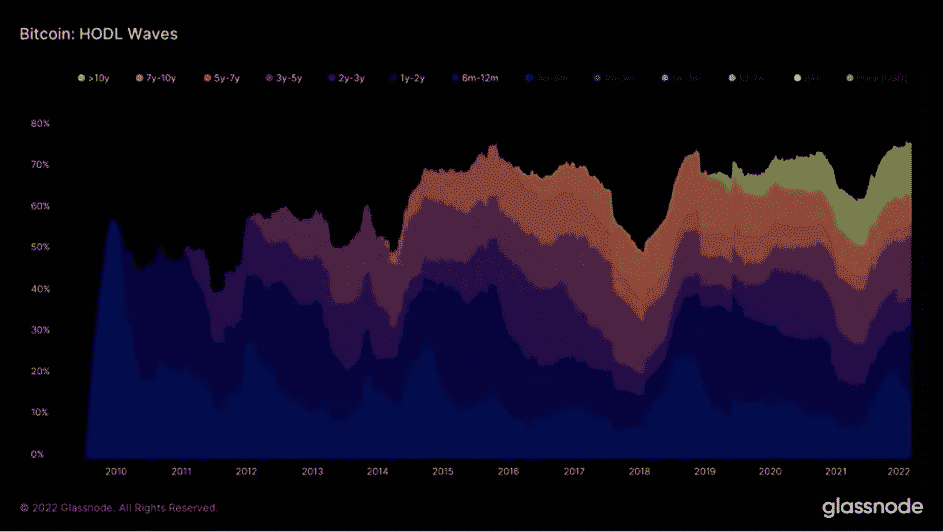
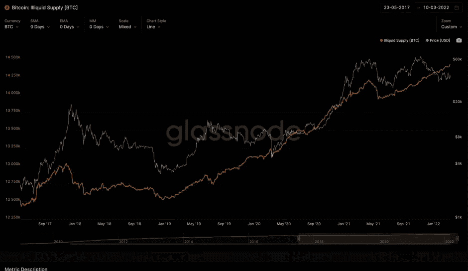
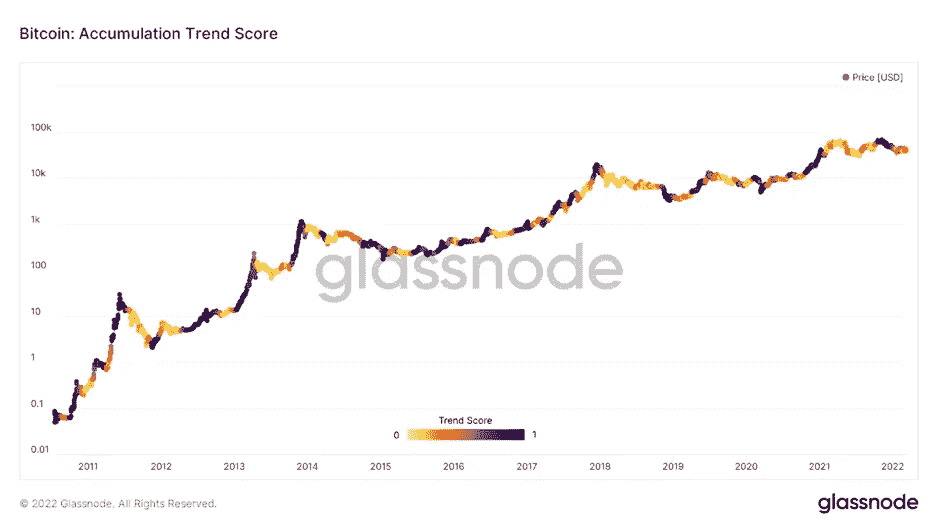
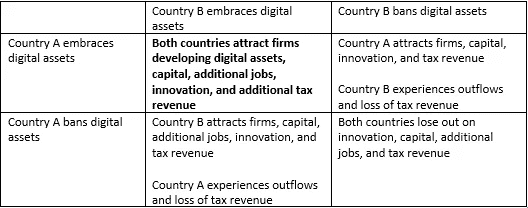

# 密码之夜——密码一周[6]

> 原文：<https://medium.com/coinmonks/cryptonight-a-week-in-crypto-6-6d2a7c377cf?source=collection_archive---------41----------------------->

## (07/03–11/03)

# 市场简介

> 俄罗斯继续炮击乌克兰，最近袭击了一家妇婴医院和波兰边境附近的一个军事训练基地。
> 
> 西方继续制裁俄罗斯个人、银行和公司。美国和澳大利亚已经禁止进口俄罗斯的天然气和石油；英国寻求在 2022 年底前消除俄罗斯石油进口。
> 
> 拜登签署了一项行政命令，旨在保护美国消费者和投资者，减轻系统性风险，防止通过加密进行非法融资，并促进美国在数字资产行业的领导地位。
> 
> VIX 上周五收盘时比周一开盘时低 5.45%，表明本周的担忧情绪有所减轻。
> 
> 标准普尔 500 本周收盘价格比周一的开盘价低 2.84%，目前为 4，203.91 美元。以科技股为主的纳斯达克综合指数本周也下跌 3.71%，收于 12，835.53 美元。
> 
> 大宗商品价格下跌，但仍处于高位。布伦特原油本周一度触及每桶 132.85 美元，但收盘时较本周开盘价低 16.15%。小麦期货本周收盘下跌 16.73%，至 1，096.5 美元。在飙升 250%之后，伦敦金属交易所的镍交易仍然暂停。
> 
> 金价本周收盘下跌 0.42%，至每盎司 1988.4 美元，尽管接近 2050 美元。
> 
> 比特币无法持有 42，000 美元，截至 3 月 13 日，比特币上涨 1.36%，至 38，975.49 美元。

# 总体前景

就市场前景而言，过去两周没有太大变化。俄罗斯的持续入侵导致大宗商品价格飙升。自战争开始以来，布伦特原油上涨了 14.7%，小麦期货上涨了 24.5%，镍上涨了 250%。对俄罗斯的制裁加剧了通货膨胀(尽管拜登政府会试图让你相信这是推动通货膨胀的唯一因素)，看起来西方不会很快放松。上周，美国和澳大利亚(俄罗斯石油分别占国内消费的 2%和 1.2%)已经禁止进口俄罗斯石油；英国(俄罗斯石油占国内消费的 8%)将在 2022 年底取消俄罗斯石油进口。更依赖俄罗斯石油和天然气的其他欧盟国家，如德国(德国 32%的天然气进口来自俄罗斯)，一直不愿完全切断进口，因为这样做根本不可行。

周五，拜登宣布，美国与北约盟国、G7 和欧盟合作，取消了俄罗斯的“最惠国”地位。这一决定降低了俄罗斯的贸易地位，并对俄罗斯产品征收更高的关税。就与美国的贸易关系而言，这一地位将俄罗斯置于朝鲜和古巴的行列。除了俄罗斯的新贸易地位，拜登还承诺继续惩罚俄罗斯，禁止向俄罗斯出口奢侈品，禁止从俄罗斯进口海鲜、烈酒/伏特加和非工业钻石。

VIX 指数，通常被称为标准普尔 500 的“恐惧指数”，一直在 38 至 27 之间波动，目前位于 30.75。尽管 30.75 的 VIX 值几乎是 10 月和 11 月的两倍，但从历史上看，与危机期间的先前值相比，这是较低的。作为背景，VIX 在 2008 年 10 月全球金融危机期间达到 89.5，在 2020 年 3 月新冠肺炎疫情爆发期间达到 85.47。此外，CBOE 的纯股票看跌/看涨比率，表明股票衍生品交易的净方向(高看跌/看涨意味着更多的参与者正在购买看跌期权——通常是一个看跌信号)，其表现类似于 VIX，目前约为 0.66，尽管在 covid 爆发期间达到 1.25 的峰值。这两个信号都可能表明，我们尚未看到市场底部。

然而，从链上的角度来看，比特币看起来很强劲。创纪录的 76.5%的比特币在至少六个月内没有移动过(图 1)，非流动性供应刚刚打破历史新高(图 2)。从短期来看，比特币的稀缺供应将导致波动性上涨和下跌。从长远来看，我认为我们会看到上升的趋势。支持这一说法的一个有趣指标是比特币累积趋势得分(图 3)。该指标反映了积极积累比特币的实体在其当前比特币持有量方面的相对规模。分数越接近 1(颜色越深)，表明较大的实体(或网络的较大部分)正在积累比特币，分数越接近 0，表明他们正在分发/没有积累比特币。流动性不足的供应处于历史最高水平，3 月 12 日的累积趋势分数为 0.185，因此大型实体似乎既没有累积也没有分发，这可以解释自 1 月以来比特币在 4.6 万美元到 3.2 万美元之间的波动。供应是稀缺的，但没有足够的需求进行牛市。宏观不确定性很高，投资者担心抓住潜在的下跌刀。比特币需要一个催化剂来开始牛市，最有可能的是 SEC 接受的现货 ETF 或另一个将比特币作为法定货币的国家/州。

Fig 1

Fig 2

Fig 3

# 拜登签署了一项加密行政命令

经过几个月的谣言，美国总统乔·拜登签署了一项行政命令，确保数字资产的负责任的创新。以下是所涵盖的关键要素的分类，以及这对加密市场意味着什么。

首先，行政命令要求采取措施保护美国消费者、投资者和企业。财政部和其他机构合作伙伴将制定政策建议，以解决数字资产的含义及其对金融市场的影响。第二，骑士团鼓励金融稳定监督委员会确定和减轻系统性金融风险，并制定应对这些风险的政策建议。第三，它旨在减轻非法使用数字资产造成的非法融资和国家安全风险。白宫还希望探索美国央行数字货币(CBDC)，如果发行被视为符合国家利益的话。我在以前的时事通讯中提到过 CBDCs，但我认为 CBDCs 和市民的利益是相互排斥的。这种货币的实施将使得对一个国家的大规模金融监控成为可能。尽管美国将声称中央银行不会被用来监控公民交易，但这样做的权力是存在的。在我看来，这种权力最终容易被滥用。最后，也是最重要的，该命令呼吁通过利用数字资产技术来促进美国在技术和经济竞争力方面的领导地位。美国希望成为这项新技术的创新中心。这将吸引投资者的投资，他们原本担心美国会宣布加密货币为非法，类似于中国的全国性禁令。有趣的是，我们开始目睹一个经典的囚徒困境在国家接受或禁止数字资产的问题上展开，类似于之前一篇关于民族国家比特币采矿的时事通讯中的游戏。

Prisoners Dilemma modeled for digital asset regulation

没有给每个结果分配量化的值，很明显这个游戏的纳什均衡是两国都拥抱数字资产并竞争吸引人才(粗体)。理由是，国家 A 和 B 没有理由不顾其他国家的反应而背离接受数字资产。拥抱这项技术并努力引领该领域是他们的最佳对策。各国竞相创新或落败只是时间问题。这场游戏似乎已经结束了。迪拜宣布，他们已经通过了一项初步的加密法律，并建立了一个独立的监管和许可机构。阿联酋总理兼迪拜统治者谢赫·穆罕默德·本·拉希德·阿勒马克图姆希望，通过《虚拟资产法》，迪拜能够“参与这个新兴且快速增长的全球领域的设计”。我想知道下一个是哪个国家/州。

# 美国通货膨胀达到 40 年来的最高点

美国劳工统计局(Bureau of Labor Statistics)2 月份的消费者价格指数(CPI)升至 7.9%，为 40 年高点。

这令人担忧。然而，更令人担忧的是，这一数据没有解释自俄罗斯入侵乌克兰以来大宗商品价格的异常飙升。上个月，小麦期货价格上涨 42%，布伦特原油价格上涨 20.6%，镍价格飙升 250%，伦敦金属交易所(LME)不得不暂停该商品的交易。看起来通货膨胀不会很快放缓，美联储几乎没有任何工具可以用来冷却经济。通常，当通货膨胀猖獗时，美联储会提高利率，以诱导消费者存钱和储蓄，而不是花钱。然而，现在提高利率可能会使经济陷入衰退。这给美联储留下了两个选择——要么让通货膨胀肆虐，要么冒着经济陷入衰退的风险。一方面，美联储可能会在全年采取更温和的货币政策，因为现在的衰退会认为所有防止整个疫情衰退的措施都是毫无价值的。另一方面，不按照投资者的预期加息将降低美联储的可信度，这是影响通胀预期的一个关键因素。在这种环境下唯一可以确定的是，现在没有人想成为杰罗姆·鲍威尔。

# 越来越多的机构开始让客户接触数字资产

尽管存在宏观不确定性，但机构越来越多地参与加密货币。全球第二大托管银行道富银行(State Street)与机构托管服务提供商 Copper 达成协议，开发并推出机构级数字资产托管产品。这一合作伙伴关系将使一家托管和/或管理资产超过 43 万亿美元、管理资产超过 4.1 万亿美元(AUM)的银行能够支持客户分配数字资产。此外，根据提交给美国证券交易委员会的监管文件，拥有 2.6 万亿 AUM 的高盛(Goldman Sachs)本周成为头条新闻，因为他们开始向客户提供银河数码(Galaxy Digital)发行的以太坊基金。以太坊基金已经向 28 个客户出售了超过 5000 万美元的资产，最低投资额为 25 万美元。

拜登的行政命令，加上机构兴趣的提高和更容易获得数字资产，对加密货币非常有利。从监管的角度来看，数字资产更加清晰只会吸引更多机构涉足这一资产类别。以养老基金为例。传统上，这些基金持有的投资组合中，60%的股票用于增长，40%的债券用于抑制波动。美国政府发行的每一只债券的实际收益率都是负的(不包括通胀保值债券)，大部分公司债也是如此；我预计机构和投资者都会寻求更好的回报。举个例子，想象一下，如果每个养老基金都将 5%的资产用于加密以抵御通胀。根据经合组织报告的数据，2020 年底，养老基金管理的资产超过 35 万亿美元。如果 35 万亿美元中的 5%分配给数字资产，行业市值将翻一番。我不能肯定地说这会发生，但如果发生了，我也不会感到惊讶。

# VanEck ETF 旨在投资黄金和数字资产的开采

在 3 月 3 日提交的监管披露文件中，VanEck 提出了一个黄金和数字资产采矿 ETF，投资于跟踪黄金采矿和数字资产采矿业务表现的指数中的证券。与 VanEck 或 BlackRock 提出的其他 ETF 一样，这种 ETF 不会直接投资于数字资产，也不会使用衍生品来模拟它们的价格行为。对于 ETF 来说，这似乎是一个奇怪的组合。通常，购买比特币和黄金的投资者对相反资产的看法截然不同。ETF 商店的总裁内森·杰拉奇(Nathan Geraci)形容他们的关系“剑拔弩张”。

这只 ETF 遵循了 VanEck 在 12 月份公布的黄金和比特币策略 ETF 建议。该基金将积极管理期货合约、交易所交易产品(etp)和其他与黄金或比特币相关的投资。除了这只 ETF，VanEck 还提供一只数字转型 ETF(持有加密交易所、矿业公司和其他数字资产相关公司的股票)和一只比特币策略 ETF(投资比特币期货合约)。美国证交会去年 11 月拒绝了 VanEck 提出的比特币现货 ETF，理由是无法防止欺诈和操纵行为，以及保护投资者和公众利益的做法。

总的来说，这是一个奇怪的组合，我不确定这只 ETF 会收到多少需求。然而，任何为传统投资者提供一些加密货币敞口的新产品都不能以任何方式阻碍该行业。

> 加入 Coinmonks [电报频道](https://t.me/coincodecap)和 [Youtube 频道](https://www.youtube.com/c/coinmonks/videos)了解加密交易和投资

# 另外，阅读

*   [Bookmap 点评](https://coincodecap.com/bookmap-review-2021-best-trading-software) | [美国 5 大最佳加密交易所](https://coincodecap.com/crypto-exchange-usa)
*   最佳加密[硬件钱包](/coinmonks/hardware-wallets-dfa1211730c6) | [Bitbns 评论](/coinmonks/bitbns-review-38256a07e161)
*   [新加坡十大最佳加密交易所](https://coincodecap.com/crypto-exchange-in-singapore) | [购买 AXS](https://coincodecap.com/buy-axs-token)
*   [红狗赌场评论](https://coincodecap.com/red-dog-casino-review) | [Swyftx 评论](https://coincodecap.com/swyftx-review) | [CoinGate 评论](https://coincodecap.com/coingate-review)
*   [投资印度的最佳密码](https://coincodecap.com/best-crypto-to-invest-in-india-in-2021)|[WazirX P2P](https://coincodecap.com/wazirx-p2p)|[Hi Dollar Review](https://coincodecap.com/hi-dollar-review)