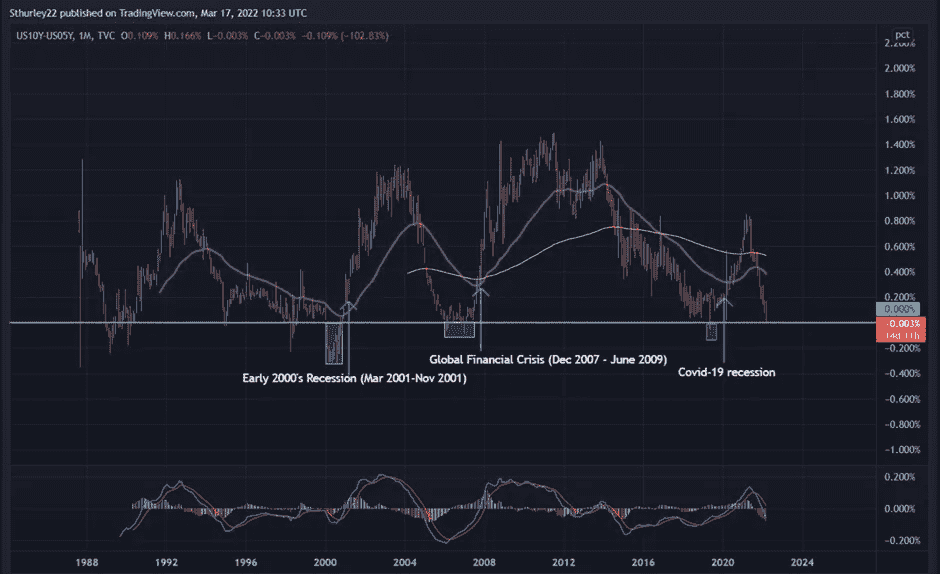
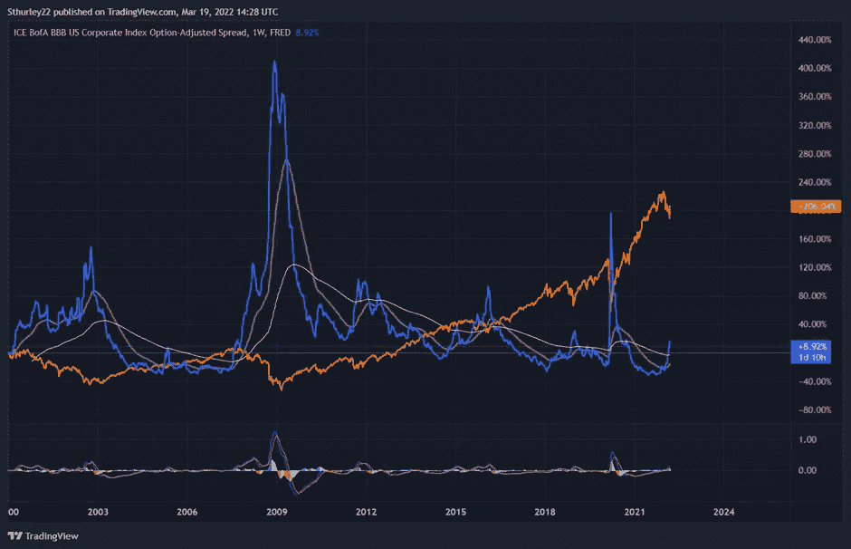
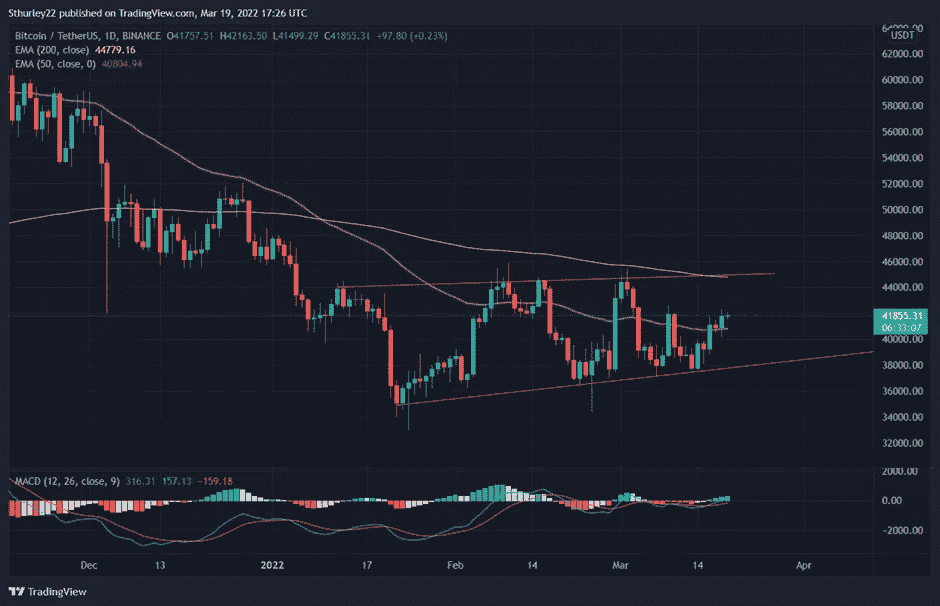
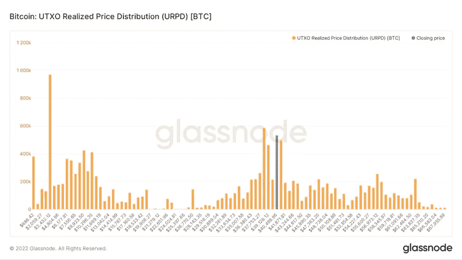

# Cryptonight — A week in Crypto [7]

> 原文：<https://medium.com/coinmonks/cryptonight-a-week-in-crypto-7-7aafdb7044d1?source=collection_archive---------55----------------------->

## (14/03–11/03)

# Market Brief

> Beijing in talks with Saudi Arabia over pricing oil in Chinese Yuan
> 
> Fed hiked rates by 25 basis points, the Bank of England raised rates to 0.75%
> 
> Vix closed 22.6% lower on Friday than when it opened on Monday
> 
> S&P 500 ended the week 6.23% above opening price on Monday, NASDAQ composite up 8.71% and Dow Jones Industrial Average up 5.04% off the back of Fed raising rates inline with inflation
> 
> Brent Crude ended the week up 1.28% at $107.71 a barrel, despite briefly sweeping $97.5\. Wheat futures were down -0.07% on the week. Nickel slid 23% after trading on the LME resumed. Gold fell by 2.83% throughout the week to $1,920.84
> 
> Bitcoin is still consolidating between $36,000 and $45,000, currently trading at $41,151.23

# China challenging the petrodollar?

Saudi Arabia, the second largest oil exporter behind the UAE, is in talks with Beijing about pricing some of its oil in Chinese Yuan for the sales to China. The discussion of yuan-priced oil has accelerated recently as the Saudis have grown unhappy with the lack of support from the US for their intervention in the Yemen civil war, and over the Biden administration’s attempts to strike a deal with Iran over its nuclear program.

US oil purchases from Saudi Arabia have diminished over the years, whereas China’s have grown, surpassing the US as the largest buyer of Saudi oil. China now accounts for more than 25% of Saudi oil exports (Saudi Arabia shipped on average 6.2 million barrels per day in 2021) and as such, could exert outsized influence on Saudi Arabia’s decision making. If priced in yuan, those sales would boost the standing of China’s currency and threaten the petrodollar system, which accounts for approximately 80% of global oil sales. This would be the first sale of Saudi oil in a currency other than the US dollar since 1974.

China may be interested in pricing oil in yuan to reduce the sanction cost of relying on the dollar; Russia has likely been a catalyst for this shift. Since Russia’s invasion of Ukraine, we’ve witnessed sanctions from the west on Russian individuals, banks, and businesses. One of the most significant sanctions, in my opinion, is the freezing of half of Russia’s $643 billion in central bank reserves. This move has altered the calculus for participants in the petrodollar system — why risk keeping your assets in a system enabling seizure? China is witnessing these sanctions bite and is taking action to mitigate the extent to which future sanctions could affect them. This is concerning considering the parallels drawn between Ukraine and Taiwan, both of which border large authoritarian nations. Beijing has long maintained that the self-governing island of Taiwan as part of its territory, and “reunification” likely high on the agenda for President Xi Jinping.

石油美元背后的想法是让全球石油贸易依赖于美元，创造对美元的需求，然后美元作为投资流回美国。美国已经成为世界上最有利可图的贸易的中间人。结果，美国制造了对美元的高需求，通过抵消不断增长的货币供应，相对抑制了通胀。这使得美国能够累积大量债务，而外国债权人却不会对还款价值失去信心。石油美元体系的崩溃将对美国造成损害。通胀将大幅上升(因为对美元的需求减少以抵消供应)，推高生活和商业成本。外国债权人可能会对美元失去信心，削弱美国滚转国债的能力，从而导致国家违约。值得注意的是，这都是最坏的情况，但它证明了石油美元的重要性。

发表在《制度经济学杂志》上的一项 2020 年的研究提出了四种潜在的未来货币结果:继续美元霸权；相互竞争的货币集团；一个国际货币联盟和国际货币无政府状态，在这种状态下，世界缩小成联系更少的岛屿。然而，还有第五种可能性——比特币标准，数字资产成为全球储备资产。比特币是中立的、去中心化的、可分的、易运输的、可验证的、稀缺的、抗集中控制的。任何有互联网连接的人都可以进入这个货币系统。如果全球对美元的需求减少，美国将无法为其过度的社会项目和军事开支提供资金。然而，法定货币和政府债务可能仍然存在，根据这些国家的经济实力和比特币地位定价。

诚然，我有点跑题了。尽管如此，这还是值得思考的。看看乌克兰战争如何影响美元霸权将是一件有趣的事情。

# 各国央行开始收紧货币政策

美联储周三上调了基准利率，幅度为 0.25 个百分点。这是自 2018 年以来的首次加息，市场普遍预计到了这一点，市场在消息公布后做出了积极的反应(标准普尔 500 自宣布以来上涨了 6.23%)。除了加息，该委员会还在今年剩下的六次会议上分别上调了利率，强调到今年年底联邦基金利率将达到 1.9%，比 12 月份高出整整一个百分点。在英国，英格兰银行本周也将利率从 0.5%上调至 0.75%，以试图对抗通胀，目前预计通胀率将在 6 月底达到 8%。

美联储主席杰罗姆·鲍威尔(Jerome Powell)表示，“委员会决心采取必要措施恢复价格稳定。美国经济非常强劲，有能力应对更紧缩的货币政策。鲍威尔确保了美国经济的“软着陆”,通货膨胀得到控制，利率上升不会引发衰退。然而，这对美联储来说将是困难的，因为他们收紧货币政策不是因为经济表现良好，而是因为迫切需要抑制猖獗的通货膨胀。美国经济增长率已经开始放缓——亚特兰大联邦储备银行(federal reserve bank of Atlanta)最近估计，2022 年第一季度的实际 GDP 增长率将为 1.3%，美国 ISM 制造业采购经理人指数自 2021 年第四季度以来一直在下降。

加息是为了减少经济中的总体支出，降低对商品和服务的需求，稳定价格。对消费者来说，获得抵押贷款、汽车贷款和信用卡贷款变得更加昂贵，对企业来说，筹集资本也更加昂贵。本质上，借钱和花钱变得更加昂贵。通常加息会对股票产生负面影响，尤其是高增长股票，因为贴现的未来现金流会减少。

经济状况的一个有趣指标是收益率曲线，即 10 年期和 2 年期国债之间的收益率差(尽管它可以针对任何不同期限但信用评级相同的债券进行计算)。周四，10 年期和 5 年期美国国债收益率曲线短暂反转(变为负值)(见图 1)。自 21 世纪初以来，这条曲线的每一次反转都先于一次衰退。10 年期和 2 年期国债之间的利差为正，但趋于平缓，为 0.212%(在撰写本文时)。短期国库券获得比长期国库券更好回报的能力对信贷市场有着严重的影响——为什么有人会为了更低的回报而拿自己的钱去冒险更长的时间呢？通常，美联储在收益率曲线反转后降息，以刺激经济——但目前利率为 0.08。我们正在接近零下限。

(fig 1– Yield Curve between 5 & 10 year treasury bills)

此外，企业信用利差(期限相同但质量不同的债券之间的收益率差)正在上升，这意味着企业的融资成本更高，因为偿还债务的成本正在增加。下图是 BBB 公司信用利差(图 2 中的蓝线)与标准普尔 500(橙线)的对比图。利差的上升似乎与标准普尔 500 的回落相一致(主要是由于这些公司的融资成本上升)。正如你所看到的，公司信用利差正在增加，这可能表明标准普尔 500 有更大的下行空间。

(fig 2 — BBB corporate credit spreads & S&P 500)

总体而言，信贷市场显示出疲软迹象，国债市场变得更加动荡和缺乏流动性，美联储已经结束了量化宽松。美联储可能会继续加息，直到金融市场崩溃，届时他们可能不得不采取更加温和的方式。

# 比特币仍在整合

这又短又甜。比特币的价格没有太大变化。我们仍在 36，000 美元至 45，000 美元之间盘整，我们自 1 月份以来一直在这样做。

(fig 3 — Bitcoin Price)

比特币的 URPD (UTXO 实现价格分布)显示了在每个指定价格区间内移动的现有比特币数量。有一大群比特币供应量在 36k 美元到 45k 美元之间波动(约占比特币供应量的 20%)，支撑着这段整合期。

(fig 4 — Bitcoin URPD)

# 俄罗斯债务危机

周三，俄罗斯避免了自 1998 年以来的首次债务违约。考虑到俄罗斯近一半的全球外汇储备已被西方冻结，市场担心俄罗斯将无法偿还以美元计价的债务。本周早些时候，俄国威胁要用卢布支付这笔外债，这将构成违约(假设在 30 天的宽限期内没有用美元支付)，尽管一些债券有后备条款，允许克里姆林宫在无法用美元支付时用卢布偿还这笔债务。周三，摩根大通在咨询美国当局后，处理了这些款项，并将其转给了花旗。俄罗斯的支付意愿导致这两种债券周五的交易价格为面值的 50%，高于一周前的 20%。然而，4 月份将有价值 20 亿美元的息票到期，全年还会有更多，俄罗斯有能力偿还这些债务吗？

分析师们担心，主权债务违约可能会产生蔓延效应，波及更广泛的经济领域。1998 年，俄罗斯出现债务违约，美国政府不得不纾困长期资本管理公司(Long-Term Capital management)，该公司对经济的过度敞口威胁到了更广泛的金融和银行体系的稳定。通常在违约后，债券持有人会得到新的债券，这些债券价值较低，但会提供一些补偿。考虑到西方禁止公民购买俄罗斯债券的制裁，尚不清楚这些债券是否会被允许。

> 加入 Coinmonks [电报频道](https://t.me/coincodecap)和 [Youtube 频道](https://www.youtube.com/c/coinmonks/videos)了解加密交易和投资

# 另外，阅读

*   [Bitsgap 审核](/coinmonks/bitsgap-review-a-crypto-trading-bot-that-makes-easy-money-a5d88a336df2) | [Quadency 审核](/coinmonks/quadency-review-a-crypto-trading-automation-platform-3068eaa374e1) | [Bitbns 审核](/coinmonks/bitbns-review-38256a07e161)
*   [密码本交易平台](/coinmonks/top-10-crypto-copy-trading-platforms-for-beginners-d0c37c7d698c) | [Coinmama 审核](/coinmonks/coinmama-review-ace5641bde6e)
*   [印度加密交易所](/coinmonks/bitcoin-exchange-in-india-7f1fe79715c9) | [比特币储蓄账户](/coinmonks/bitcoin-savings-account-e65b13f92451)
*   [OKEx vs KuCoin](https://coincodecap.com/okex-kucoin) | [摄氏替代品](https://coincodecap.com/celsius-alternatives) | [如何购买 VeChain](https://coincodecap.com/buy-vechain)
*   [币安期货交易](https://coincodecap.com/binance-futures-trading)|[3 comas vs Mudrex vs eToro](https://coincodecap.com/mudrex-3commas-etoro)