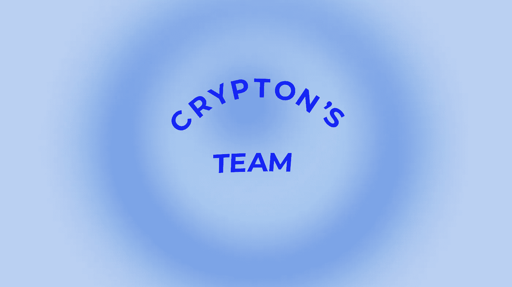
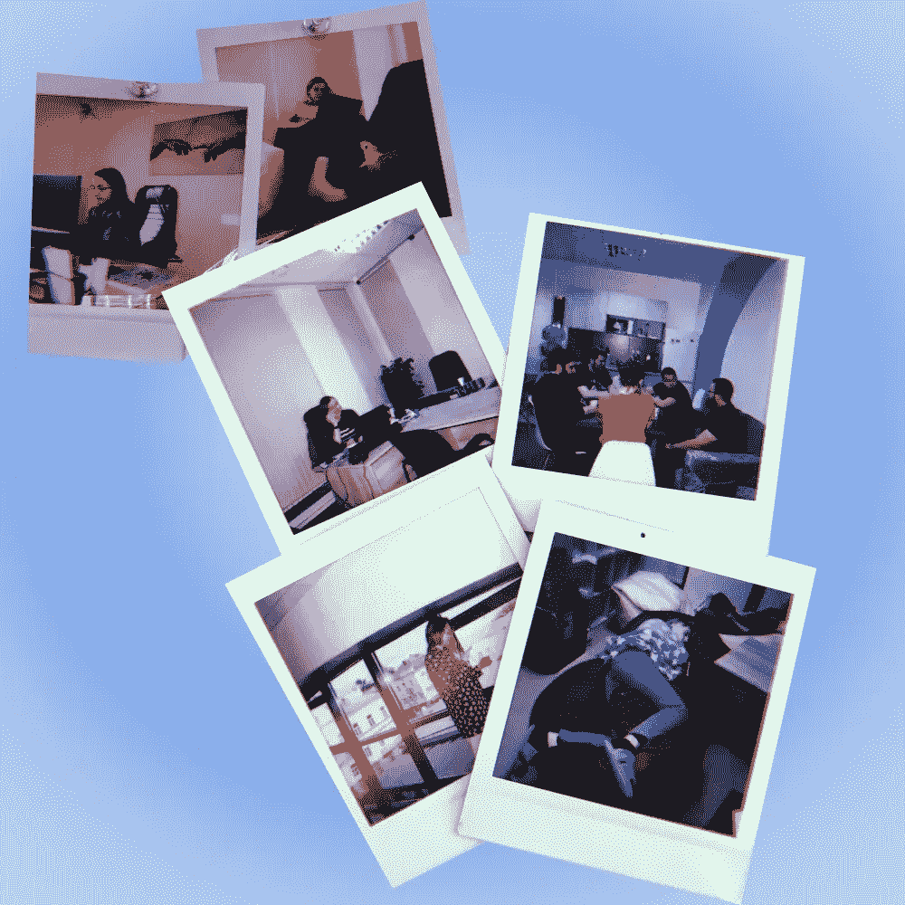

# Crypton 的团队

> 原文：<https://medium.com/coinmonks/cryptons-team-519bed89a97f?source=collection_archive---------66----------------------->

你已经知道 [Crypton Studio](https://crypton.studio) 是欧洲定制区块链开发领域最大的公司。由于人是公司发展的背后力量，今天我们将告诉你这个团队是如何组建的，以及是什么让公司在一年内增加了 130 多人。

首先，这一切都是从我们 HR 蜂开始的。对于安吉丽娜来说，她从人力资源部门开始，第一个任务就是招聘进公司。她组织了下班后的聚会、公司聚会和兴趣小组来介绍和召集这个呈指数级增长的团队。

所有这些都有助于加强 Crypton 的团队。目前，Crypton Studio 共有 **166** **人:3 名总监，1 名副总监，105 名开发人员，5 名设计师，6 名 DevOps，10 名 QA 工程师，4 名业务分析师，11 名项目经理，10 名销售(包括两名 lead generators)，5 名 HR，2 名营销人员，英语老师，律师，会计，办公室经理。以前，82 平方米对我们来说已经足够了，现在我们有一个两层楼的办公室，面积为 904 平方米**

安吉丽娜说，看到公司的变化，并成为这种增长的一部分，这是非常好的。此外，她相信一切都将继续在这方面和进一步。因此，我们不断成长，为所有员工创造最有利的环境。

我们可以帮助您实现项目，请[联系我们](https://crypton.studio/contacts)！

> 加入 Coinmonks [电报频道](https://t.me/coincodecap)和 [Youtube 频道](https://www.youtube.com/c/coinmonks/videos)了解加密交易和投资

# 另外，阅读

*   [如何开始通过加密贷款赚取被动收入](https://coincodecap.com/passive-income-crypto-lending)
*   [BigONE 交易所评论](/coinmonks/bigone-exchange-review-64705d85a1d4) | [电网交易机器人](https://coincodecap.com/grid-trading)
*   [氹欞侊贸易评论](https://coincodecap.com/anny-trade-review) | [CoinSpot 评论](https://coincodecap.com/coinspot-review)
*   [新加坡十大最佳加密交易所](https://coincodecap.com/crypto-exchange-in-singapore) | [购买 AXS](https://coincodecap.com/buy-axs-token)
*   [投资印度的最佳加密软件](https://coincodecap.com/best-crypto-to-invest-in-india-in-2021) | [WazirX P2P](https://coincodecap.com/wazirx-p2p)