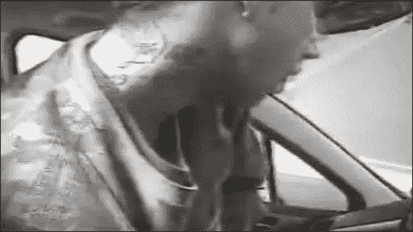
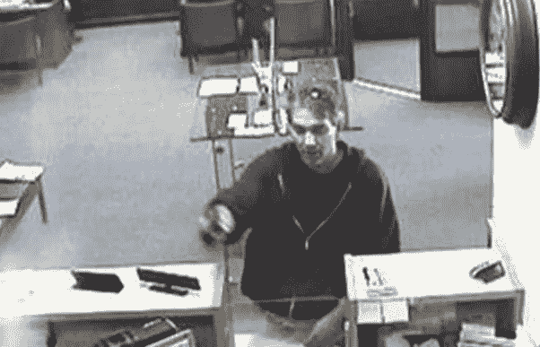
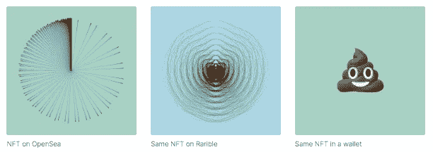

# 密码革命#18

> 原文：<https://medium.com/coinmonks/cryptorevolution-18-27a84bd7e02b?source=collection_archive---------5----------------------->

## 世纪骗局！

亲爱的朋友和订户:

你听说过英国“天才”窃贼吗？他闯入一辆警车，偷走了 GPS 设备，并确保车里的摄像头拍下了他脖子上纹有自己姓氏的全过程。

是的——警察没用 30 多分钟就找到了他，并再次逮捕了他……*。*你看，这个天才是个惯犯。

然而，美国人对此并不满意！

英国人也不甘示弱，一个名叫麦克阿瑟·惠勒的人灵光一现:

他想出了一个更好的办法来代替抢劫时戴面具。我说的更好，是指他心目中的更好的*。*

那么，还有什么比面具更好的呢？

在他的“电灯泡”时刻，他做了这个“开创性”的连接:

柠檬汁可以用来制造隐形墨水。

> *因此:脸上的柠檬汁=我隐形！*
> 
> 事实上，我赢了！

友情提示:我们在谈论一个完全成熟的 45 岁男人。

他用新发现的知识武装自己，用柠檬汁涂抹自己的脸，双眼布满血丝，然后在光天化日之下抢劫了两家匹兹堡银行。

是的，不是一家，而是两家银行。他自信地微笑着，从银行 1 走向银行 2。

**“别担心我有脸，只是看不见而已。现在把钱放在袋子里，”他边说边用枪指着出纳员的脸！**

他坚信自己的脸是隐形的，以至于当他走出银行时，他抬头对着监控摄像头微笑！

他给了他友好的邻居警察一张全脸照片——微笑！让它成为警察追踪他的奶酪蛋糕。

那天晚上晚些时候，当警察出现在他家时，Genius 先生很惊讶，并给他看了监控录像。

看完视频后，他处于震惊和完全不相信的状态，他咕哝道:

> **“但是我穿了果汁！”**

问:那么这和比特币、加密货币有什么关系呢？

答:没什么，今天的小寓言和 NFT 的……

你可以看到对不可替代代币的狂热。

> “他们在区块链老兄号上！永久！像琥珀里的苍蝇！”

事实证明，我们都被蒙上了一层柠檬，因为所有的 NFT 平台(除了一个),比如 OPENSEAS，都没有在区块链储存 NFT。

他们只存储一个链接，该链接指向他们的集中式平台，即存储 NFT 的服务器！

怎么了？

是的，你没看错。

所有关于 NFT 永久存在的传言都是胡说八道。不…其实更糟。这是骗人的谎言扯淡！

Signal 的创造者莫邪·马林斯派克刚刚发表了一篇关于它的令人惊叹的博客！

他发表了一个 NFT，根据你在哪个平台上看到它，它会有不同的显示。

***它会在你的钱包里显示为一个大便表情符号！是的，一个大便表情符号！***

💩

但这还不是最糟糕的。

糟糕的是，OpenSeas 管理员删除了他在平台上的 NFT

还有…

在他的钱包里！

这怎么可能呢？

> 但是——但是——琥珀里的苍蝇怎么样？！区块链是永久的！

没有。OpenSeas 只是一个和其他网站一样的网站。

他们卖给你一个超级链接，链接到他们服务器上的一个 NFT 文件！

像任何网站管理员一样，他们可以在任何时候以任何他们认为合适的理由删除你的账户和钱包里的东西。

世纪骗局！

**其他新闻，**这位亿万富翁说出了你需要知道的关于比特币的一切:

**底线:还早。马上上车。**

真诚地

埃里克·Z——你的实话实说者和“废话终结者”

附言

哦，那么实际上在区块链储存 NFT 的 NFT 平台是什么？——你知道——就像每个人都认为 NFT 做的那样？

[https://relayx.com/](https://relayx.com/)

在 BSV 区块链。

目前世界上唯一“真正”的 NFT 平台。

> 加入 Coinmonks [电报频道](https://t.me/coincodecap)和 [Youtube 频道](https://www.youtube.com/c/coinmonks/videos)了解加密交易和投资

## 另外，阅读

*   [n ave 零点回顾](/coinmonks/ngrave-zero-review-c465cf8307fc) | [Phemex 回顾](/coinmonks/phemex-review-4cfba0b49e28) | [PrimeXBT 回顾](/coinmonks/primexbt-review-88e0815be858)
*   最佳[区块链分析](https://bitquery.io/blog/best-blockchain-analysis-tools-and-software)工具| [赚比特币](/coinmonks/earn-bitcoin-6e8bd3c592d9)
*   [加密套利](/coinmonks/crypto-arbitrage-guide-how-to-make-money-as-a-beginner-62bfe5c868f6)指南| [如何做空比特币](/coinmonks/how-to-short-bitcoin-568a2d0b4ae5)
*   [比特币基地 vs 瓦济克斯](https://blog.coincodecap.com/coinbase-vs-wazirx) | [比特鲁点评](https://blog.coincodecap.com/bitrue-review) | [波洛涅克斯 vs 比特克斯](https://blog.coincodecap.com/poloniex-vs-bittrex)
*   [德国最佳加密交易所](https://blog.coincodecap.com/crypto-exchanges-in-germany) | [Arbitrum:第二层解决方案](https://blog.coincodecap.com/arbitrum)
*   [币安交易机器人](/coinmonks/binance-trading-bots-d0d57bb62c4c) | [OKEx 评论](/coinmonks/okex-review-6b369304110f) | [Atani 评论](https://blog.coincodecap.com/atani-review)
*   [最佳加密交易信号电报](/coinmonks/best-crypto-signals-telegram-5785cdbc4b2b) | [MoonXBT 评论](/coinmonks/moonxbt-review-6e4ab26d037)
*   如何在 Bitbns 上购买柴犬(SHIB)币？ | [买弗洛基](https://blog.coincodecap.com/buy-floki-inu-token)
*   [CoinFLEX 评论](https://blog.coincodecap.com/coinflex-review) | [AEX 交易所评论](https://blog.coincodecap.com/aex-exchange-review) | [UPbit 评论](https://blog.coincodecap.com/upbit-review)
*   [十大最佳加密货币博客](https://blog.coincodecap.com/best-cryptocurrency-blogs) | [YouHodler 评论](https://blog.coincodecap.com/youhodler-review)
*   [AscendEx 保证金交易](https://blog.coincodecap.com/ascendex-margin-trading) | [Bitfinex 赌注](https://blog.coincodecap.com/bitfinex-staking)
*   [最好的卡达诺钱包](https://blog.coincodecap.com/best-cardano-wallets) | [Bingbon 副本交易](https://blog.coincodecap.com/bingbon-copy-trading)