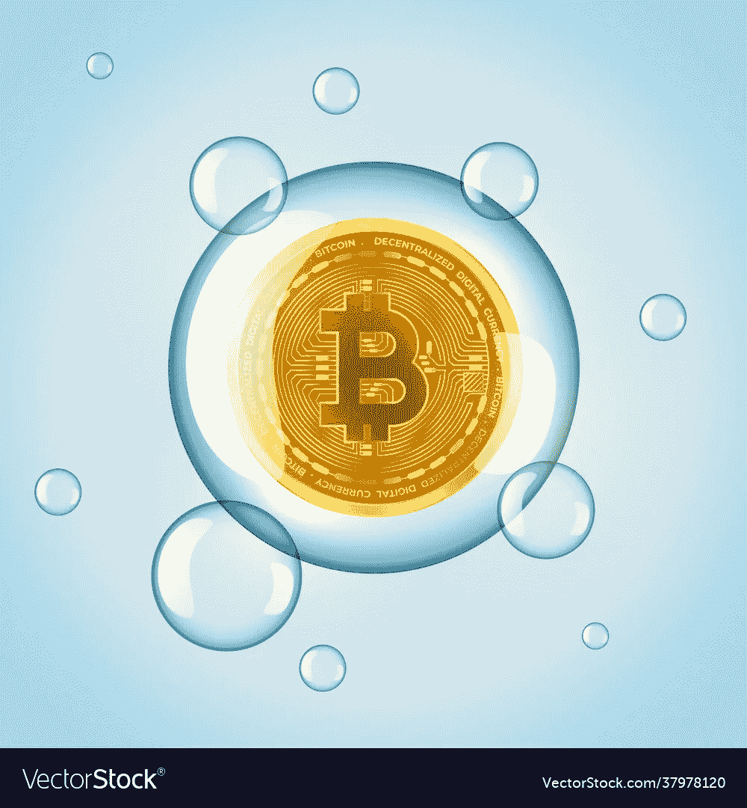

# 密码和 NFTs！整个市场是由 FOMO 和炒作推动的。

> 原文：<https://medium.com/coinmonks/cryptos-and-nfts-the-whole-market-is-driven-by-fomo-and-hype-6a99f0eddf46?source=collection_archive---------14----------------------->

在我给你看一些明显的危险信号之前。让我对底层技术做一个声明。

B lockchain 是一个高度安全的点对点网络架构，它有潜力取代互联网。它以其分散的结构、不变性、可追溯性和安全性肯定是有前途的。它解决了当今互联网的主要问题。

所以，学习技术，不要试图把你的头缠在迷因股票上。在你投资之前，问问你自己，我将要拥有的资产，它是否有我可以用当前市场价格来证明的内在价值？如果答案是否定的，那么这些短期资产很有可能变成长期负债。

如果你看看这两个市场！！你会注意到，这些市场是由炒作驱动的。这些市场形成了泡沫，而泡沫往往是由 FOMO 领导的——害怕错失良机。

Image Source: VectorStock

# **泡沫是如何形成的？**

我们看到其他人通过这些产品变得富有，我们开始评判自己。我们的人类行为开始将我们与他们进行比较，这是人类的心理。我们看到青少年，没有受过教育或没有金融知识的人变得比我们更好，变得更富有。

这就是贪婪和恐惧的来源。贪婪驱使人们想通过炒作赚更多的钱，恐惧导致了 FOMO 效应。越来越多的人投入到为该资产创造现金流并推高其价格的炒作中，随着越来越多的人加入其中，泡沫就变得越来越大。

这与 90 年代末网络泡沫遵循的模式完全相同。在这个时代，投资者将资金注入基于互联网的创业公司，希望赚些钱，这导致了崩溃。

# 泵和排放方案

这基本上意味着创造一个虚假的需求。这是经济学 101。不幸的是，抽取转储方案已经搞乱了加密和 NFT 世界。基本上，一群人购买 NFTs 或 cryptos，并在市场上创造一个虚假的需求，这抬高了产品的价格。一旦他们抬高价格，这些阴谋家就开始在价格高的时候抛售，而不知道发生了什么的人最终会持有所谓的数字资产，如果市场没有需求，这些资产就可能变得一文不值。

# **没有基本面或内在价值**

在你投资任何产品之前，确保该产品的当前市场价格是合理的，否则你就是在玩投机游戏。

拿任何股票来说，它们的价格都是合理的。我所说的数字是指公司的财务表现，是指公司的利润逐年增加，是指公司正在扩大市场，公司目前是否有任何债务，公司的市值是多少，公司拥有哪些产品和服务。而这些问题只是冰山一角。在你投资你的血汗钱之前，你可以验证“n”个基本原则。

这是 Cryptos 和 NFT 中所缺少的，这些是流言蜚语、社交媒体迷因和付费 YouTubers 的产物！一些社交媒体影响者甚至在创造他们自己的硬币。这太疯狂了。

我是说外面的一切都是垃圾吗？

不要！！一些数字产品具有无可非议的内在价值。例如，一个艺术家出售他的艺术。如果一个项目是一件收藏品，当然为什么不呢！

可能是歌手在卖他的歌曲版权，也可能是达芬奇在卖数码版的蒙娜丽莎。有价值的东西！！

# 众多的 NFT 和 Cryptos

在撰写本文时，有超过 10，000 种加密货币，并且每周(如果不是每天)都有新的加密货币加入这个市场。在这些池中，只有排名前 20 位的密码占据了 90%的市场份额。90%的加密货币仍在挣扎，人们每天都在增加新的货币。

同样的事情也发生在 NFT 身上，今天的密码朋克很出名，明天的密码猴子，兔子，机器人等等。不胜枚举。所以称其为独一无二毫无意义。创作者可以创造数十亿这样的数字艺术。

只有当你认为这些资产有价值，能给你带来利润而不被炒作扭曲时，你才会购买它们。炒作是推动产品价值的一个变量。如果它独立于产品的宣传和真正的内在价值，它的独特之处是什么。例如拥有迈克尔杰克逊的月球漫步的视频的权利，这些权利由 MJ 本人或任何授权方出售。

# 不稳定的行情

因此，如果它真的是一种货币，那么你就不会希望出现如此剧烈的价格波动。如今，加密货币只是投机货币。

以此为例，Dogecoin 的价格在 Elon Musk 的推文后飙升，当他在 SNL 上称之为 hustle 时，价格暴跌。

如果我早上花 1000 美元买了一部 iPhone，到了晚上，它的价格下跌了 10%。现在，仅仅因为一种货币的价格变化，同样的手机就要多花我 10%的钱。

是的，市场是不稳定的，但货币不应该。货币是基础对象，每一项资产和负债都是根据货币的价值进行交易的。因此，汇率波动和市场波动不可能同时发生。人们必须保持稳定以保持经济的稳定。

# 过度投机

投机仍然可以，但过度投机是一个大危险信号。在这里，人们继续交易市场，每个人都希望获得更多的利润，从而抬高产品的价格。是价格变化的速度！

# 烫手山芋投资

烫手山芋是一种游戏，一群人一边玩音乐，一边互相扔东西或土豆。当音乐停止时，拿着土豆的玩家被淘汰，最后最后一个拿着土豆的人得到一个土豆。因此，在投资游戏中，人们购买 NFT 是期望将来有人会以高于他们支付的价格购买 NFT。这将使你摆脱烫手山芋，他们将获得可观的利润。这里的问题是，人们只看到他们感兴趣的产品的宣传，而不知道这个产品的实际价值。最后，获胜者只能得到一个土豆，而不是他们认为的金条。这种投资是由两种人类情感驱动的。

> 贪多赚少，怕吃亏。不幸的是，这两种情绪造成市场波动，导致不可预测性。

只是不要投资你不完全了解的东西。在你发疯之前先学着点。

在 Linkedin 上找到我

 [## Rikam Palkar -软件工程师-小天鹅-威德福| LinkedIn

### 通过编写可伸缩的代码让世界变得更美好。我从来没有在大学里发现我对编码的热情，也没有在…

www.linkedin.com](https://www.linkedin.com/in/rikampalkar/) 

# 明智地研究、学习和投资。

> *加入 Coinmonks* [*电报频道*](https://t.me/coincodecap) *和* [*Youtube 频道*](https://www.youtube.com/c/coinmonks/videos) *了解加密交易和投资*

# 另外，阅读

*   [Bookmap 评论](https://coincodecap.com/bookmap-review-2021-best-trading-software) | [美国 5 大最佳加密交易所](https://coincodecap.com/crypto-exchange-usa)
*   最佳加密[硬件钱包](/coinmonks/hardware-wallets-dfa1211730c6) | [Bitbns 评论](/coinmonks/bitbns-review-38256a07e161)
*   [新加坡十大最佳加密交易所](https://coincodecap.com/crypto-exchange-in-singapore) | [购买 AXS](https://coincodecap.com/buy-axs-token)
*   [红狗赌场评论](https://coincodecap.com/red-dog-casino-review) | [Swyftx 评论](https://coincodecap.com/swyftx-review) | [造币厂评论](https://coincodecap.com/coingate-review)
*   [投资印度的最佳密码](https://coincodecap.com/best-crypto-to-invest-in-india-in-2021)|[WazirX P2P](https://coincodecap.com/wazirx-p2p)|[Hi Dollar Review](https://coincodecap.com/hi-dollar-review)
*   [加拿大最佳加密交易机器人](https://coincodecap.com/5-best-crypto-trading-bots-in-canada) | [库币评论](https://coincodecap.com/kucoin-review)
*   [火币加密交易信号](https://coincodecap.com/huobi-crypto-trading-signals) | [HitBTC 审核](/coinmonks/hitbtc-review-c5143c5d53c2)
*   [如何在 FTX 交易所交易期货](https://coincodecap.com/ftx-futures-trading) | [OKEx vs 币安](https://coincodecap.com/okex-vs-binance)