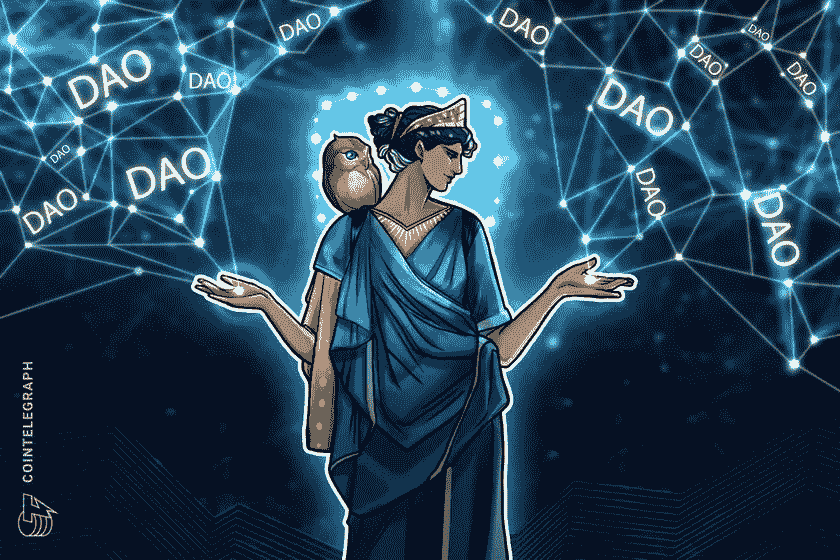

# 隐型:分散的自治组织(XCC 道)

> 原文：<https://medium.com/coinmonks/cryptotypes-decentralized-autonomous-organization-xcc-dao-85c557b8ae83?source=collection_archive---------36----------------------->

**概述**

分散自治组织(DAO)是一种规则被编码为计算机程序的组织，它是透明的，由其成员管理，不受中央政府的影响。“Dao 是与世界各地志同道合的人进行协作的一种高效、安全的方式”。Dao 是由其成员集体拥有和管理的企业。它允许每个人都有发言权，并防止操纵数字，因为一切都是公开的。交易记录保存在区块链上。区块链提供了一个安全的数字账本来跟踪互联网上的数字交互。

**为什么是刀及其好处**

在当今时代，我们需要 Dao 的原因有很多。最重要的原因是，许多新的组织需要大量的资金，这需要来自人们的信任，你可能很难通过互联网互动。随着 DAOs 的引入，您不需要担心信任任何人，因为整个概念是基于去中心化的。你所需要的只是 DAO 的代码，它是 100%透明的，任何人都可以验证。

与传统组织相比，Dao 为其成员提供了多种好处。首先，你不需要信任组织中的任何特定个人。因为一切都是公开的，所以很难操纵数字。Dao 通常有一个扁平的、完全民主化的层级组织结构。任何事情都不需要人工处理，因为一切都是以分散的方式自动处理的。所有活动都是透明和完全公开的。因为 DAO 在计算机程序上工作，所以人们不能改变组织的规则，这是传统组织中的首席执行官可以做到的。这就是在一个道中不存在高层管理人员滥用权力的地方，这种情况在传统组织中很常见。

**弊端**

尽管 Dao 有很多好处，但是它们也面临着一些缺点。首先，它们容易受到黑客的攻击。由于 DAO 在以太坊上工作，如果黑客侵入 DAO 并窃取 ETH，组织将会损失相当多的资源。其次，Dao 容易出现编程错误。如前所述，由于 Dao 处理智能合同和代码，如果编程中有错误，那么组织的结构、运作方式和其他操作可能是不正确的。因为没有大多数成员的同意，代码不能被改变，一个不正确的代码可能导致巨大的损失。

**刀的工作原理**

为了以更简单的方式理解道，可以把慈善看作道的一种形式。

运营慈善机构的人“可以接受世界上任何人的会员资格和资金，该组织完全控制捐款的支出”。没有一个人负责捐钱。任何人都可以捐款，同样，管理慈善机构的成员和捐款人都有责任决定把钱花在哪里。

Dao 的工作基于智能合同。“合同规定了组织的规则。该合同在以太坊上有效，除了投票外不能更改。没有小组的批准，任何成员都不能试图花钱”。如果任何人试图篡改代码或做一些超出代码规则和逻辑的事情，都将失败。这是非常重要的事情，因为它确保没有一个人可以滥用组织的资源。此外，这些事实也突出了权力下放的重要性，因为不需要一个中央机构。团队作为一个整体一起做决定，只有当大多数成员投票赞成某件事时，才继续进行。

**道空间中最大的令牌**

现在我们已经详细了解了什么是去中心化自治组织(DAO ),因此有必要指出几个属于这一类别的著名加密货币。

”[颁布](https://www.decred.org/)是自主数字货币。它采用混合共识体系，旨在成为一种去中心化、可持续和自治的货币”。Decred 是在牢记安全性、适应性和可持续性等属性的基础上推出的。Decred 是最大的分散自治组织令牌，在整个 DAO 市场中大约占 44%的权重。

[以太坊名称服务](https://ens.domains/) (ENS)是最普遍采用的区块链命名标准，允许对钱包、网站和其他数字资产进行分散命名。ENS 允许用户使用传统的域名和分散的网站，为他们所有的地址取一个名字。ENS 是第二大 DAO 令牌，在整个 DAO 市场中占 15%的份额。

Aragon(ANT)是一个建立在以太坊网络上的分散式平台，它提供了一种模块化的方式来开发和操作分散式自治组织、密码协议和 dApps。“ANT ERC-20 令牌的持有者将能够管理 Aragon 网络”。它是 DAO 空间中的第三大令牌，占 8%的权重。

" [Badger DAO](https://badger.com/) 是一个去中心化的自治组织(DAO)，允许比特币在 DeFi 应用中用作抵押品"。“獾的主要角色是刀。任何拥有 BADGER ----社区的治理象征----的人都有权对社区提案进行投票。它是 DAO 空间中的第三大令牌，占 8%的权重。

[安普尔福思](https://www.ampleforth.org/)的目标是创造一个更安全、更有弹性的金融生态系统。

“Ampleforth 协议和 forth DAO 由＄Forth 令牌(Forth 是 Ampleforth 的(AMPL)治理令牌)的持有者来治理。建议和想法在 discord 或我们的公共论坛上出现，并在部署到链上时定稿”。Ampleforth 在 DAO 空间中大约占 4%的权重。

**结论**

总的来说，Dao 越来越受欢迎，预计其空间还会增长。它们通过提供一种新的组织运行方式，即以分散的方式运行，彻底改变了组织的存在方式。尽管它们有某些缺点，但好处大于它们，有助于解决传统层级组织中存在的问题。如上所述，Decred 是最大的 DAO 令牌，除此之外，其他著名的 DAO 包括以太坊名称服务、Aragon、Badger DAO 和 Ampleforth。总之，随着传统的组织结构变得多余，Dao 只会获得更多的吸引力和采用。

由**阿尔汗·帕里克**([arhan.parikh@xumitcapital.com](mailto:arhan.parikh@xumitcapital.com))撰写

— — — — — — — — — — — — — — — — — — -

**参考文献:**

维基媒体基金会。(2022 年 4 月 20 日)。*分权自治组织*。维基百科。2022 年 5 月 2 日检索，来自[https://en . Wikipedia . org/wiki/Decentralized _ autonomous _ organization](https://en.wikipedia.org/wiki/Decentralized_autonomous_organization)

*分权自治组织*。ethereum.org。(未注明)。于 2022 年 5 月 2 日从[https://ethereum.org/en/dao/](https://ethereum.org/en/dao/)检索

北卡罗来纳州赖夫(2021 年 9 月 27 日)。*分权自治组织【道】*。Investopedia。于 2022 年 5 月 2 日从[https://www.investopedia.com/tech/what-dao/](https://www.investopedia.com/tech/what-dao/)检索

*安全。适应性强。可持续发展。*颁布法令。(未注明)。于 2022 年 5 月 2 日从[https://decred.org/](https://decred.org/)检索

Ens.domains .(未标明)。2022 年 5 月 2 日从[https://ens.domains/](https://ens.domains/)检索

*今日阿拉贡价格，蚂蚁对美元汇率，市值和图表*。CoinMarketCap。(未注明)。检索于 2022 年 5 月 2 日，发自 https://coinmarketcap.com/currencies/aragon/

*共同治理更好。现在就造你的刀。*一起治理更好。现在就造你的刀。(未注明)。2022 年 5 月 2 日从[https://aragon.org/](https://aragon.org/)检索

*獾刀是什么？:獾令牌*。北海巨妖。(未注明)。于 2022 年 5 月 2 日从[https://www.kraken.com/en-gb/learn/what-is-badger-dao](https://www.kraken.com/en-gb/learn/what-is-badger-dao)检索

*Ampleforth governance token 今日报价，forth 对美元实时报价、市值和图表*。CoinMarketCap。(未注明)。2022 年 5 月 2 日检索，来自[https://coinmarketcap . com/currences/ample forth-governance-token/](https://coinmarketcap.com/currencies/ampleforth-governance-token/)

*AMPL* 。ampleforth.org。(未注明)。2022 年 5 月 2 日从 https://www.ampleforth.org/检索

> 加入 Coinmonks [电报频道](https://t.me/coincodecap)和 [Youtube 频道](https://www.youtube.com/c/coinmonks/videos)了解加密交易和投资

# 另外，阅读

*   [OKEx vs KuCoin](https://coincodecap.com/okex-kucoin) | [摄氏替代品](https://coincodecap.com/celsius-alternatives) | [如何购买 VeChain](https://coincodecap.com/buy-vechain)
*   [币安期货交易](https://coincodecap.com/binance-futures-trading)|[3 commas vs Mudrex vs eToro](https://coincodecap.com/mudrex-3commas-etoro)
*   [如何购买 Monero](https://coincodecap.com/buy-monero) | [IDEX 评论](https://coincodecap.com/idex-review) | [BitKan 交易机器人](https://coincodecap.com/bitkan-trading-bot)
*   [CoinDCX 评论](/coinmonks/coindcx-review-8444db3621a2) | [加密保证金交易交易所](https://coincodecap.com/crypto-margin-trading-exchanges)
*   [红狗赌场评论](https://coincodecap.com/red-dog-casino-review) | [Swyftx 评论](https://coincodecap.com/swyftx-review) | [CoinGate 评论](https://coincodecap.com/coingate-review)