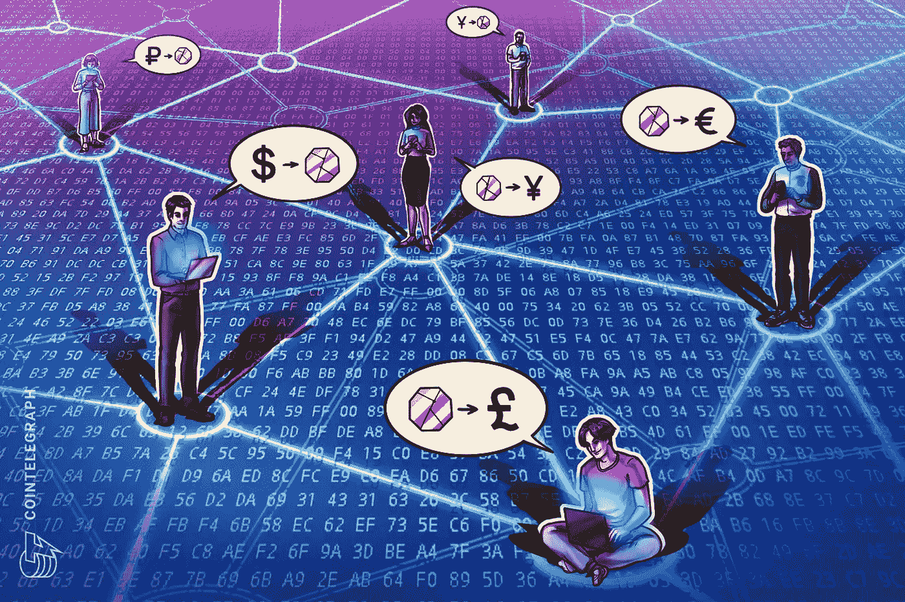
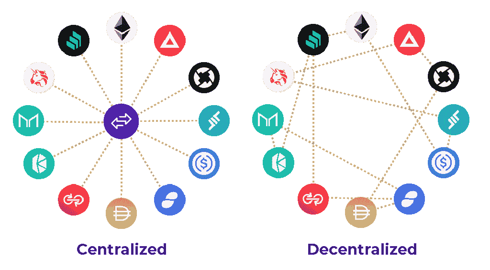
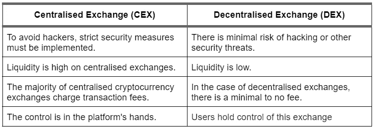
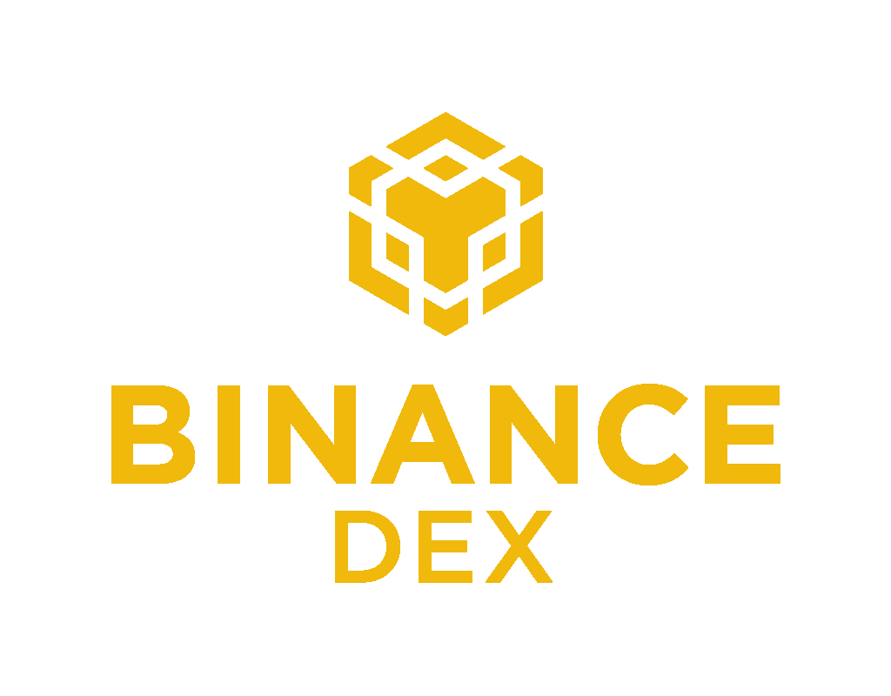

# 加密类型:分散的交易所和市场(XCC-DXM)

> 原文：<https://medium.com/coinmonks/cryptotypes-decentralized-exchanges-and-marketplaces-xcc-dxm-1020ea090188?source=collection_archive---------48----------------------->

今天，我们将探讨另一类加密货币，即分散式交易所和市场。我们首先需要了解什么是加密货币交易所及其类型。交易所是一个平台(市场)，在这个平台上，你可以买卖加密货币或其他资产的数字货币，如传统的法定货币或其他数字货币。交换可以分为两种类型:集中式交换和分散式交换。

术语集中交易是指使用中间人或第三方来协助交易处理。买家和卖家都把他们的资产委托给这个中间人。集中交易所更可靠，因为它们由一家公司经营和控制。集中交易所的一些例子有[币安交易所](https://www.binance.com/)、 [CoinBase](https://www.coinbase.com/) 、 [ByBit](https://www.bybit.com/) 等。

另一方面，分散交易所也称为 dex，是一种点对点市场，加密货币交易者可以在其中进行交易，而无需将资金委托给中介或托管人。Uniswap 、 [Stellar](https://www.stellar.org/) 和 [THORChain](https://thorchain.org/) 是一些值得注意的 dex。既然我们已经谈到了基础知识，我们现在将探索这些类型的交易所之间的差异，并了解他们提供的硬币。

**平台币**

平台，无论是集中的还是分散的，都可以有自己的硬币或令牌。它们可以用作公用事业代币，甚至可以用于在线支付服务。我们要看的是集中和分散交易所的顶级平台币和代币。

**集中兑换硬币(CEX 硬币)**

有各种各样的交易所拥有自己的硬币和代币，但市值最高的硬币是币安硬币。币安硬币是一种由币安交易所开发的加密货币，交易代码为 BNB。币安是世界上最大的加密货币交易所。币安硬币最初是作为折扣交易费的公用令牌，但现在它被用于各种各样的事情，包括交易费(在币安连锁店)，旅游预订，娱乐，在线服务和金融服务。

尽管币安以其集中式交易所而闻名，但它也创造了一个分散式交易所(DEX ),我们将在下一节中讨论它。

**分散兑换硬币(DEX 硬币)**

由于没有单一的权力控制，dex 正迅速获得投资者和交易者的关注。此外，由于这些交易所提供非常低的交易费用，人们渴望使用这些平台交易和投资加密货币。即使是最大的加密货币交易所币安，这是一个集中的交易所，也创建了自己的分散加密货币交易所-币安 DEX。这是一个由币安硬币(BNB)提供动力的分散式交易所。

另一个流行的 DEX 是 UniSwap。Uniswap 是以太坊区块链上最大的分散式交易所(或 DEX)。它允许世界各地的用户在不使用中间人的情况下交易加密货币。UNI 是 Uniswap 的官方标志。它是一种治理令牌，允许用户对关键协议变更进行投票，是比特币基地第四大最有价值的加密货币，市值超过 60 亿美元。

在新生的加密货币空间(DEX)中，Uniswap 既是加密货币，也是分散的交易所。UNI 令牌的持有者可以在“交换”中用它们交换任何两个基于 ETH 的加密硬币此举被视为一种更具流动性的交易大量加密货币的方式。Uniswap 令牌(UNI)利用各种加密资产，这些资产可以在交易者之间进行交易，而无需中央机构的参与。

Stellar DEX 也是顶级的去中心化加密货币交易所之一。Stellar 是一个分散的网络，允许用户创建、发送和交易各种加密货币。它成立于 2014 年，于 2015 年推出，目标是将世界金融系统连接成一个单一的网络。流明是一种交易代号为 XLM 的代币，是区块链的加密货币。Stellar 的市值接近 50 亿美元，是过去五年中表现最好的替代硬币之一。

DEX 有其局限性，但在管理交易所市场方面有着巨大的潜力。公司已经开始致力于技术和创新来改善 dex。例如，原子互换允许在不使用中央监控团队等中介或智能令牌的情况下完成跨境交易。闪电网络是分散化网络的一个众所周知的例子，它使用智能合约来允许两种最受欢迎的加密货币以太坊和比特币之间的互换，而无需使用中介。根据一些行业专家的说法，分散的加密货币交易所不会完全取代集中的交易所，但会与其共存。

编剧**穆迪特·坦登**([tandon.mudit2000@gmail.com](mailto:tandon.mudit2000@gmail.com))

— — — — — — — — — — — — — — — — — — — — — — — — — — — -

来源

1.  乔治，B. (2022 年 2 月 11 日)。*什么是 dex？分散加密交换如何工作*。CoinDesk 最新头条 RSS。

检索于 2022 年 4 月 22 日，来自[https://www . coin desk . com/learn/what-is-a-dex-how-Decentralized-crypto-exchange-work/#:~:text = Decentralized %20 crypto % 20 exchange % 20(dex)% 20 are，在% 20 买家% 20 和% 20 卖家% 20 之间的中介% 20](https://www.coindesk.com/learn/what-is-a-dex-how-decentralized-crypto-exchanges-work/#:~:text=Decentralized%20crypto%20exchanges%20(DEXs)%20are,intermediary%20between%20buyers%20and%20sellers)

1.  硬币电报。(2022 年 1 月 13 日)。*什么是分散式交易所，dex 是如何工作的？*硬币电报。

检索于 2022 年 4 月 22 日，来自[https://coin telegraph . com/defi-101/what-is-decentralized-exchange-and-how-do-dexs-work](https://cointelegraph.com/defi-101/what-are-decentralized-exchanges-and-how-do-dexs-work)

1.  小 k(2022 年 4 月 18 日)。什么是加密交换？|时间为的 nextadvisor。时间。

检索于 2022 年 4 月 22 日，来自[https://time . com/next advisor/investing/cryptocurrency/what-are-cryptocurrency-exchange/](https://time.com/nextadvisor/investing/cryptocurrency/what-are-cryptocurrency-exchanges/)

1.  北卡罗来纳州赖夫(2022 年 3 月 18 日)。*什么是集中式加密货币交易所？*投资媒体。

检索于 2022 年 4 月 22 日，来自[https://www . investopedia . com/tech/what-are-centralized-cryptocurrency-exchange/](https://www.investopedia.com/tech/what-are-centralized-cryptocurrency-exchanges/)

1.  *加密货币交易所*。公司金融研究所。(2022 年 4 月 8 日)。

检索于 2022 年 4 月 22 日，来自[https://corporatefinanciensinstitute . com/resources/knowledge/other/cryptocurrency-exchange/](https://corporatefinanceinstitute.com/resources/knowledge/other/cryptocurrency-exchanges/)

1.  *集中式和分散式加密货币交换的区别*。CoinDCX。(2022 年 4 月 19 日)。

检索于 2022 年 4 月 22 日，来自[https://blog . coindcx . com/cryptocurrency/difference-between-centralized-and-decentralized-cryptocurrency-exchange/](https://blog.coindcx.com/cryptocurrency/difference-between-centralized-and-decentralized-cryptocurrency-exchange/)

1.  弗兰肯菲尔德，J. (2021 年 9 月 8 日)。*币安硬币(BNB)定义*。Investopedia。

检索于 2022 年 4 月 22 日，来自[https://www . investopedia . com/terms/b/币安-coin-bnb . ASP #:~:text =币安% 20 coin % 20 is % 20 加密货币% 20 发行% 20the % 20Binance % 20exchange，拥有% 20 区块链% 2C % 20 binance % 20 chain](https://www.investopedia.com/terms/b/binance-coin-bnb.asp#:~:text=Binance%20Coin%20is%20the%20cryptocurrency%20issued%20by%20the%20Binance%20exchange,own%20blockchain%2C%20the%20Binance%20chain)。

1.  德德扎德，E. (2021 年 2 月 5 日)。*币安 Dex 评论:经验用户的分散交流*。解密。

2022 年 4 月 22 日检索，来自[https://decrypt . co/56703/币安-dex-review-a-decentralized-exchange-for-experimented-users](https://decrypt.co/56703/binance-dex-review-a-decentralized-exchange-for-experienced-users)

1.  帕拉沙尔河(2021 年 9 月 21 日)。*什么是 Uniswap，它为什么有用？* NDTV 小工具 360。

检索于 2022 年 4 月 22 日，来自[https://gadgets 360 . com/cryptocurrency/features/what-is-uni swap-cryptocurrency-why-is-it-used-2547964](https://gadgets360.com/cryptocurrency/features/what-is-uniswap-cryptocurrency-why-is-it-useful-2547964)

1.  海耶斯，A. (2022 年 2 月 8 日)。*什么是恒星？*投资媒体。

检索于 2022 年 4 月 22 日，来自[https://www . investopedia . com/terms/s/stellar-cryptocurrency . ASP #:~:text = The % 20 stellar % 20 区块链的%20cryptocurrency%20is，of % 20just % 20over % 20 % 241 %亿](https://www.investopedia.com/terms/s/stellar-cryptocurrency.asp#:~:text=The%20Stellar%20blockchain's%20cryptocurrency%20is,of%20just%20over%20%241%20billion)

> 加入 Coinmonks [电报频道](https://t.me/coincodecap)和 [Youtube 频道](https://www.youtube.com/c/coinmonks/videos)了解加密交易和投资

# 另外，阅读

*   [加密货币储蓄账户](/coinmonks/cryptocurrency-savings-accounts-be3bc0feffbf) | [YoBit 评论](/coinmonks/yobit-review-175464162c62)
*   [Botsfolio vs nap bots vs Mudrex](/coinmonks/botsfolio-vs-napbots-vs-mudrex-c81344970c02)|[gate . io 交流回顾](/coinmonks/gate-io-exchange-review-61bf87b7078f)
*   [CoinFLEX 评论](https://coincodecap.com/coinflex-review) | [AEX 交易所评论](https://coincodecap.com/aex-exchange-review) | [UPbit 评论](https://coincodecap.com/upbit-review)
*   [AscendEx 保证金交易](https://coincodecap.com/ascendex-margin-trading) | [Bitfinex 赌注](https://coincodecap.com/bitfinex-staking) | [bitFlyer 点评](https://coincodecap.com/bitflyer-review)
*   [Bitget 回顾](https://coincodecap.com/bitget-review)|[Gemini vs block fi](https://coincodecap.com/gemini-vs-blockfi)cmd |[OKEx 期货交易](https://coincodecap.com/okex-futures-trading)
*   [AscendEx Staking](https://coincodecap.com/ascendex-staking)|[Bot Ocean Review](https://coincodecap.com/bot-ocean-review)|[最佳比特币钱包](https://coincodecap.com/bitcoin-wallets-india)