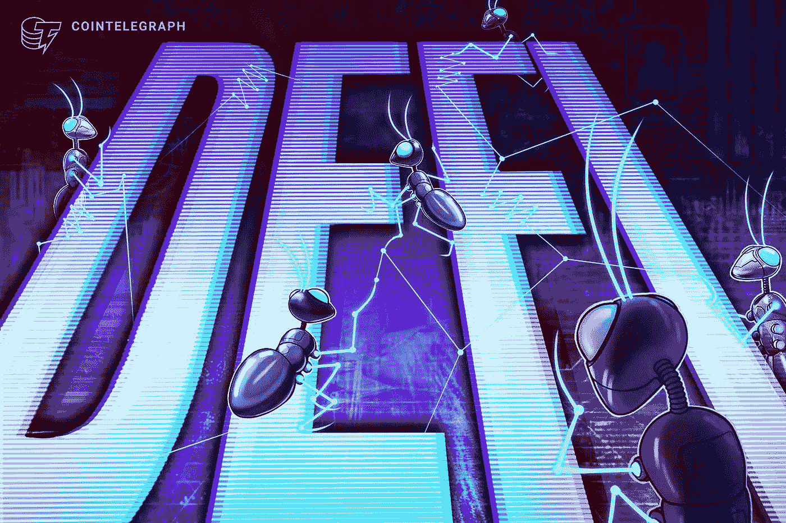

# 加密类型:分散金融(XCC-DFI)

> 原文：<https://medium.com/coinmonks/cryptotypes-decentralized-finance-xcc-dfi-8eb460fe95b2?source=collection_archive---------49----------------------->

DeFi 是通过公共区块链提供的金融服务的总称，尤其是[以太坊](https://ethereum.org)。像其他加密货币一样，该技术基于分布式分类账。

目前，金融服务部门的权力集中在几个非常强大的组织手中，如中央银行、监管机构、大型投资银行和共同基金。通过 DeFi，区块链科技有能力打破这种趋势，因为 DeFi 可以完成传统金融中介可以做的大多数事情，只是更快，不需要任何中介，降低了多方之间的信任需求。

【DeFi 是如何工作的？

DeFi 协议利用在区块链网络上运行的被称为智能合同的计算机代码。大多数 DeFi 项目的源代码可供世界上任何人查看和审计。DeFi 协议的用户可以通过他们的钱包(例如 metamask、electrum 和菌丝体)与这些智能合约连接，以转移现金、借入、借出或使用 DeFi 提供的任何服务。区块链网络上的 DeFi 倡议使人们能够简单而廉价地获得资金，以及高效的借贷。

**Defi 的好处**

一个分散的金融世界显示出消除集中的金融世界的许多弱点的希望。分散式金融系统消除了对任何第三方的信任，如个人、银行或任何可以在两个实体之间操作的中介。由于区块链网络的每个节点在新信息被接受之前都参与了对新信息的审查和确认，因此消除了对可信任中介的需要。

与此同时，区块链网络上的交易是透明的。由于包含区块链网络上发生的所有活动的信息的分布式分类帐由每个人共享，网络的数据对任何人都是公开的。

构成区块链网络的数据块是不可变的，这意味着一旦数据块上的信息被存储，出于工作证明等共识算法的考虑，几乎不可能更改该信息。这确保了操纵存储在区块链网络上的财务记录几乎是不可能的。

***用例 DeFi***

**借贷**

DeFi 最常见的用途之一是贷款。这是通过分散应用程序(DApps)实现的，它允许参与者将数字资产借给其他用户以赚取利息，或者从其他用户处借用数字资产并支付利息。

**Stablecoins**

稳定资产是一种数字资产，其价值与另一种资产挂钩，以减少波动性并保持价格稳定。这些硬币可以与美元或欧元等法定货币挂钩，也可以与黄金等其他资产或一篮子混合资产挂钩。

**市场**

除此之外，DeFi 还提供了一个交换商品和服务的市场。

尽管 DeFi 有很多好处，但也有必要看看它的一些缺点。DeFi 的主要缺点之一是可伸缩性。在其最大容量下，以太坊每秒只能处理 13 笔交易。相反，DeFi 的集中交易对手可以在相关期间处理数千笔交易。

**DeFi 的弊端**

如果在 DeFi 项目中出现任何问题，责任在于用户，DeFi 项目不对错误负责。简而言之，很难让任何人对 DeFi 网络上的任何错误负责。

正如我们前面讨论的，DeFi 协议使用智能契约来实现代码。因此，即使智能合约的代码中有一点点瑕疵，也可能导致资金损失。

到目前为止，我们已经研究了什么是 DeFi 协议，以及它的优点、应用和局限性。现在，我们将从投资者的角度来审视 DeFi 空间，并探索一些关键的 DeFi 硬币。根据 DeFi Pulse 的数据，DeFi 协议锁定的总价值超过 780 亿美元，自 2020 年 5 月以来增长了 10 倍。

2021 年，为 DeFi apps 提供支持的主要区块链以太坊(Ethereum)是市值第二大的加密货币，交易量超过 11.6 万亿美元，超过了 VISA(第二大支付处理公司)。有一点是肯定的，DeFi 的世界在不断扩大。现在让我们看看一些主要的基于 DeFi 的加密货币。

[Terra Luna](https://www.terra.money/)

**价格:90.80 美元**

**市场:资本总额:31670629270 美元**

Terra 是由 Terraform 实验室创建的区块链项目。这是一种稳定的货币，比其他加密货币波动性小。泰拉美元是泰拉稳定币的名称，通过一种算法与美元挂钩。为了创造一个新的 UST，另一种叫做“月神”的加密货币的一部分被烧毁。Terra Luna 不仅接受美元，还接受韩元、日元和人民币作为法定货币。此外，它提倡特别提款权。Terra Luna 是目前市值最高的 DeFi 加密货币。

[**雪崩**](https://www.avax.network/)

**价格:70.40 美元**

**市值:18891041234 美元**

目前，大多数 DeFi 系统都基于以太坊网络。以太坊的问题在于其交易缓慢，费用高昂。Avalanche 是一种区块链，通过其 Avalanche 共识协议，声称结合了可扩展性和短确认时间。它的事务速率是每秒 4500 个事务，而以太坊是每秒 14 个事务。

[AAVE](https://aave.com/)

**价格:162.85 美元**

市值:2220851391 美元

AAVE 是首批 DeFi 系统之一，于 2017 年推出。AAVE 是一个流动性协议平台，允许资产借贷和存款激励。它有助于在一个分散的环境中为贷款人和借款人提供一个平台，从而建立一个机会均等的贷款系统。

[**包裹比特币**](https://wbtc.network/)

**价格:39177.21 美元**

市值:10980459893 美元

包裹比特币是以太坊网络上代表比特币的 ERC-20 代币。WBTC 的主要优势是它与以太坊钱包、dapps 和智能合约领域的整合。一个包装好的比特币的价值和一个比特币的价值是一样的。包装比特币旨在让比特币持有者参与去中心化的金融革命。

**价格:8.53 美元**

**市值:5916186127 美元**

**Uniswap 是一种加密货币交易所，采用分散式网络技术运营。这仅仅意味着没有中央实体参与 uniswap 上的加密货币买卖。与集中交易不同，uniswap 利用流动性池，而不是充当做市商。**

**作者:**山图努索德**([shantnu.sood@xumitcapital.com](mailto:shantnu.sood@xumitcapital.com))**

**— — — — — — — — — — — — — — — — — — — — — — — — — —**

****参考文献**:**

**[https://www . PwC . ch/en/insights/digital/defi-defining-the-future-of-finance . html](https://www.pwc.ch/en/insights/digital/defi-defining-the-future-of-finance.html)**

**[https://www . vistra . com/insights/decentralized-finance-understanding-benefits-risk-and-challenges-defi](https://www.vistra.com/insights/decentralised-finance-understanding-benefits-risks-and-challenges-defi)**

**[https://101 block chains . com/pros-and-cons-of-decentralized-finance/](https://101blockchains.com/pros-and-cons-of-decentralized-finance/)**

**[https://economic times . India times . com/markets/crypto currency/why-defi-is-the-big-this-in-history-of-finance/articleshow/89745980 . CMS](https://economictimes.indiatimes.com/markets/cryptocurrency/why-defi-is-the-biggest-thing-in-the-history-of-finance/articleshow/89745980.cms)**

> **加入 Coinmonks [电报频道](https://t.me/coincodecap)和 [Youtube 频道](https://www.youtube.com/c/coinmonks/videos)了解加密交易和投资**

# **另外，阅读**

*   **[Bookmap 评论](https://coincodecap.com/bookmap-review-2021-best-trading-software) | [美国 5 大最佳加密交易所](https://coincodecap.com/crypto-exchange-usa)**
*   **最佳加密[硬件钱包](/coinmonks/hardware-wallets-dfa1211730c6) | [Bitbns 评论](/coinmonks/bitbns-review-38256a07e161)**
*   **[新加坡十大最佳加密交易所](https://coincodecap.com/crypto-exchange-in-singapore) | [购买 AXS](https://coincodecap.com/buy-axs-token)**
*   **[红狗赌场评论](https://coincodecap.com/red-dog-casino-review) | [Swyftx 评论](https://coincodecap.com/swyftx-review) | [CoinGate 评论](https://coincodecap.com/coingate-review)**
*   **[投资印度的最佳密码](https://coincodecap.com/best-crypto-to-invest-in-india-in-2021)|[WazirX P2P](https://coincodecap.com/wazirx-p2p)|[Hi Dollar Review](https://coincodecap.com/hi-dollar-review)**