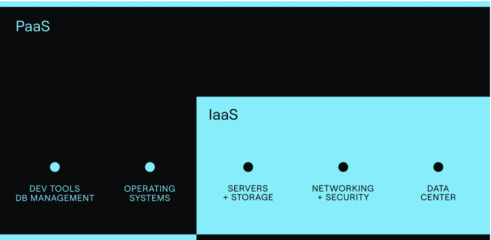
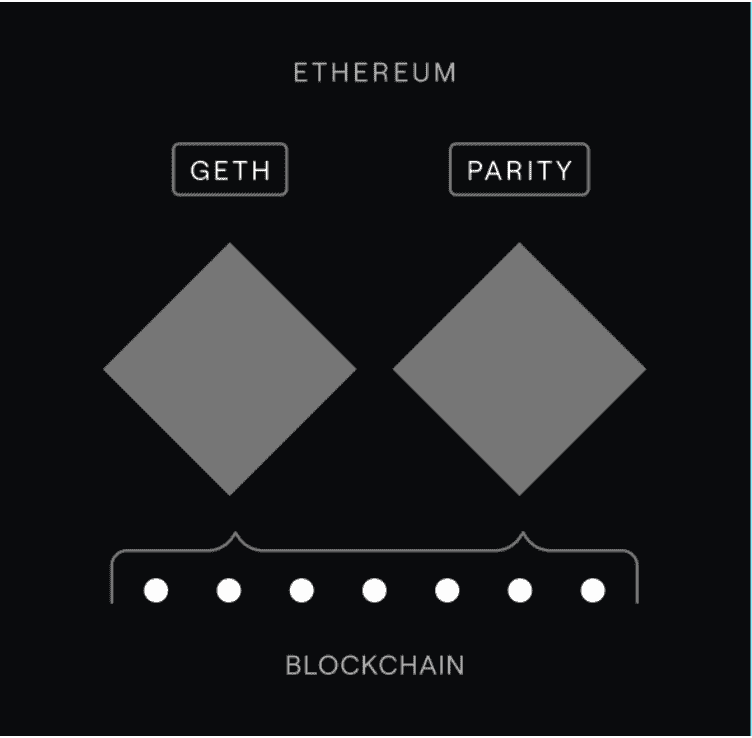
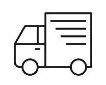
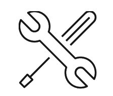
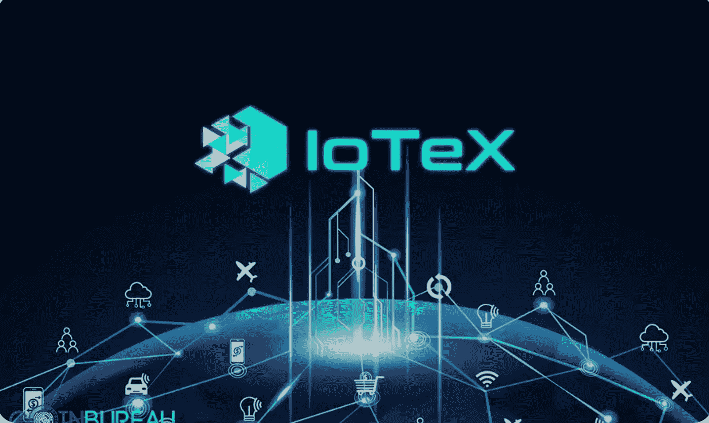
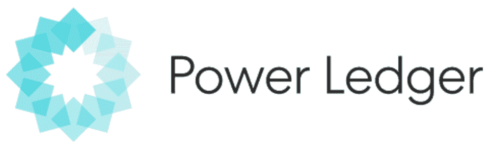
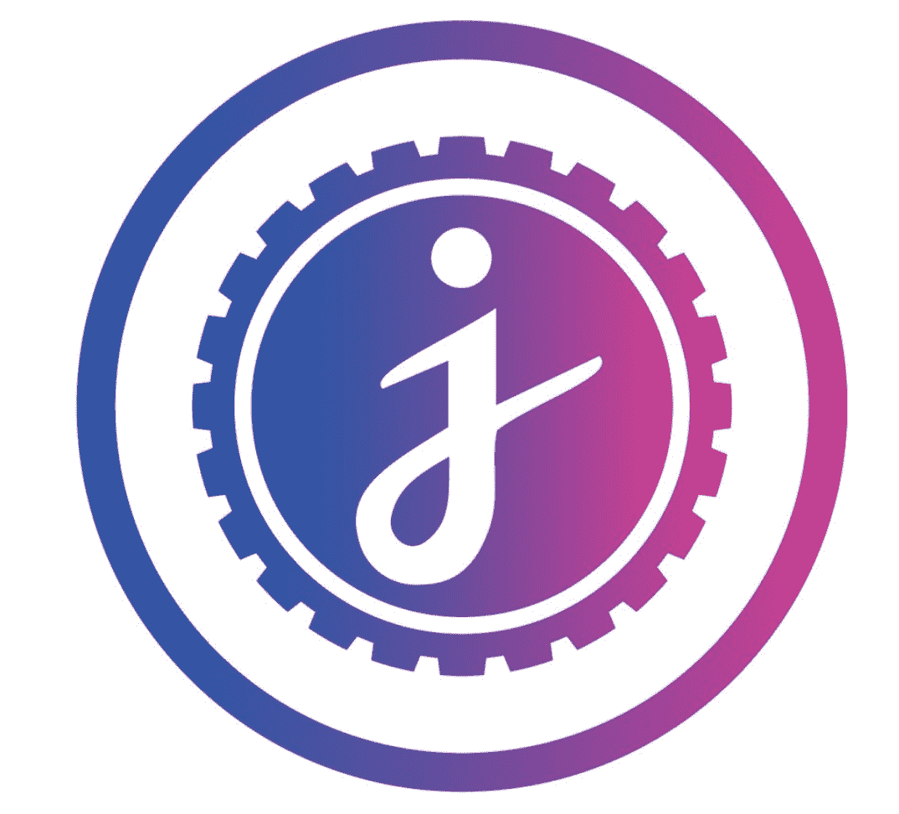
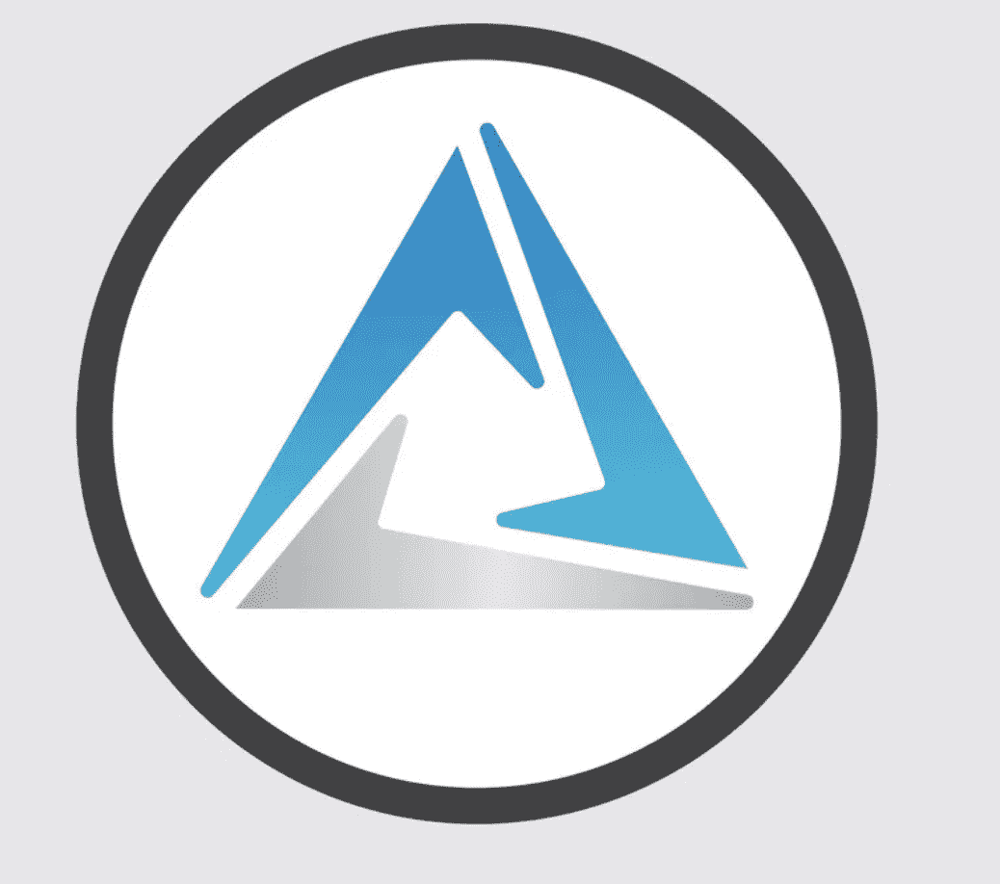

# 密码类型:基础设施和物联网(XCC-IOT)

> 原文：<https://medium.com/coinmonks/cryptotypes-infrastructure-iot-xcc-iot-91328b957b38?source=collection_archive---------51----------------------->

由**阿罗汉·帕里克**(【arhan.parikh@xumitcapital.com】T2)

**什么是物联网和区块链基础设施？**

物联网(IoT)是一个术语，涵盖具有传感器、处理能力、软件和其他技术的物理对象或物理对象组，这些物理对象或物理对象组通过互联网或其他通信网络与其他设备和系统进行链接和交换数据。区块链基础架构的平台即服务(PaaS)提供商协调并维护对驱动区块链的基础架构的访问，如开发工具和节点，以及运行其系统所需的底层基础架构，如云存储和安全性。

“物联网允许世界各地的设备向专用区块链网络发送数据，从而实现共享交易的防篡改记录。区块链允许您与业务合作伙伴交换和访问物联网数据，而无需集中控制和管理。为了避免争议并在所有获得许可的网络成员之间建立信任，可以对每一笔交易进行核实”。

**物联网和区块链基础设施的优势**

物联网和区块链基础设施一起提供了大量好处。首先，它“有助于培养对物联网数据的信心。每笔交易都被记录、存储在一个数据块中，并添加到一个安全的、不可逆的数据链中，该数据链只能添加到”。其次，物联网“依赖于额外的安全性，因为人们可以选择数据进行管理、分析、定制，并在获得许可的客户和合作伙伴之间共享”。第三，人们可以“获得更大的灵活性，因为物联网和区块链基础设施在一个开放和可互操作的机制上工作”。最后，它有助于“通过利用来自物联网设备和传感器的数据，随着区块链基础设施简化运营并在您的生态系统中产生新的商业价值，产生新的效率”。

**物联网和区块链基础设施的应用**

物联网和区块链基础设施在现实世界中有多种应用。首先，他们从事货运。货运是一个复杂的过程，涉及多个利益攸关方，他们的优先事项各不相同。集装箱的温度、位置、到达时间和状态都可以在运输过程中存储在支持物联网的区块链基础设施上。不可变的区块链事务确保所有利益相关者可以信任数据，并快速有效地行动起来”。

此外，它们还有助于组件跟踪和合规性。能够跟踪进入飞机、汽车或其他产品的组件对于安全性和法规遵从性都是至关重要的。由于物联网数据保存在共享的区块链总账中，各方都可以在产品的整个生命周期中看到组件的来源。与监管机构、运输商和制造商共享这些信息是安全、简单和经济的”。

最后，物联网和区块链基础设施有助于记录运营维护数据。“物联网设备监控关键机器的安全和维护状态。从发动机到电梯，区块链基础设施提供了一个防篡改的运行数据数据库以及随之而来的维护。第三方维修合作伙伴可以关注区块链基础设施的预防性维护，然后记录他们的工作。操作记录也可以与政府当局共享，以便进行合规核查”。

**前五大基础设施和物联网令牌(基于市值)**

现在，我们已经详细了解了基础设施和物联网的构成，因此有必要注意一下属于这一类别的几种主要加密货币。氦是一枚硬币“由氦区块链，即人民网络提供动力，这标志着去中心化无线基础设施的范式飞跃”。氦是一个社区驱动的网络，它通过允许用户开采、标桩和利用氦区块链的多种用途，迎来了一场无线革命。氦是这一类别中最大的令牌，在基础设施和物联网类别中占 65%的权重。

" [IoTeX](https://iotex.io/) 是一个开源平台，以可信物联网(IoTeX)为愿景，这是一个分散的环境，人类和机器可以安全可靠地进行通信。为了给用户带来价值并推动新机器经济，IoTeX 希望将机器支持的 DApps、资产和服务的访问民主化。“IoTeX 是世界上最快、最安全、可扩展的区块链平台，有助于创建一个链接的世界”。IoTeX 是这一类别中的第二大令牌，在市场资本总额中占 20%的权重。

" [Powerledger](https://www.powerledger.io/) 开发可再生能源跟踪、追踪和交易软件，目标是为了更可持续的未来实现电力民主化。Powerledger 是一个允许用户买卖能源、交易环境商品和投资可再生能源的平台”。就市值而言，‍Powerledger 在基础设施和物联网领域的权重为 7.50%。

Jasmy 是一种基于以太坊的实用令牌，可以在 JASMY 平台上使用，该项目旨在通过将个人数据存储在“数据锁”中并与愿意付费的企业共享来赋予消费者对其个人数据的所有权。JasmyCoin 在基础设施和物联网类别中约占 3%的权重。

" [Cortex Blockchain](https://www.cortexlabs.ai/) 是一个开源的公共区块链，旨在解决当今区块链面临的最紧迫的问题之一，如比特币和以太坊:链上 AI 执行。在 Cortex 区块链上，Cortex 虚拟机(CVM)是一个支持快速机器学习推理的平台。它允许机器学习模型集成到智能合同和分散应用程序(dApps)中。皮质在这一类别中约占 1.50%的权重。

**结论**

总而言之，区块链的基础设施和物联网已经越来越受欢迎，而且这一空间预计只会增长。它们有大量的使用案例，在这个日益增长和发展的数字世界中，它们提供了一种新的操作方式。如上所述，Helium 是最大的基础设施和物联网令牌，除此之外，其他著名的令牌包括 IoTeX、Powerledger、JasmyCoin 和 Cortex Blockchain。

— — — — — — — — — — — — — — — — — — — -

**参考文献**:

维基媒体基金会。(2022 年 4 月 30 日)。*物联网*。维基百科。检索于 2022 年 5 月 18 日，来自[https://en.wikipedia.org/wiki/Internet_of_things](https://en.wikipedia.org/wiki/Internet_of_things)

比特币基地。(未注明)。*什么是区块链基础设施？*比特币基地。检索于 2022 年 5 月 18 日，来自[https://www . coin base . com/cloud/discover/dev-foundations/区块链-基础设施](https://www.coinbase.com/cloud/discover/dev-foundations/blockchain-infrastructure)

*IOT 跟区块链是什么关系？— IBM 区块链*。IBM。(未注明)。检索于 2022 年 5 月 18 日，来自[https://www.ibm.com/topics/blockchain-iot](https://www.ibm.com/topics/blockchain-iot)

以人为本的网络。氦气。(未注明)。于 2022 年 5 月 18 日从[https://www.helium.com/](https://www.helium.com/)检索

*Iotex 团队*。简介— IoTeX Onboarding Pack。(未注明)。于 2022 年 5 月 18 日从[https://onboard.iotex.io/introduction](https://onboard.iotex.io/introduction)检索

*构建互联世界*。IoTeX。(未注明)。检索于 2022 年 5 月 18 日，发自 https://iotex.io/

*能源项目*。Powerledger 能源项目。(未注明)。于 2022 年 5 月 18 日从[https://www.powerledger.io/](https://www.powerledger.io/)检索

*茉莉考因*。CoinDesk 最新头条 RSS。(未注明)。检索于 2022 年 5 月 18 日，来自[https://www.coindesk.com/price/jasmycoin/](https://www.coindesk.com/price/jasmycoin/)

*首页:Cortex labs* 。公司。(未注明)。检索于 2022 年 5 月 18 日，来自[https://www.cortexlabs.ai/](https://www.cortexlabs.ai/)

> 加入 Coinmonks [电报频道](https://t.me/coincodecap)和 [Youtube 频道](https://www.youtube.com/c/coinmonks/videos)了解加密交易和投资

# 另外，阅读

*   [Bookmap 点评](https://coincodecap.com/bookmap-review-2021-best-trading-software) | [美国 5 大最佳加密交易所](https://coincodecap.com/crypto-exchange-usa)
*   [如何在 FTX 交易所交易期货](https://coincodecap.com/ftx-futures-trading) | [OKEx vs 币安](https://coincodecap.com/okex-vs-binance)
*   [CoinLoan 审查](https://coincodecap.com/coinloan-review) | [YouHodler 审查](/coinmonks/youhodler-4-easy-ways-to-make-money-98969b9689f2) | [BlockFi 审查](https://coincodecap.com/blockfi-review)
*   [XT.COM 评论](https://coincodecap.com/profittradingapp-for-binance)币安评论 |
*   [SmithBot 评论](https://coincodecap.com/smithbot-review) | [4 款最佳免费开源交易机器人](https://coincodecap.com/free-open-source-trading-bots)
*   [比特币基地僵尸程序](/coinmonks/coinbase-bots-ac6359e897f3) | [AscendEX 审查](/coinmonks/ascendex-review-53e829cf75fa) | [OKEx 交易僵尸程序](/coinmonks/okex-trading-bots-234920f61e60)
*   [如何在印度购买比特币？](/coinmonks/buy-bitcoin-in-india-feb50ddfef94) | [WazirX 评论](/coinmonks/wazirx-review-5c811b074f5b)