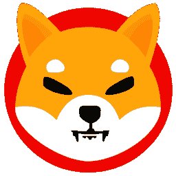

# 加密类型:媒体、Memecoins 和移动(XCC-MMM)

> 原文：<https://medium.com/coinmonks/cryptotypes-media-memecoins-mobile-xcc-mmm-ba98119483c0?source=collection_archive---------65----------------------->

由**穆迪特·坦登**(【tandon.mudit2000@gmail.com】T2)

今天，我们将探索一种新的加密货币指数，即媒体、Memecoins 和移动。

**媒体币**

媒体网络是具有基本协议的分散式内容传送网络。这个网络可以被内容创作者、企业、媒体和应用集成到现有的模型和技术栈中。许多网站依赖于内容交付网络(cdn)。它们充当用户和在线内容之间的纽带，确保用户接收到相同的高质量内容，无论他们在世界的哪个角落，也无论有多少用户对相同的内容感兴趣。另一方面，由于复杂的基础设施和保持竞争力所需的高成本，cdn 正在被整合到几个大公司中。分散的 CDN 是媒体网络。它确保完全匿名，内容创建者不需要注册任何东西就可以开始流媒体播放。

[**电影区块令牌**](https://www.moviebloc.com/)

在电影集团生态系统中有三类:集团、市场和筹款。Bloc 是一个去中心化的社区层，连接所有参与者；市场是内容和人才交易层，筹款是支持和鼓励内容创作者的层。

MBL 是 Moviebloc 的原生标志，movie bloc 是一个去中心化的电影和内容分发平台。它旨在为内容创作者提供透明的收入共享、受众数据和平等的放映机会。

MBL 是基于 ERC 20 以太坊标准的令牌。它在 MovieBloc 生态系统中充当了一个效用令牌，充当了一个驱动力。通过承担创作者、管理者、译者、评论者和观众的角色，参与者将沉浸在一个新的生态系统中。其他基于区块链的电影项目主要关注的是增加内容提供商的利润，同时也回报观众。MovieBloc 与其他项目不同，它包括制作、营销和翻译等活动，所有这些活动都由 MovieBloc 参与者执行。

该令牌可用于各种目的，如允许用户观看优质内容和使用 MBL 加密货币进行支付。创作者还可以用 MBL 代币来支付翻译、捐款，以及奖励用户对电影的评论、评级和举报非法内容。MovieBloc 于 3 月 2 日宣布，它已与 Continuance Pictures 合作，在其平台上发行其电影。

**Memecoins**

迷因币是一种加密货币，通常受迷因的启发或具有另一种有趣的功能。它可以用来批评整个加密货币市场，以及那些基于迷因的加密货币，如狗币或 Coinye 等名人

比特币和以太坊等主要加密货币是为了解决现实世界的问题而创建的。其目的是获得商家的认可，并创造一种新的分散货币形式，这将彻底改变各行各业。另一方面，迷因币目前没有服务于现实世界的目的，它们中的大多数都是为了盈利而创造的。

简而言之，迷因币是受网络笑话和迷因启发的数字货币。例如，Dogecoin 是 Doge meme 的产物，其灵感来自一张柴犬的病毒照片。这些加密货币不应该被认真对待，但当社区成员购买最新的加密货币并加入玩笑时，它们仍然可以获得牵引力。

迷因币通常有无限的供应。与比特币不同，比特币被设计为只有有限数量的单位可供挖掘，迷因币经常有数十亿单位在流通。迷因硬币也缺乏一种“烧掉”或永久让硬币退出流通的机制，所以数量持续上升。

[**Dogecoin**](https://dogecoin.com/)

符号 DOGE

市值-160 亿美元

最大供应量-无限制

总供应量-1320 亿

我们大多数人都听说过 Dogecoin 和“Doge to the Moon”这个短语。Dogecoin 是一种加密货币，作为一个“笑话”被创造出来，以应对当时加密货币的疯狂投机性质。它被认为是第一枚“迷因币”，更准确地说，是第一枚“狗币”。

Dogecoin 在 Reddit 和 Twitter 上被用作奖励高质量内容创作或分享的小费系统。您可以通过加入 Dogecoin 社区或从 Dogecoin 水龙头获得 Dogecoin，Dogecoin 水龙头是一个网站，免费向您提供少量 Dogecoin 作为货币介绍，以便您可以开始与 Dogecoin 社区互动。

Dogecoin 的流行主要归功于埃隆·马斯克。他第一次遇到 DOGE 是在 2018 年 9 月，当时他公开寻求前 dogecoin 创作者杰克逊·帕尔梅的帮助。“Doge 可能是我最喜欢的加密货币，”马斯克 7 个月后在推特上说。马斯克在 2020 年 3 月发布了另一条与 doge 相关的推文，四个月后与他的 4690 万 Twitter 粉丝分享了 dogecoin meme。马斯克在 2020 年底继续发布关于 DOGE 的推文，导致价格在 12 月 20 日上涨了 25%。

[**柴犬**](https://shibatoken.com/) **u**

符号- SHIB

市值-90 亿美元

最大供应量-无限制

总供给- 589 万亿

柴犬是由匿名创始人 Ryoshi 创造的加密货币 meme token。它基于 Doge meme，以一只柴犬为特色，就像 Dogecoin 一样。它甚至称自己为“Dogecoin 刺客”。该令牌在其白皮书中被描述为一个基于社区的加密货币项目。这实质上意味着“ShibArmy”，一个分散的柴犬社区，负责加密货币的开发。

虽然柴犬最初是作为 Dogecoin 替代品上市的，但它与众不同。这是一个建立在以太坊区块链上的智能合约平台。它可以使用智能合约与分散的应用程序进行交互。Dogecoin 没有这种能力，大大限制了它的能力。

柴犬硬币因两个原因而闻名:

1.  埃隆·马斯克曾在推特上表达了他想要拥有一只柴犬小狗的愿望，这导致加密货币价格上涨了 300%。
2.  以太坊区块链网络的创始人 Vitalik Buterin 向印度 Covid 救济基金捐赠了 50 万亿个柴犬币，该基金由一位名叫 Sandeep Naiwal 的印度加密企业家创立。

**移动币**

随着我们的世界围绕着智能手机和小配件，移动行业的技术创新一直在快速发展。区块链技术与移动行业的融合催生了移动币。例如，购买和销售移动数据与区块链技术相结合，方便用户访问全球数据。

[**凹痕币**](https://www.dentwireless.com/)

符号-凹痕

市值-9300 万美元

总供应量-1000 亿

Dent 是 eSIM 卡、移动数据计划、通话时间充值和免漫游服务的数字网络提供商。Dent 令牌是一种基于 ERC 20 的令牌。它利用区块链技术为移动数据的自由化创造了一个全球市场。

登特提供各种优势:

1.  数据共享的经济性:

消费者可以使用 DENT coin 购买、出售和捐赠他们的移动数据给任何其他设备。DENT Exchange 是一个交易移动数据的横向市场。这枚硬币将成为电信公司和消费者之间移动数据交易的全球货币。

2.国际漫游:

Dent 可以更容易地消除数据漫游成本驱动因素，如昂贵的电信路由。

3.移动数据购买:

Dent 使客户能够自动购买数据包。最好的价格总是从消费者所在地区最合适的经营者那里获得。无需建立自己的中央系统，运营商可以快速连接到 Dent 网络，以支持全球客户群。

— — — — — — — — — — — — — — — — — — — — — — — — -

来源

*   工作人员，K. M. (2019 年 10 月 22 日)。*什么是凹痕币？Dent 加密货币入门指南*。最新的加密新闻。

检索于 2022 年 5 月 12 日，来自[https://krypto money . com/DENT-coin/#:~:text = DENT % 20 coins % 20 stands % 20 out % 20 as % 20 an % 20 important % 20 member，至% 20 building % 20 up % 20 an % 20 end-to-end % 20 mobile % 20 data % 20 exchange](https://kryptomoney.com/dent-coin/#:~:text=DENT%20coins%20stands%20out%20as%20an%20important%20member,to%20building%20up%20an%20end-to-end%20mobile%20data%20exchange)。

*   查图维迪，纽约(2021 年 9 月 11 日)。*关于丹特币的一个镜头(带音频)*。中等。

2022 年 5 月 12 日检索自[https://medium . datadriveninvestor . com/all-about-DENT-in-one-shot-df 6 c 7 e0c 0028 #:~:text = DENT % 20 is % 20 an % 20 ether eum % 20 based，market place % 20 for % 20 mobile % 20 data % 20 liberialization](https://medium.datadriveninvestor.com/all-about-dent-in-one-shot-df6c7e0c0028#:~:text=DENT%20is%20an%20Ethereum%20based,marketplace%20for%20mobile%20data%20liberalization)。

*   戴利，L. (2022 年 2 月 2 日)。*什么是柴犬币加密货币？*杂色的傻瓜。

检索于 2022 年 5 月 12 日，来自[https://www . fool . com/investing/stock-market/market-sections/financials/cryptocurrency-stocks/shiba-inu/](https://www.fool.com/investing/stock-market/market-sectors/financials/cryptocurrency-stocks/shiba-inu/)

*   慕克吉河(2021 年 12 月 31 日)。*2021 年 Dogecoin 的崛起与崛起*。新闻 18。

2022 年 5 月 12 日检索，来自[https://www . news 18 . com/news/buzz/the-rise-and-rise-of-dog ecoin-in-2021-4611008 . html](https://www.news18.com/news/buzz/the-rise-and-rise-of-dogecoin-in-2021-4611008.html)

*   比特币基地。(未注明)。*什么是 dogecoin？*比特币基地。

检索于 2022 年 5 月 12 日，来自[https://www . coin base . com/learn/crypto-basics/what-is-doge coin](https://www.coinbase.com/learn/crypto-basics/what-is-dogecoin)

*   Bogna，J. (2021 年 12 月 20 日)。什么是迷因币，它们是如何工作的？ PCMAG。

检索于 2022 年 5 月 12 日，来自[https://www . pcmag . com/how-to/what-is-a-meme-coin-how-do-they-work](https://www.pcmag.com/how-to/what-is-a-meme-coin-how-do-they-work)

*   尚卡尔，硕士(未注明)。 *MovieBloc (MBL) crypto:独一无二的内容分发平台*。今日 ASX 新闻，股票财经新闻& ASX 股票市场——kalk ine Media。

检索于 2022 年 5 月 12 日，来自[https://kalkinedia . com/uk/news/cryptocurrency/movie bloc-MBL-crypto-a-content-distribution-platform-like-no-other](https://kalkinemedia.com/uk/news/cryptocurrency/moviebloc-mbl-crypto-a-content-distribution-platform-like-no-other)