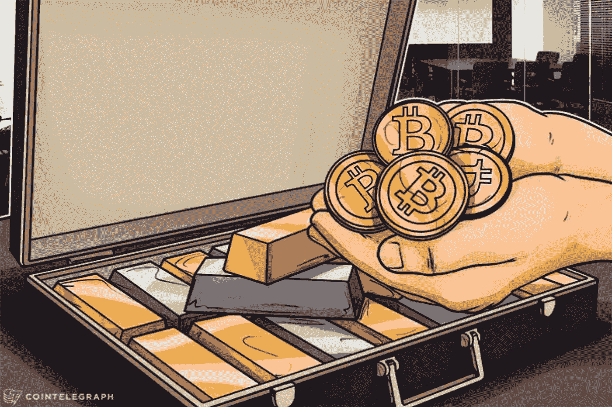

# 隐型:交换和价值储存的媒介(XCC-梅夫)

> 原文：<https://medium.com/coinmonks/cryptotypes-medium-of-exchange-store-of-value-xcc-mev-c3e8c1069b23?source=collection_archive---------52----------------------->

交换媒介是一种中介工具或系统，用来促进交易双方之间的商品买卖或交易。要使某样东西发挥交换媒介的功能，它必须代表一种所有各方都必须接受的价值标准。在今天这个时代，交换媒介就是货币。“加密货币是一种数字化、加密和去中心化的交易媒介。与美元或印度卢比不同，没有中央机构来管理和维护加密货币的价值。相反，这些责任是通过互联网在加密货币的用户之间分配的”。

在所有加密货币中，[比特币](https://bitcoin.org/en/)是迄今为止谈论最多的加密货币，不仅仅是在交易媒介类别，而是在整个加密货币市场中，就市值而言，比特币约占整个加密货币市场的 45%。比特币被定义为“电子现金的点对点版本，允许在线支付直接从一方发送到另一方，而无需通过金融机构”。比特币被认为是一种资产，具有交换媒介、记账单位和价值储存的功能，这些功能也是货币和黄金所具备的。然而，比特币比它们有优势，因为它还具有耐用性、便携性、稀缺性和内在价值等特征。

“价值储存是指通常在未来保持购买力的任何商品或资产，是资产的功能，可以在以后保存、检索和交换，并且在检索时有价值”。围绕加密货币作为价值储存手段的问题是一个争论的热点。美利坚合众国国税局发布了关于虚拟货币的指导意见，指出虚拟货币不仅是一种价值储存手段，也是一种交易媒介和记账单位。比特币是整个加密货币生态系统中市值最大的加密货币，占所有交易媒介和价值令牌存储的市值的 80%以上。

比特币和其他此类数字代币可以被认为是价值储存机制的原因有几个。首先，比特币的供给是有限的，只有 2100 万比特币可供开采，这意味着它是一种稀缺商品，类似于黄金、白银和铂金等贵金属。比特币是一种流动性资产，与黄金相比更容易交易。比特币经常被吹捧为数字黄金，由于黄金的稀缺性、耐用性和便携性等特性，可以被视为价值储存手段，比特币也应该被视为一种，因为它拥有所有这些特性，而且因为它是数字的，所以大量持有更方便。最后但同样重要的是，加强比特币作为价值象征储存手段的另一个关键因素是，由于它是去中心化的，不受监管权力的限制，它可以出现在任何地方和任何地方，因此无论你在世界的任何地方，都很容易随身携带它。这也有助于消除与货币、黄金等受监管资产相关的任何第三方风险。然而，加密货币作为价值储存手段的作用仍然存在争议，主要是因为它们表现出的极端价格波动性以及政府对其监管和法律立场的担忧。

现在，我们已经详细了解了什么构成了价值令牌的交换和存储媒介，重要的是要注意除比特币之外的加密货币属于这两个类别。除了比特币，还有其他几种替代币也属于这一类。

[Ripple](https://ripple.com/) 作为价值空间的交换和存储媒介的第二大加密货币，是一种为支付而构建的数字资产。它是 XRP 账本上的原生数字资产，是一种开源、无许可、去中心化的区块链技术，可以在 3-5 秒内完成交易结算。Ripple 大约占整个交换媒介和价值储存市场的 4%。Ripple 被吹捧为该领域现有数字资产中速度最快、成本最低、可扩展性最强的资产之一，为“金融机构按需获取流动性提供了更快、更可靠的选择”。

[莱特币](https://litecoin.org/)是这一类别中的第三大加密货币，是一种“点对点互联网货币，可以实现对世界上任何人的即时、接近零成本的支付”。这是一个“开放源代码的全球支付网络，完全去中心化，没有任何中央机构”。莱特币是一种成熟的交易媒介，是比特币的补充，具有重要的“行业支持、交易量和流动性”。莱特币在整个交易媒介和价值储存部分的市场资本总额中占很小的份额，代币的权重约为 1%。

此外，属于这一类别的另一个众所周知的令牌被称为[比特币现金](https://bitcoincash.org/)。比特币现金是一种加密货币，创建于 2017 年 8 月，是比特币分叉的结果。当社区修改“区块链协议或基本规则集”时，就会出现分叉。比特币现金的块大小更大，允许完成更多交易，增强了其可扩展性。更大的块大小也意味着单个块中可以存储更多的事务。即使比特币和比特币现金有概念上的差异，但它们在技术上有很多相似之处。比特币现金约占整个交易媒介和价值存储市场资本总额的 0.70%。

最后但同样重要的是，属于这一类别的另一种著名的替代硬币叫做 [Monero](https://www.getmonero.org/) 。“Monero 是领先的加密货币，专注于私人和抗审查交易”。Monero 相对于其他交易媒介的一个优势是，它“使用各种隐私增强技术来确保用户的匿名性，使其交易保密且不可追踪”。“Monero 是一种电子现金系统，可以在世界任何地方进行快速、低成本的支付。”Monero 在整个交易媒介和价值储存部分的市场资本总额中所占份额也非常小，代币的权重约为 0.50%。

还有其他几种替代硬币属于交换媒介和价值储存类别，但就市场资本总额而言，这五种是主要的替代硬币。其他替代硬币包括 Alchemy Pay、比特币黄金、CyberVein、Dash、eCash、Electroneum、EOS、Gas、Groestlcoin、IOTA、Metal、Nano、Pax Dollar、sUSD、Telcoin 和 Zilliqa。

在全球范围内，加密货币尚未被广泛接受为交易媒介。截至目前，美国只有萨尔瓦多和特斯拉、星巴克、PayPal 和 Square 等少数公司接受比特币支付。当谈到交换媒介的话题时，比特币和法定货币之间有很多比较。许多个人认为法定货币是有价值的，因为它们是由一个中央权威机构，即一个国家的政府和/或中央银行发行的，并在经济运行中广泛使用。相比之下，由于比特币、Ripple、莱特币、比特币现金和 Monero 等加密货币是分散的，它们不是由中央机构发行的，在经济运行中也不是至关重要的。这使得个人对加密货币作为交换媒介的作用持怀疑态度。然而，可以争论的是，比特币的价值与黄金等贵金属的价值有些相似。它们具有相似的特征，如有限的供应、高需求和现实生活中的使用案例，黄金用于工业案例，而比特币背后的底层技术区块链则应用于金融服务业。出于这个原因，比特币作为价值储存手段的功能可以得到有力的论证，这反过来有助于其作为交换媒介的情况，特别是由于区块链在金融服务业中的使用以及比特币在几个国家作为支付形式的采用。

总之，加密货币的价值类别的交换和存储媒介有几个标志，显示重要的用例，并具有不同的功能。虽然有人反对将这些加密货币归类为交换媒介和价值代币存储，但也有一些人支持将它们作为交换媒介和价值代币存储，因为它们具有这些特征。如上所述，比特币是这一类别中最大的加密货币，显示了交换媒介(在少数国家可用作支付形式)、价值储存(如黄金等因稀缺而增值的资产)和记账单位(产品和交易的市场价值衡量标准)的功能。除了比特币，其他一些被归类为交换媒介硬币的著名代币包括 Ripple、Litecoin、比特币现金和 Monero，还有其他几种替代硬币也出现在这个领域。

由**阿尔汗·帕里克**(【arhan.parikh@xumitcapital.com】T2)撰写

— — — — — — — — — — — — — — — — — — — — — — — — — —

**参考文献:**

陈，J. (2020 年 11 月 30 日)。*交易媒介定义*。Investopedia。检索于 2022 年 4 月 19 日，发自 https://www.investopedia.com/terms/m/mediumofexchange.asp

维基媒体基金会。(2022 年 3 月 28 日)。*价值储存*。维基百科。检索于 2022 年 4 月 19 日，来自[https://en . Wikipedia . org/wiki/Store _ of _ value #:~:text = Cryptocurrency 的%20role%20as%20a%20store，对比%20by%20advocates%20to%20gold。](https://en.wikipedia.org/wiki/Store_of_value#:~:text=Cryptocurrency's%20role%20as%20a%20store,compared%20by%20advocates%20to%20gold.)

中本聪(未注明)。*比特币:一种点对点的电子现金系统*。检索于 2022 年 4 月 19 日，来自[https://bitcoin.org/bitcoin.pdf](https://bitcoin.org/bitcoin.pdf)

*开源 P2P 数字货币*。莱特币。(未注明)。检索于 2022 年 4 月 19 日，来自[https://litecoin.org/](https://litecoin.org/)

*XRP:全球实时支付的数字资产*。涟漪。(2021 年 7 月 14 日)。检索于 2022 年 4 月 19 日，来自[https://ripple.com/xrp](https://ripple.com/xrp)

弗兰肯菲尔德，J. (2022 年 2 月 8 日)。*比特币现金*。Investopedia。于 2022 年 4 月 13 日从[https://www.investopedia.com/terms/b/bitcoin-cash.asp](https://www.investopedia.com/terms/b/bitcoin-cash.asp)检索

*什么是叉子？|比特币基地*。(未注明)。于 2022 年 4 月 19 日从[https://www.coinbase.com/learn/crypto-basics/what-is-a-fork](https://www.coinbase.com/learn/crypto-basics/what-is-a-fork)检索

莫内罗项目。getmonero.org，莫内罗项目。(未注明)。于 2022 年 4 月 8 日从[https://www.getmonero.org/](https://www.getmonero.org/)检索

堪萨斯州阿什福德(2022 年 4 月 8 日)。什么是加密货币？福布斯。2022 年 4 月 8 日检索自[https://www . Forbes . com/advisor/investing/cryptocurrency/what-is-cryptocurrency/#:~:text = A % 20 cryptocurrency % 20 is % 20a % 20 media，cryptocurrency 的% 20 users % 20 via % 20 the % 20 internet](https://www.forbes.com/advisor/investing/cryptocurrency/what-is-cryptocurrency/#:~:text=A%20cryptocurrency%20is%20a%20medium,cryptocurrency's%20users%20via%20the%20internet)。

比特币是价值储存手段吗？:比特币和加密是如何工作的？:从 Bitcoin.com 开始。Bitcoin.com。(未注明)。2022 年 4 月 8 日检索，来自[https://www . bit coin . com/get-started/is-bit coin-a-store-of-value/](https://www.bitcoin.com/get-started/is-bitcoin-a-store-of-value/)

> 加入 Coinmonks [电报频道](https://t.me/coincodecap)和 [Youtube 频道](https://www.youtube.com/c/coinmonks/videos)了解加密交易和投资

# 另外，阅读

*   [3 商业评论](/coinmonks/3commas-review-an-excellent-crypto-trading-bot-2020-1313a58bec92) | [Pionex 评论](https://coincodecap.com/pionex-review-exchange-with-crypto-trading-bot) | [Coinrule 评论](/coinmonks/coinrule-review-2021-a-beginner-friendly-crypto-trading-bot-daf0504848ba)
*   [莱杰 vs n rave](/coinmonks/ledger-vs-ngrave-zero-7e40f0c1d694)|[莱杰 nano s vs x](/coinmonks/ledger-nano-s-vs-x-battery-hardware-price-storage-59a6663fe3b0) | [币安评论](/coinmonks/binance-review-ee10d3bf3b6e)
*   [Bybit Exchange 审查](/coinmonks/bybit-exchange-review-dbd570019b71) | [Bityard 审查](https://coincodecap.com/bityard-reivew) | [Jet-Bot 审查](https://coincodecap.com/jet-bot-review)
*   [3 commas vs crypto hopper](/coinmonks/3commas-vs-pionex-vs-cryptohopper-best-crypto-bot-6a98d2baa203)|[赚取秘密利息](/coinmonks/earn-crypto-interest-b10b810fdda3)
*   最好的比特币[硬件钱包](/coinmonks/hardware-wallets-dfa1211730c6) | [BitBox02 回顾](/coinmonks/bitbox02-review-your-swiss-bitcoin-hardware-wallet-c36c88fff29)