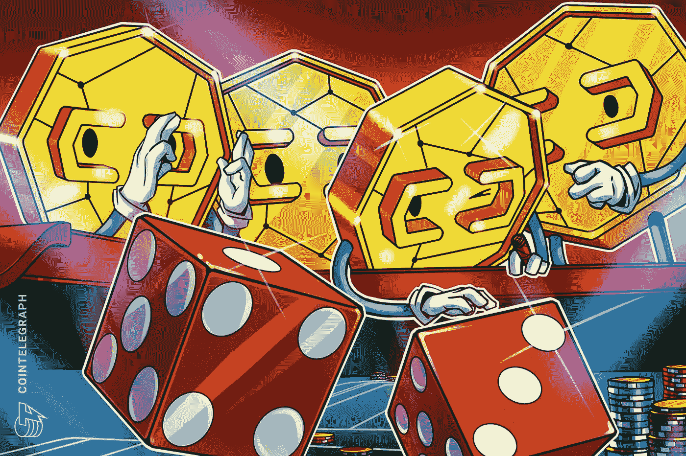

# 密码类型:网络、缩放和标桩(XCC-NSS)

> 原文：<https://medium.com/coinmonks/cryptotypes-network-scaling-staking-xcc-nss-3d4c5d2de14e?source=collection_archive---------40----------------------->

由**阿舒托什·钱德拉**(【aashutosh.chandra@xumitcapital.com】T2)

加密货币网络是一个使用加密系统运行的点对点支付网络。加密货币钱包软件允许用户通过向网络广播数字签名消息来发送和接收加密货币，加密货币是货币单位。事务存储在区块链上，这是一个分布式的复制公共数据库，通过一种称为挖掘的工作验证技术来达成共识。

为了共享交易，网络需要一个简单的结构。有一个分散的志愿者网络就足够了。节点可以在任何时候离开和重新加入网络，消息是在尽最大努力的基础上广播的。当一个节点重新连接时，它从其他节点下载并验证新的块，以完成其区块链的本地拷贝。

**1.1 草间弥生网络**

Kusama 是 Polkadot 的公共预生产环境，允许任何开发人员在网络上发布新的区块链和应用程序之前进行试验和测试。草间弥生可以被视为开发人员的一个沙箱，这些开发人员希望使用公开市场上交易的实际比特币来测试 Polkadot 项目的早期版本。草间弥生的目标是让开发者在设计 Polkadot 项目时有更大的灵活性。

另一方面，草间弥生的法规比波尔卡多更少，包括更少的治理要求。

草间弥生在别处借用了波尔卡多特的大部分关键设计元素。例如，Kusama 采用了两种类型的区块链:主网络，称为中继链，其中的交易是永久性的，以及用户生成的网络，称为副链。

在草间弥生上开始一个项目的好处是允许 Polkadot 项目在上线之前创建一个用户群并在社区中获得牵引力。

在草间网络上可以创建两种类型的区块链:

1.  中继链是交易完成的地方。中继链将添加新事务的操作与验证这些事务的行为隔离开来，以获得更快的速度。
2.  **副链**是定制的区块链，利用中继链的计算能力来验证交易的准确性。

草间弥生是波尔卡多特区块链的“金丝雀网络”，这意味着它在波尔卡多特区块链部署之前提供未经审计的早期代码版本。

这两个网络的第一个显著区别是治理系统的速度。在草间弥生，公民投票需要 7 天，实施改革需要 8 天，而在波尔卡多特需要 1 个月。

第二，在草间弥生上成为验证者要比在波尔卡多上容易得多，因为最低赌注要求更低。

重要的是要记住草间弥生是用于测试的区块链，它牺牲了稳定性和安全性来提高网络性能。

**1.2 Mina 协议**

不管有多少事务被提交给网络，Mina 协议都努力成为一个轻量级的区块链，大小不变，为 22 kB。不需要复杂的计算机硬件，任何人都应该能够管理一个节点并帮助保护其网络。随着区块链技术越来越受欢迎，存储在大多数平台上的交易量急剧增加。例如，以太坊区块链在 2016 年 4 月略高于 5 GB，但到 2021 年 4 月已增长到 220 GB 以上。在这五年中，区块链上播放了数百万次交易。

Mina 的创造者通过使用加密技术来构建一个面向支付的区块链，它不需要每个节点保存历史交易的完整记录。这有效地减少了整个区块链网络的计算需求。Mina 认为，通过允许更多的用户运行节点和验证交易，将会形成更多的节点，从而使网络变得更加分散和安全。

**2。加密货币赌注**

如果他/她拥有的加密货币能够实现，那么他/她可以持有一些加密货币，并随着时间的推移获得一定比例的奖励(目前的可能性包括 Tezos、Cosmos 和现在的以太坊等。

这通常通过“赌注池”来完成，类似于有息储蓄账户。因为区块链让你的密码发挥作用，所以在下注时会产生激励。支持赌注的加密货币使用一种称为“赌注证明”的“共识技术”，以确保所有交易都得到验证和保护，而无需银行或支付处理器的参与。如果你选择押上你的密码，它就成为这个过程的一部分。

**2.1 凸财**

[凸金融令牌(CVX)](https://www.convexfinance.com/) 是建立在曲线金融稳定币交换基础上的一个独特的 DeFi 协议。凸支付额外的 DeFi 收益率，以曲线流动性提供者和 CRV 利益相关者为核心。

Convex Finance 是一个平台，允许 CRV 代币持有者和曲线流动性提供商从代币中赚取额外的利息和曲线交易费。凸金融，换句话说，提供了增强的曲线赌注。

通过向分散的自动化做市商提供流动性，加密资产的持有者可以获得被动收入。例如，Curve Finance 是一个分散式交易所(DEX ),在其协议中使用这一点来实现无许可的数字资产交易。任何人都可以锁定他们的加密资产，并通过将其原生 CRV 令牌添加到各种流动性池中来赚取费用。

Convex Finance 是一个由一群匿名开发人员创建的平台，允许 Curve Finance 的流动性提供商在不锁定其 CRV 代币的情况下获得更多奖励。平台上没有提现费，只有很少的表演费。

赌注和提供流动性是协议创造更多收益的两种重要方式。

**通过提供流动性:** Curve 的 LP 代币可以存放在凸金融。由于其他用户也用 Convex 锁定了他们的 CRV 代币，这些流动性提供者在曲线上获得了更多的 CRV 激励。提振来自其他 CRV 投资者。Convex 的工作原理是通过让大量的人使用它来增加回报。CVX 是凸金融的原生加密货币令牌。

**通过下注:**即使你不是流动性提供商，你也可以利用 Convex 来下注你的 CRV 代币，分享增加的收益。如果您直接在 Curve 上下注 CRV 代币，您将获得 veCRV，它会通过分享 Curve 平台交易成本的百分比来补偿您。

你也可以在凸台上下注 CRV 代币来换取 cvxCRV 代币。cvxCRV 硬币提供了与 veCRV 相同的好处，包括向 veCRV 持有者空投和曲线平台奖励。然而，cvxCRV 代币有额外的好处，如 CVX 代币和凸平台收益分成。然而，在凸平台上下注是单向交易。

**2.2 安培**

AmpAmp 是一种数字抵押令牌，可以保护用户希望转移的任何形式的资产，包括数字支付、法定货币、贷款分配和财产交易收入。

赌注是一种确保交易安全的机制。智能合约用于冻结资产，直到交易通过验证，然后将资金发放给收款方。开发者可以构建自己的应用程序，使用 amp 加密传输，因为它是开源的。

当双方完成支付交易时，AMP 专注于降低双方之间的交换成本。这也有助于避免欺诈。AMP 代币可用于担保任何类型的金融交易。货币兑换、贷款支付和数字支付都是这样的例子。

**总结**

随着加密货币世界和开源解决方案的最新中断，加密货币网络即将升级，同时牢记开源项目。随着投资者加密投资的逐渐增加，基础项目的开发将会得到越来越多的重视。