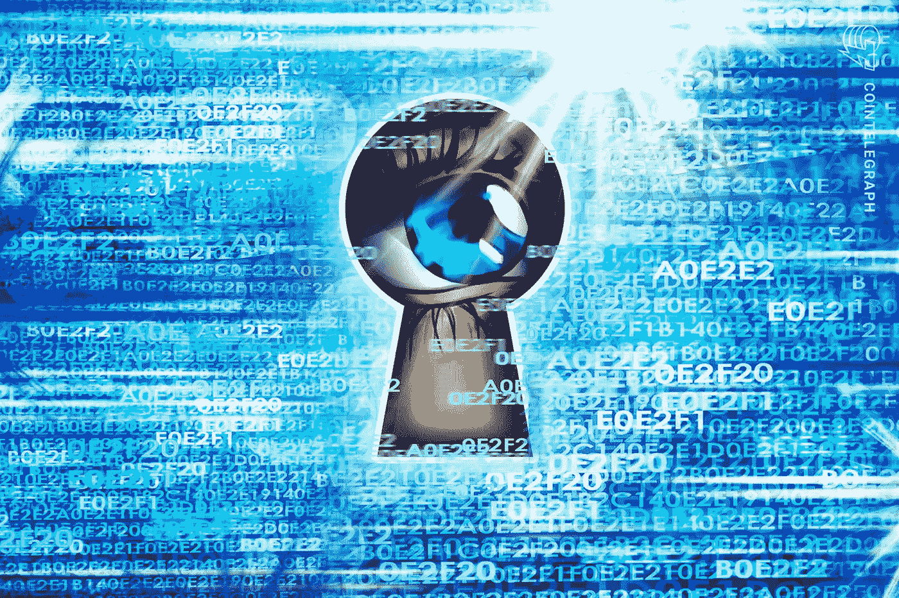

# 密码类型:隐私和协议(XCC-PRP)

> 原文：<https://medium.com/coinmonks/cryptotypes-privacy-protocol-xcc-prp-159380f2eb6e?source=collection_archive---------48----------------------->

由**山图努索德**(【shantnu.sood@xumitcapital.com】T2)

今天，我们将关注一个名为**的加密货币新指数，即隐私和协议。**

**隐私加密币**

隐私币是一种加密货币，通过掩盖交易的来源和目的地，允许私人和匿名的区块链交易。与比特币和其他非隐私区块链不同，比特币和其他非隐私允许任何人以开放的精神观察其网络上的公共地址和交易，从而很容易跟踪某人的存款和取款，这些匿名加密货币采用的策略包括隐藏用户的真实钱包余额和地址，以及合并几笔交易以避免链分析，链分析可用于确定进行交易的人的身份。隐私币有两个明显的特性:匿名性和不可追踪性。由于不可追踪性，其他方会发现利用区块链等技术追踪交易轨迹非常困难。

**私人硬币的使用案例**

使用隐私币的私人交易不一定会助长洗钱和恐怖融资等恶意活动。一些用户珍惜他们的财务隐私。

下面我们讨论了隐私币的一些使用案例。

*   **用于个人安全的隐私币**

为了隐藏他们的钱和掩盖他们的交易，富裕的加密货币投资者正在求助于隐私替代硬币。他们还利用隐私硬币来隐藏数字钱包中的钱数。

黑客首先掌握了根据比特币和以太坊等公共账本上的交易追踪比特币持有者的技术。Zcash、Monero 和 PIVX 的持有者现在可以通过利用这些硬币的安全性和隐私来阻止黑客。

*   **自由使用**

将比特币资金输送给反主流文化组织、政治异见人士和社会活动可能会很困难。如果当局或政府反对，情况尤其如此。

使用传统加密货币进行支付从来都不是一个好主意，因为当局可以监控它们，并找出它们的来源。然而，使用匿名硬币，人们可以向任何团体或组织捐款，而不用担心被认出来。

*   **金融数据保护**

企业和政府总是在寻找人们的财务信息。这些信息被用于各种目的，其中之一是评估个人的财务行为。人们越来越多地转向关注隐私的替代硬币，以对抗此类组织获得财务数据的前景。

比特币可能比借记卡更难追踪。然而，它不能提供与隐私替代币相同的隐私级别，尤其是在保护交易轨迹方面。

**主要隐私币**

[Zcash](https://z.cash/)

**价格:105.69 美元**

市值:1521240220 美元

“Zk-SNARKs”代表“零知识简洁非交互式知识论证”，是 Zcash 使用的一种方法。zk-SNARKs 允许一方在不透露任何个人信息的情况下向另一方验证任何事情，这使得这种方法非常适合私人加密交易。

然而，因为隐私不是 Zcash 的核心组成部分，所以交易并不总是匿名的。Zcash 允许四种不同的交易，每种交易都有不同的隐私保护。

Zcash 的优势包括一些最棒的隐私机制，以及我们名单上第二大的硬币市值。

[**濒临**](https://vergecurrency.com/)

**价格:0.004848 美元**

市值:79，678，052 美元

Verge 没有使用加密技术来保护用户的身份，而是依靠洋葱路由器(TOR)和隐形互联网项目(I2P)的测试技术。TOR 隐藏用户的身份，通过分散的中继网络和由世界各地的志愿者管理的隧道路由他们的通信。另一方面，I2P 在通过一个匿名的、点对点的、由志愿者运营的全球分布式网络传输数据之前，会对用户数据进行加密。它允许隐藏交易参与者的位置和 IP 地址。

[**莫内罗**](https://www.getmonero.org/)

**价格:165.40 美元**

市值:2997349488 美元

Monero 是一种私人数字货币，允许用户成为自己的银行。Monero 安全协议确保外人无法看到任何个人用户的余额或活动。这与以太坊或比特币等更知名的硬币形成对比，它们有透明的区块链。据其创造者称，Monero 是唯一一种默认情况下每个用户都是匿名的加密货币。除了发送者和接收者的身份之外，每笔交易的金额都通过三种特定的技术隐藏起来:环签名、环 CT 和隐形地址。由于每笔交易都是私人的，所以无法追踪 Monero。

**协议加密货币**

协议是允许计算机交流信息的规则的集合。他们为加密货币构建了区块链的结构，这是一个分布式数据库，允许数字货币在互联网上安全交易。工作证明和股份证明是使用最多的两种加密货币技术。下面讨论一些顶级协议加密货币:

[**阿尔格兰德**](https://www.algorand.com/)

**价格:0.4521 美元**

市值:3056140764 美元

阿尔格兰德是一个区块链平台，也是一种数字货币。其他加密货币和基于区块链的项目可以托管在 Algorand 上。Algorand 是一个开源的区块链，这意味着任何人都可以查看代码并为之做出贡献。Algorand 是一个纯粹的赌注证明游戏(PPoS)。Algorand 宣传自己是一个可扩展的高效平台，可以快速完成交易。

[**埃尔隆德**](https://elrond.com/)

**价格:92.81 美元**

市值:2021750688 美元

埃尔隆德是一款软件，旨在鼓励分布式计算机网络运营智能合约平台，重点是可扩展性和低廉的交易成本。与 algorand 一样，埃尔隆德也是基于利益证明(PPoS)算法。智能合约、交易结算和代币发行都可以在埃尔隆德网络上使用，这与其他加密货币网络类似。埃尔隆德设计的分片和股权证明变体是独一无二的，它们有助于每秒执行 12，500 笔交易。

— — — — — — — — — — — — — — — — — — — — — — — —

**参考文献:**

[https://www.kraken.com/en-gb/learn/what-is-elrond-egld](https://www.kraken.com/en-gb/learn/what-is-elrond-egld)

[https://www . investopedia . com/algo rand-algo-definition-5217725 #:~:text = algo rand %20(ALGO)% 20 is % 20a % 20 区块链，以及% 20 reward % 20 平台的% 20 运营商](https://www.investopedia.com/algorand-algo-definition-5217725#:~:text=Algorand%20(ALGO)%20is%20a%20blockchain,and%20reward%20the%20platform's%20operators)。

[https://medium . com/coin monks/cryptotypes-media-meme coins-mobile-xcc-mmm-ba 98119483 c 0](/coinmonks/cryptotypes-media-memecoins-mobile-xcc-mmm-ba98119483c0)

 [## 6 种私有加密货币

### 加密货币之所以流行，有几个原因，包括隐私和匿名。其中一些有助于…

www.investopedia.com](https://www.investopedia.com/tech/five-most-private-cryptocurrencies/) 

> 加入 Coinmonks [电报频道](https://t.me/coincodecap)和 [Youtube 频道](https://www.youtube.com/c/coinmonks/videos)了解加密交易和投资

# 另外，阅读

*   [Bookmap 评论](https://coincodecap.com/bookmap-review-2021-best-trading-software) | [美国 5 大最佳加密交易所](https://coincodecap.com/crypto-exchange-usa)
*   最佳加密[硬件钱包](/coinmonks/hardware-wallets-dfa1211730c6) | [Bitbns 评论](/coinmonks/bitbns-review-38256a07e161)
*   [新加坡十大最佳加密交易所](https://coincodecap.com/crypto-exchange-in-singapore) | [购买 AXS](https://coincodecap.com/buy-axs-token)
*   [红狗赌场评论](https://coincodecap.com/red-dog-casino-review) | [Swyftx 评论](https://coincodecap.com/swyftx-review) | [CoinGate 评论](https://coincodecap.com/coingate-review)
*   [投资印度的最佳密码](https://coincodecap.com/best-crypto-to-invest-in-india-in-2021)|[WazirX P2P](https://coincodecap.com/wazirx-p2p)|[Hi Dollar Review](https://coincodecap.com/hi-dollar-review)
*   [加拿大最佳加密交易机器人](https://coincodecap.com/5-best-crypto-trading-bots-in-canada) | [库币评论](https://coincodecap.com/kucoin-review)