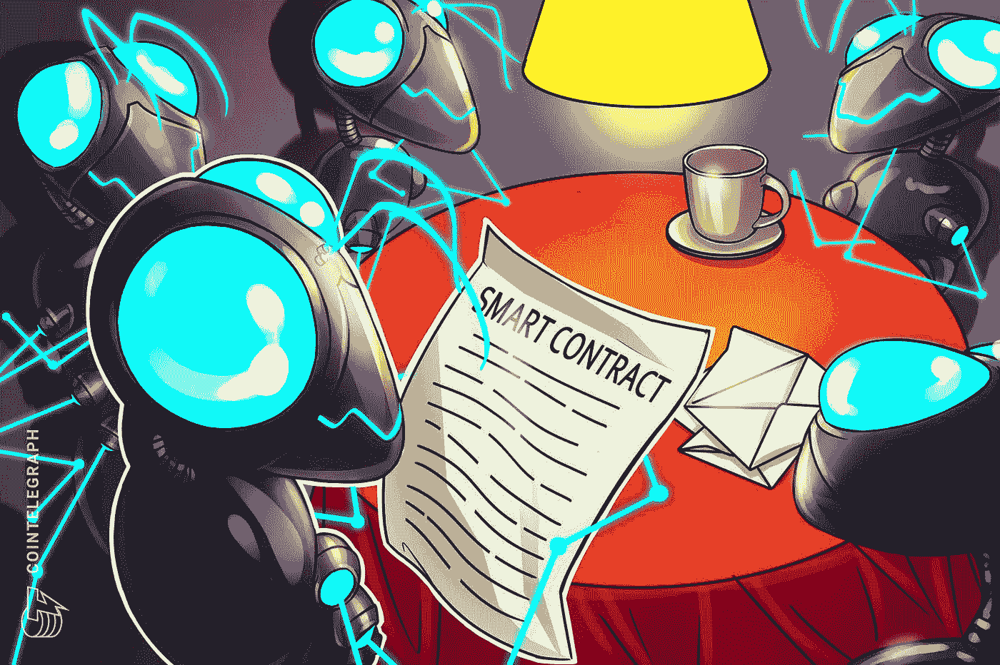

# 密码类型:智能合同(XCC-SMC)

> 原文：<https://medium.com/coinmonks/cryptotypes-smart-contracts-xcc-smc-e663e86b1c4?source=collection_archive---------48----------------------->

由**阿罗汉·帕里克**(【arhan.parikh@xumitcapital.com】T2)

**什么是智能合约？**

“智能合约是存储在区块链上的程序，当达到预设标准时就会运行。它们通常用于自动化协议的执行，以便各方可以立即确定结果，而不需要任何中介或浪费时间。智能合约的工作原理是遵循写在区块链代码中的简单语句。当预设的环境得到满足和验证时，活动由计算机网络执行。当交易完成时，区块链被更新。这意味着交易不能被修改，只有那些有权限的人才能访问结果”。

**智能合同如何工作**

“在智能合同中，可以有尽可能多的规定，以满足参与者正确执行任务的需要。为了制定条款，参与者必须确定交易及其数据在区块链上的表示方式，就管理这些交易的规则达成一致，探索所有可能的例外情况，并定义解决争议的框架。然后，开发人员可以对智能合同进行编程”。

**智能合约的优势**

智能合约有很多好处。首先，它们以高速、高效和精确的方式运行。“当条件满足时，合同立即执行。因为智能合同是数字化和自动化的，所以不需要处理文书工作，也不需要花费时间来纠正手动填写表格时可能出现的错误”。其次，由于“没有第三方参与，因此信任度和透明度更高。没有必要担心信息被篡改，因为加密货币会保留参与者之间共享的加密交易记录”。接下来，加密货币的安全方面是这样的，因为“区块链的交易记录是加密的，很难被侵入”。此外，由于分布式分类账中的每条记录都与之前和之后的条目相关联，黑客必须改变整个链条才能改变一条记录。最后，智能合同的另一个主要好处是有助于节约成本。“智能合同消除了对中介进行交易的需要，以及往往与涉及中介的交易相关的时间延迟和费用”。

**智能合约的应用**

展望未来，智能合约在现实世界中提供了大量的应用。首先，“智能合同有助于保护药物疗效”。IBM 和 Sonoco 等公司正在努力通过增加供应链透明度来减少救生药物运输中的问题。“Pharma Portal 是一个位于区块链的技术平台，可跟踪整个供应链中的温控药品，为众多利益相关方提供可信、可靠和准确的数据”。其次，智能合同有助于“增加对零售商-供应商关系的信任”。”例如，家得宝在区块链采用智能合同来快速处理供应商问题。他们通过实时沟通和对供应链的更深入了解来加强与供应商的联系，从而有更多时间进行关键工作和创新”。最后但同样重要的是，智能合约有助于“让国际贸易更快、更高效”。IBM 区块链有一个“名为 we.trade 的贸易金融网络，有助于为全球贸易的企业创造一个信任的生态系统”。“We.trade 是一个总部位于区块链的平台，它提供统一的规则和简化的交易选择，以减少摩擦和风险，同时简化交易流程，促进参与企业和银行的贸易前景”。

**前 5 名智能合约令牌(基于市值)**

现在，我们已经详细了解了智能合约的构成，请注意属于这一类别的几个值得注意的加密货币。

[**以太坊**](https://ethereum.org/en/) 是全球第二大加密货币，市值仅次于比特币。“以太坊为每个人提供开放的数字货币和数据友好服务。正是这项技术推动了加密货币以太网(ETH)和当今数以千计的其他应用。这是一个建立在比特币创新基础上的可编程区块链，但有一些很大的不同。以太坊是智能合约领域迄今为止最大的代币，就市值而言，它占整个智能合约类别的近 97%。

[**VeChain**](https://www.vechain.org/) 是一个“公共区块链，其价值来源于生态系统内成员解决现实世界经济问题所创造的活动”。VeChain 区块链有一个治理和经济模式，利益攸关方通过发展生态系统从集体价值创造中受益”。VeChain 是智能合约类别中的第二大令牌，在市值方面占 0.90%的权重。

接下来，“[**”Hedera**](https://hedera.com/)是应用最广泛的企业级公共网络，让您可以控制自己的数字环境。海德拉本地的节能加密货币 HBAR 是分散经济背后的驱动力。对于开发者来说，Hedera 超越了区块链，开创了一个快速、公平和安全应用的新时代”。Hedera 是智能合约类别中的第二大股票，在市值方面的权重为 0.90%。

" [**Celo**](https://celo.org/) 是一个全球性的支付基础设施，允许任何拥有手机的人使用金融工具。Celo 是一个移动优先的平台，提供快速、安全和稳定的支付”。Celo 是智能合约类别中的第四大令牌，在市值方面的权重为 0.30%。

"[**【NEM(新经济运动)**](https://coinmarketcap.com/currencies/nem/) 是一个平台生态系统，利用区块链和加密给出企业和个人的解决方案。NEM 的运作方式与比特币类似，拥有一个由分布式独立节点组成的网络，处理和记录区块链的交易。NEM 确实提供了许多独特的功能，使其有别于比特币和大多数其他加密货币”。NEM 是智能合约类别中的第五大令牌，在市值方面的权重为 0.20%。

**结论**

总而言之，智能合约已经越来越受欢迎，预计空间只会增长。他们有大量的使用案例，在这个日益增长和发展的数字世界中，他们提供了一种新的方式来开展业务活动。如上所述，以太坊是最大的智能合约令牌，除此之外，其他著名的智能合约令牌包括 VeChain、Hedera、Celo 和新经济运动(NEM)。总之，智能合同有各种使用案例和好处，如果实施得当，可以提供一个充满数字化的未来。

— — — — — — — — — — — — — — — — — — — — — — — —

**参考文献**

*区块链上的智能合约有哪些？* IBM。(未注明)。于 2022 年 5 月 10 日从[https://www.ibm.com/topics/smart-contracts](https://www.ibm.com/topics/smart-contracts)检索

*以太坊是什么？【ethereum.org】T21。(未注明)。于 2022 年 5 月 10 日从[https://ethereum.org/en/what-is-ethereum/](https://ethereum.org/en/what-is-ethereum/)检索*

*Vechainthor 区块链|商业大众采用的公共区块链*。VeChainThor Blockchain |面向商业大众采用的公共区块链。(未注明)。检索于 2022 年 5 月 10 日，发自 https://www.vechain.org/

*你好未来*。海德拉。(未注明)。于 2022 年 5 月 10 日从[https://hedera.com/](https://hedera.com/)检索

*移动第一 DEFI 平台，实现快速、安全和稳定的数字支付*。塞洛。(未注明)。检索于 2022 年 5 月 10 日，来自[https://celo.org/](https://celo.org/)

*今日新市场价格，XEM 对美元汇率，市值和图表*。CoinMarketCap。(未注明)。于 2022 年 5 月 10 日从[https://coinmarketcap.com/currencies/nem/](https://coinmarketcap.com/currencies/nem/)检索

> 加入 Coinmonks [电报频道](https://t.me/coincodecap)和 [Youtube 频道](https://www.youtube.com/c/coinmonks/videos)了解加密交易和投资

# 另外，阅读

*   [如何在 FTX 交易所交易期货](https://coincodecap.com/ftx-futures-trading) | [OKEx vs 币安](https://coincodecap.com/okex-vs-binance)
*   [CoinLoan 评论](https://coincodecap.com/coinloan-review) | [YouHodler 评论](/coinmonks/youhodler-4-easy-ways-to-make-money-98969b9689f2) | [BlockFi 评论](https://coincodecap.com/blockfi-review)
*   [XT.COM 评论](https://coincodecap.com/profittradingapp-for-binance) | [币安评论](https://coincodecap.com/xt-com-review)
*   [SmithBot 评论](https://coincodecap.com/smithbot-review) | [4 款最佳免费开源交易机器人](https://coincodecap.com/free-open-source-trading-bots)
*   [比特币基地僵尸程序](/coinmonks/coinbase-bots-ac6359e897f3) | [AscendEX 审查](/coinmonks/ascendex-review-53e829cf75fa) | [OKEx 交易僵尸程序](/coinmonks/okex-trading-bots-234920f61e60)