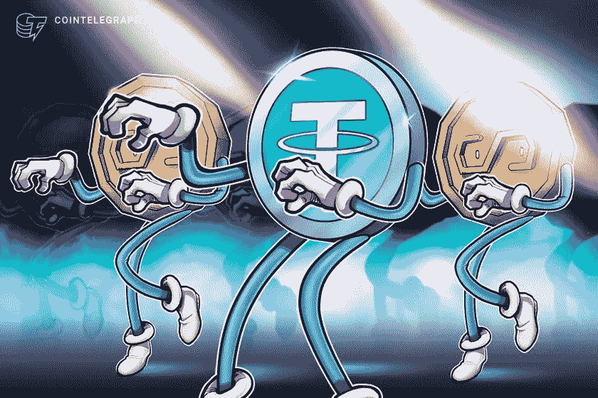

# 隐型:稳定隐型

> 原文：<https://medium.com/coinmonks/cryptotypes-stablecoins-xcc-stc-c20f5a748387?source=collection_archive---------23----------------------->

由**山图努索德**(【shantnu.sood@xumitcapital.com】T2)

传统的加密货币非常不稳定，本质上具有内在的风险。投资加密货币伴随着高风险和高回报。有很多这样的例子，人们一夜之间成为百万富翁，几周后却失去了一切。然而，stablecoin 是一种加密货币，其波动性远远小于任何其他类型的加密货币。法定货币和数字货币都由这些货币代表。

**什么是 Stablecoins？**

稳定币是一种加密货币，与法定货币、商品或其他加密货币等储备资产挂钩。它是资产的令牌化版本，可以巧妙地引入区块链生态系统，以促进无缝传递交易、改进套利和价值交换。它也被称为效用代币，因为它允许你在不接受法定货币的分散交易所快速买卖。

***稳定币的种类:***

**法定抵押债券**

法定抵押稳定币是稳定币的传统类型。这种稳定的货币与一个国家的主权货币挂钩。

这些稳定货币不是由任何中央机构发行的，而是由公司通过在其储备中存入等量的法定货币发行的。一些最大的 stablecoins 如 Tether 和 TrueUSD 就是基于菲亚特的 stablecoins 的例子。

**商品支持稳定债券**

顾名思义，大宗商品支持的稳定债券是由不同类型的资产类别支持的，比如贵金属。黄金是最常用的大宗商品，作为大宗商品支持的稳定债券的抵押品。房地产、石油和其他商品可能被用作抵押品。

**加密支持的稳定密码**

也有加密支持的 stablecoins。一种基于加密的稳定币由另一种加密货币支持。尽管许多人可能认为，与其他形式的稳定币相比，加密支持的稳定币可能风险更大，但事实上，加密挂钩的稳定币比法定支持的稳定币提供了更好的多样化。此外，加密支持的 stablecoins 被过度抵押。

假设你必须存入价值 1000 美元的比特币，才能发行价值 500 美元的稳定币。因此，稳定的硬币被超额抵押了 200%。因此，即使比特币的价格下跌 25%，仍会有价值 500 美元的稳定硬币和价值 750 美元的比特币作为抵押品。

**算法稳定积分**

最后一类稳定债券是非抵押稳定债券。这些硬币没有任何资产支持，而是通过一种算法来稳定其价值。当需求增加时，该算法增加稳定币的供应，从而稳定稳定币，反之亦然。

***stable coins 的用例***

**快速交易**

稳定的货币是当代金融体系的重要组成部分，是安全交易和储存价值的一种方式。没有数字货币，向另一个国家汇款既缓慢又昂贵。与 SWIFT 或汇款运营商相比，Stablecoins 可以在全球范围内以更快的速度进行交易，而成本仅为后者的一小部分。这对全球价值交换有着巨大的影响。

**避险资产**

Stablecoins 具有一个在整个时间内保持不变的值。这使得 stablecoins 成为一种优秀的避险资产，因为与比特币等价格每天可能大幅波动的加密货币不同，一个人在 stablecoins 中储存价值没有损失金钱的风险，特别是考虑到他们对自己的资产拥有完全的监护权。最近，委内瑞拉的政治和经济动荡凸显了价格稳定和稳定硬币自我保管性质的相关性，许多逃离该国的居民将他们的财富藏在比特币中，以避免他们的法定货币被没收。

**支付**

随着沃尔玛宣布其 stablecoin 专利，支付预计将成为未来几年的关键用例之一。企业从接受 stablecoins 作为付款中获利，因为他们节省了与银行机构中间人处理费相关的 2-3%的交易费。此外，脸书的 Libra 已经准备好接受来自世界各地的付款，这要归功于区块链技术公司的最低交易费。

现在，让我们来看看市场上可供投资的各种稳定债券:

[**系绳(USDT)**](https://tether.to/en/)

**价格:0.9999 美元**

市值:83，227，967，198 美元

Tether 是世界上第一种稳定货币，也是市值最大的货币，是继比特币(BTC)和以太坊(ETH)之后第三种最有价值的加密货币。系绳是一种法定抵押的稳定硬币，这意味着 1 个系绳单位价值 1 美元。这表明可以以 1 美元的价格购买和出售 1 个系绳单元。如果你借出你的系绳硬币，你可以赚取高达 13%的利息。任何支持加密贷款的交易所都可以很容易地做到这一点。

[**美元硬币**](https://www.circle.com/en/usdc)

**价格:1 美元**

市值:48577510352 美元

像 USDT 一样，美元硬币是一种以美元计价的稳定硬币。这是一种加密支持的稳定币，使用以太币等其他加密货币作为抵押品。USDC 目前基于索拉纳和阿尔格兰德区块链。这些货币之所以受欢迎，是因为与其他一些稳定货币相比，它们提供了更高的透明度、审计性和稳定性。像泰瑟一样，USDC 可以通过出借硬币产生高达 9.5%的利息。

[terra USD](https://www.terra.money/)

**价格:1.00 美元**

市值:18，757，551，006 美元

TerraUSD 是一个基于算法的稳定币。它最出名的是其无限扩张的货币政策。与其他 stablecoins 不同，TerraUSD 不是由银行中的美元支持，而是使用 Terra 的本地加密货币 LUNA 作为储备资产。换句话说，如果你想铸造一个单位的 TerraUSD，就需要烧掉一个单位的 LUNA。它可以提供高达 14%的利率借给你的加密硬币。

[**BinanceUSD**](https://www.binance.com/en/busd)

**价格:1.00 美元**

市值:17，510，480，623 美元

BUSD 是一种以美元计价的稳定货币，由纽约州金融服务局监管。它是由币安交易所和 Paxos 信托公司合作创建的。旨在与美元保持 1:1 的平价，长期保值。

— — — — — — — — — — — — — — — — — — — — — -

**参考文献:**

[https://crypto-academy.org/what-are-stablecoins/](https://crypto-academy.org/what-are-stablecoins/)

[https://coinmarketcap.com/](https://coinmarketcap.com/)

[https://www . CNBC . com/2021/07/07/tether-cryptocurrency-usdt-what-you-need-to-know . html](https://www.cnbc.com/2021/07/07/tether-cryptocurrency-usdt-what-you-need-to-know.html)

[https://en.bitcoinwiki.org/wiki/BUSD](https://en.bitcoinwiki.org/wiki/BUSD)

 [## Stablecoins 的主要使用案例和优势

### 更快、更便宜、透明、无边界和可编程

medium.com](/stably-blog/top-use-cases-and-benefits-of-stablecoins-4f1ceab57d00) 

> *加入 Coinmonks* [*电报频道*](https://t.me/coincodecap) *和* [*Youtube 频道*](https://www.youtube.com/c/coinmonks/videos) *了解加密交易和投资*

# 另外，阅读

*   [Bookmap 点评](https://coincodecap.com/bookmap-review-2021-best-trading-software) | [美国 5 大最佳加密交易所](https://coincodecap.com/crypto-exchange-usa)
*   最佳加密[硬件钱包](/coinmonks/hardware-wallets-dfa1211730c6) | [Bitbns 评论](/coinmonks/bitbns-review-38256a07e161)
*   [新加坡十大最佳加密交易所](https://coincodecap.com/crypto-exchange-in-singapore) | [购买 AXS](https://coincodecap.com/buy-axs-token)
*   [红狗赌场评论](https://coincodecap.com/red-dog-casino-review) | [Swyftx 评论](https://coincodecap.com/swyftx-review) | [CoinGate 评论](https://coincodecap.com/coingate-review)
*   [投资印度的最佳密码](https://coincodecap.com/best-crypto-to-invest-in-india-in-2021)|[WazirX P2P](https://coincodecap.com/wazirx-p2p)|[Hi Dollar Review](https://coincodecap.com/hi-dollar-review)