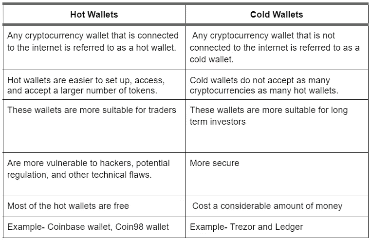

# 密码类型:钱包(XCC-沃尔玛)

> 原文：<https://medium.com/coinmonks/cryptotypes-wallets-xcc-wal-8512554b43a2?source=collection_archive---------51----------------------->

什么是加密钱包？

加密钱包是一种软件程序或物理设备，它存储您的加密货币，并允许您在其中发送和接收交易。它们可以是硬件钱包，如账本(看起来像 u 盘)，也可以是移动应用，如比特币基地钱包，这使得使用加密货币像用信用卡在线购物一样简单。私钥和公钥是组成加密钱包的两对密钥。用于向钱包发送加密的地址是由公钥决定的，而公钥是从私钥派生出来的。

虽然许多人不熟悉加密货币的概念，但加密钱包的设计是用户友好的。MetaMask 和 Coin98 等网络钱包的图形用户界面(GUI)设计得尽可能简单。

钱包有多种款式，包括

**纸质钱包-** 密钥被写在一种物理介质上，比如纸，并存储在一个安全的位置。这使得使用你的密码更加困难，因为作为数字货币，它只能在互联网上使用。

**硬件钱包-** 密钥存储在一个安全的拇指驱动器上，只有当你需要使用加密货币时，它才会连接到电脑上。目标是在安全性和便利性之间取得平衡。

**在线钱包-** 密钥存储在应用程序或其他软件中；找一个双因素认证的。这简化了发送、接收和使用加密货币的过程。

而且，这些钱包根据工作机制也可以被称为热钱包或冷钱包。

它们是如何工作的？

与传统的可以存放实物现金的钱包不同，加密钱包不存储加密货币。资产存储在区块链上，但只有私钥可以访问它们。这些密钥证明了一个人的数字货币的所有权，并允许一个人用它进行交易。

私钥可以比作密码，而公钥可以比作用户名。因此，用户永远不要共享他们的私钥是非常重要的。当用户发送另一种加密货币时，接收者必须能够匹配私钥和公钥，以便解锁资金并花掉硬币。虽然没有硬币或货币交换，但交易记录在区块链的交易记录中。因此，发送方和接收方的加密货币钱包的余额将发生变化。

**钱包硬币&代币**

一些钱包有自己的硬币和代币，可以在各种交易所交易。他们也可以利用各种津贴。一些重要的钱包硬币和代币是:

**航海家令牌**

符号- VGX

市值-3.88 亿美元

最大供应量- 279，387，971

总供应量- 278，482，214

Voyager 是一家加密货币经纪商，为投资者提供了一种安全可靠的数字资产交易方式。Voyager 旨在为零售和机构投资者提供一个近乎即时的加密资产交易解决方案。加密经纪服务于 2018 年 10 月首次亮相，现在支持超过 55 种加密资产，并拥有专有的智能订单路由技术，可连接到十几个加密交易所。Voyager Token 的移动应用程序于 2019 年 1 月发布，使用户更容易交易加密货币。

Voyager 有一个集成的加密钱包，允许你在平台上保存所有的硬币。尽管它是纯移动设计，但该公司允许钱包使用交叉兼容性来与基于网络的应用程序配合工作。这个钱包是完全免费的，它是目前最友好的加密钱包之一。

旅行者平台的本地令牌是 VGX。旅行者用它来奖励它的用户。更高的利率(VGX 和代币)，返现奖励和其他好处是可能的。

VGX 利息:第一年，旅行者号持有的所有 VGX 代币将获得 7%的年收益率。在此之后，持有人可以投票决定未来的收益率。

返现奖励:当 Voyager 的智能订单路由器可以实现价格提升时，用户可以获得 2 倍或 3 倍的价格提升，这取决于他们的忠诚度。这种奖励的形式是 VGX。

推荐给朋友的奖励:根据你的忠诚度等级，你推荐给旅行者应用的每个人可以获得高达 40 美元的奖励。

**Coin98 令牌**

符号- C98

市值-2.74 亿美元

最大供应量-10 亿

总供应量-10 亿

Coin98 Wallet 是存储、发送、接收和管理加密货币资产的最简单、最安全的方式之一，包括比特币(BTC)、以太坊(ETH)、基于以太坊的 ERC20 令牌等。Coin98 钱包现在接受来自五个不同区块链的硬币和代币:比特币、以太坊、TomoChain、TRON 和币安链。

C98 是 Coin98 的原生加密货币，其持有者有权享有许多优势。首先，硬币的持有者赚取网络交易费，并可以将资产作为赌注来赚取回报。令牌持有者还可以通过提交提案和更新并进行投票来参与治理。

**安全令牌**

符号- SFP

市值-8600 万美元

最大供应量- 5 亿

总供应量- 5 亿

SafePal 是一款加密货币钱包，旨在为普通大众提供一个安全且用户友好的加密货币管理平台。SafePal 是币安首个硬件钱包产品组合。用户可以使用 SafePal 的硬件和软件钱包产品线轻松存储、管理、交换、交易和增加他们的加密财富，这些产品都通过 SafePal 应用程序进行配对和管理。

SafePal 令牌(SFP)是一个实用令牌，为整个 SafePal 生态系统提供动力。当用户使用 SFP 时，SafePal 产品和服务(如 SafePal 硬件钱包和 SafePal 交换)会打折扣。代币持有者还可以享受特殊优惠券和奖励，以及为新功能投票。

由**穆迪特·坦登**(【mudit.tandon@xumitcapital.com】T2)撰写

— — — — — — — — — — — — — — — — — —

**来源:**

*   职员，c .(未标明)。加密钱包:热钱包与冷钱包。双子座。

2022 年 5 月 4 日检索，来自[https://www . Gemini . com/crypto pedia/crypto-wallets-hot-cold # section-hot-wallets-pros-and-cons](https://www.gemini.com/cryptopedia/crypto-wallets-hot-cold#section-hot-wallets-pros-and-cons)

*   G.c .，说:，C. C .，说:，s，，，说:，R. (2022 年 4 月 8 日)。*热钱包 vs 冷藏*。30 天学会编码。

于 2022 年 5 月 4 日从[https://learn.onemonth.com/hot-wallet-vs-cold-storage/](https://learn.onemonth.com/hot-wallet-vs-cold-storage/)检索

*   Sergeenkov，A. (2021 年 11 月 5 日)。*coin 98 是什么？:CoinMarketCap* 。亚历山大港。

于 2022 年 5 月 4 日从[https://coinmarketcap.com/alexandria/article/what-is-coin98](https://coinmarketcap.com/alexandria/article/what-is-coin98)检索

*   *今日 COIN98 价格，C98 对美元直播，市值和走势图*。CoinMarketCap。(未注明)。

2022 年 5 月 4 日从 https://coinmarketcap.com/currencies/coin98/检索

*   贾斯敏·h .(2022 年 4 月 13 日)。*航海家加密审查(无忧交易费)*。哥特克特。

2022 年 5 月 4 日检索，来自[https://www . gotechtor . com/Voyager-crypto-review/#:~:text = Voyager % 20% 20 是否拥有% 20a %内置% 20crypto % 20wallet %，是否应该% 20stick % 20to %使用% 20 it % 20 for % 20 Voyager % E2 % 80% 99s % 20 平台](https://www.gotechtor.com/voyager-crypto-review/#:~:text=Voyager%20does%20have%20a%20built-in%20crypto%20wallet%20that,should%20stick%20to%20using%20it%20for%20Voyager%E2%80%99s%20platform)

*   琼斯 J. (2022 年 3 月 18 日)。航海家加密投资:特点，额外津贴，缺点和选择。CoinCentral。

于 2022 年 5 月 4 日从[https://coincentral.com/voyager-crypto-invest-review/](https://coincentral.com/voyager-crypto-invest-review/)检索

*   尼罗河。(2022 年 3 月 29 日)。什么是航海家令牌(VGX)？关于航海家令牌的完整指南评论。欢迎来到 Wootfi All In One 评论博客。

2022 年 5 月 4 日从[https://wootfi.com/voyager-token/](https://wootfi.com/voyager-token/)检索

> 加入 Coinmonks [电报频道](https://t.me/coincodecap)和 [Youtube 频道](https://www.youtube.com/c/coinmonks/videos)了解加密交易和投资

# 另外，阅读

*   [印度最佳 P2P 加密交易所](https://coincodecap.com/p2p-crypto-exchanges-in-india) | [柴犬钱包](https://coincodecap.com/baby-shiba-inu-wallets)
*   [八大加密附属计划](https://coincodecap.com/crypto-affiliate-programs) | [eToro vs 比特币基地](https://coincodecap.com/etoro-vs-coinbase)
*   [最佳以太坊钱包](https://coincodecap.com/best-ethereum-wallets) | [电报上的加密货币机器人](https://coincodecap.com/telegram-crypto-bots)
*   [交易杠杆代币的最佳交易所](https://coincodecap.com/leveraged-token-exchanges)
*   [最佳加密分析或链上数据](https://coincodecap.com/blockchain-analytics) | [Bexplus 评论](https://coincodecap.com/bexplus-review)
*   [NFT 十大市场造币集锦](https://coincodecap.com/nft-marketplaces)