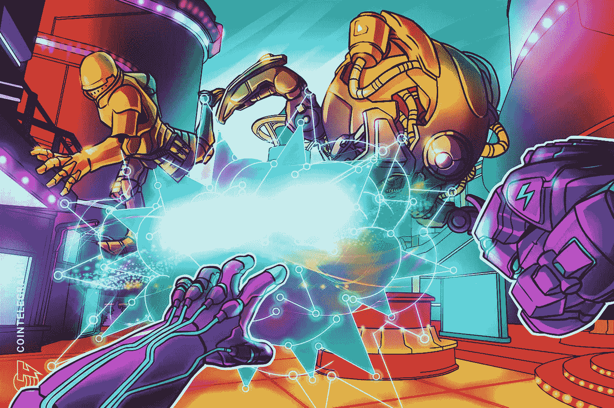
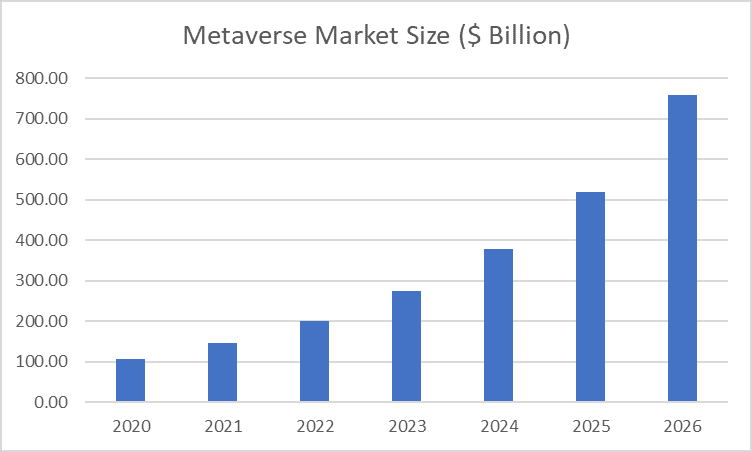

# 密码类型:Web3 和元宇宙(XCC-W3M)

> 原文：<https://medium.com/coinmonks/cryptotypes-web3-and-metaverse-xcc-w3m-5641bdee793e?source=collection_archive---------58----------------------->

元宇宙被认为是互联网的下一代。元宇宙代币最近越来越受欢迎，去年和今年为投资者提供了巨额利润。区块链和 NFT 被视为新生的元宇宙生态系统的关键组成部分。

在我们上一篇关于元宇宙的博客中，我们讨论了什么是元宇宙，以及它的一些用途、优点和缺点。本节将探讨这一领域所呈现的巨大投资机会，以及这一领域的一些主要参与者。

在新冠肺炎危机中，2020 年元宇宙的全球市场估计为 1071 亿美元，预计到 2026 年将达到 7586 亿美元的修正规模，CAGR 增长率为 37.1%。

此外，投资公司 gray 预测，到 2025 年，仅来自虚拟游戏的全球收入就可能超过 4000 亿美元，高于目前的 1800 亿美元，增长 122%。

许多大企业已经开始参与。耐克于 2021 年 12 月宣布收购虚拟运动鞋业务 RTFKT，以扩大其数字影响力。其他高级时装品牌，如纪梵希、古驰、杜嘉班纳和阿迪达斯，也在元宇宙举办了虚拟时装秀。同样，像爱莉安娜·格兰德和莉莉·纳斯·X 这样的歌手在元宇宙举办了虚拟音乐会，赢得了来自世界各地的数百万崇拜者。

现在，每个元宇宙都有自己的加密货币令牌，作为货币单位，用于在元宇宙内进行交易。虽然一些元宇宙代币只能在元宇宙境内使用，但其他代币可以在瓦济克斯、比特币基地和币安等交易所使用。

在下一节中，我们将看看一些主要的元经文及其各自的象征，它们目前正在蓬勃发展，在未来可能成为很好的投资。

[下放 ](https://decentraland.org/)

市值:4108724820 美元

化学机械抛光:2.23 美元

分散王国是一个虚拟现实世界，于 2018 年推出。它是一个建立在以太坊区块链上的平台。用户可以进入这个元宇宙，创建和定制自己的头像。3 月下旬，分散地举办了自己的时装周，在四天的时间里，共有 108，000 名独立访客。此外，JP 摩根银行在分散地购买了一个休息室，为用户提供更加虚拟的互动体验。

从投资的角度来看，分散土地拥有自己的加密货币，名为 MANA 分散土地使用魔法内部的所有交易，无论是买卖虚拟土地还是 NFT。

分散土地一直是机构投资者的最爱，灰度分散土地信托在 2021 年投资 6490 万美元。3

MANA 的价格从 2018 年推出时的 0.025 美元大幅上涨至目前的 2.23 美元，创下 5.15 美元的历史新高。因此，这可能是一个很好的时间来投资这个元宇宙令牌。

[**沙盒**](https://www.sandbox.game/en/)

市值:3307780714 美元

化学机械抛光:2.86 美元

沙盒和分散土地一样，是一个虚拟环境，用户可以在其中购买、交易和创建基于以太坊区块链的数字资产。Sand 是沙盒上使用的加密硬币的名称，它用于在这个特定的元宇宙上执行交易。虽然它与其他 metaverses 如分散地竞争，但它已经获得了几个高质量的合作伙伴，如雅达利，史努比狗狗和阿迪达斯，这使它具有竞争优势。

21Shares 是一家位于瑞士的加密交易所交易产品(ETP)发行商，它为 SAND token 创建了一个 ETP，为投资者提供沙盒的元宇宙和游戏平台^4

8 月份，沙子的价格为 0.051 美元，目前为 2.86 美元，创下 8.4022 美元的历史新高，价格涨幅超过 16000%。

[T5【金恩】T6](https://enjin.io/)

市值:1417120103 美元

化学机械抛光:1.62 美元

金恩于 2017 年推出，是一个类似元宇宙的游戏环境，ENJ 令牌用于购买有助于游戏进展的商品。金恩的主要用例是允许用户管理和存储游戏的虚拟物品。ENJ 的价格从 0.017 美元上涨到 1.722 美元，达到 4.5 美元以上的历史最高水平。

[以太坊 ](https://ethereum.org/en/)

市值:381891154221 美元

化学机械抛光:3174.05 美元

如果你一直在投资加密货币或关注它们，你可能听说过以太坊。继比特币之后，以太坊是第二大最有价值的加密货币。所有上述元宇宙系统都是利用以太坊区块链网络上的智能合约构建的。metaverses 使用的代币是 ERC20 代币，因此，如果元宇宙地区越来越受欢迎，以太的价格(以太坊加密货币代币)也将不可避免地上涨。

有不同的公司正在构建他们自己版本的元宇宙，这里我们讨论了这个领域中一些最有前途的项目。元宇宙技术正在蓬勃发展，在这个领域分配一些资金可能会带来好的回报和巨大的回报。然而，与任何其他投资一样，重要的是不要把所有的钱都放在一个元宇宙项目上，分散投资各种元宇宙硬币变得很重要。

作者:**山图努·索德**([shantnu.sood@xumitcapital.com](mailto:shantnu.sood@xumitcapital.com))

— — — — — — — — — — — — — — — — — — — — — — — — —

**引用:**

[https://www . globe news wire . com/news-release/2022/02/22/2389001/0/en/Global-元宇宙-Market-to-Reach-US-758-60 亿-by-the-Year-2026 . html #:~:text = Amid % 20 the % 20 covid % 2d 19% 20 crisis，Billion % 20 in % 20 the % 20 Year % 202021](https://www.globenewswire.com/news-release/2022/02/22/2389001/0/en/Global-Metaverse-Market-to-Reach-US-758-6-Billion-by-the-Year-2026.html#:~:text=Amid%20the%20COVID%2D19%20crisis,Billion%20in%20the%20year%202021)。

【https://news.nike.com/news/nike-acquires-rtfkt 

[https://www . fxstreet . com/cryptocurrences/news/investment-firms-is-during-capital-into-decentral land-202112071313](https://www.fxstreet.com/cryptocurrencies/news/investment-firms-are-pouring-capital-into-decentraland-202112071313)

⁴[https://www . coin desk . com/markets/2022/04/07/21 shares-launchs-元宇宙-etp-via-sandboxs-sand-token/#:~:text = 21 shares % 2c % 20a % 20 Switzerland % 2d based % 20 crypto，on % 20cryptocurrencies %和%20blockchain%20projects](https://www.coindesk.com/markets/2022/04/07/21shares-launches-metaverse-etp-via-sandboxs-sand-token/#:~:text=21Shares%2C%20a%20Switzerland%2Dbased%20crypto,on%20cryptocurrencies%20and%20blockchain%20projects) 。

**参考文献:**

[https://fashion United . com/news/fashion/global-元宇宙-到 2026 年市值 75860 亿美元/2022021945943](https://fashionunited.com/news/fashion/global-metaverse-market-to-be-worth-758-6-billion-dollars-by-2026/2022021945943)

[https://decentraland.org/](https://decentraland.org/)

[https://www.sandbox.game/en/](https://www.sandbox.game/en/)

[https://enjin.io/blog-tags/efinity?utm_source=google_ads&UTM _ medium = CPC&UTM _ campaign = OM _ brand&gclid = CJ 0 KC qjwgmqsbhdcarisaiivn 1 vwz 3 jkcckb 6 ejuz 1 u 0 petx ffv 9 u 9 z 7 nqz 8 wjsraiahgtasytzarmmaavl _ EALw _ wcB](https://enjin.io/blog-tags/efinity?utm_source=google_ads&utm_medium=cpc&utm_campaign=OM_brand&gclid=Cj0KCQjwgMqSBhDCARIsAIIVN1Vwz3jkccKb6ejuZ1u0PETXFfv9U9Z7NqZ8WJSRaiAhGtaSyTZArmMaAvl_EALw_wcB)

> 加入 Coinmonks [电报频道](https://t.me/coincodecap)和 [Youtube 频道](https://www.youtube.com/c/coinmonks/videos)了解加密交易和投资

# 另外，阅读

*   [Bookmap 点评](https://coincodecap.com/bookmap-review-2021-best-trading-software) | [美国 5 大最佳加密交易所](https://coincodecap.com/crypto-exchange-usa)
*   最佳加密[硬件钱包](/coinmonks/hardware-wallets-dfa1211730c6) | [Bitbns 评论](/coinmonks/bitbns-review-38256a07e161)
*   [新加坡十大最佳加密交易所](https://coincodecap.com/crypto-exchange-in-singapore) | [购买 AXS](https://coincodecap.com/buy-axs-token)
*   [红狗赌场评论](https://coincodecap.com/red-dog-casino-review) | [Swyftx 评论](https://coincodecap.com/swyftx-review) | [CoinGate 评论](https://coincodecap.com/coingate-review)
*   [投资印度的最佳密码](https://coincodecap.com/best-crypto-to-invest-in-india-in-2021)|[WazirX P2P](https://coincodecap.com/wazirx-p2p)|[Hi Dollar Review](https://coincodecap.com/hi-dollar-review)