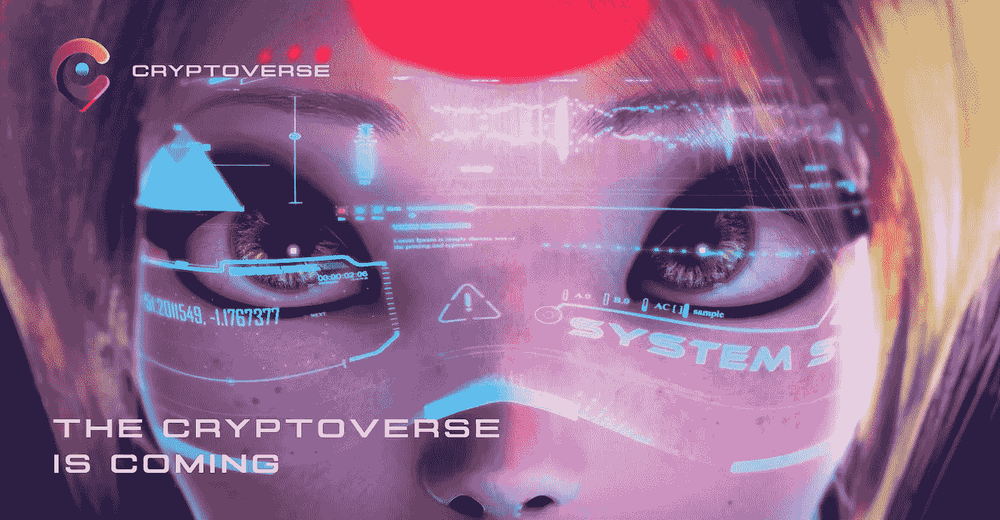
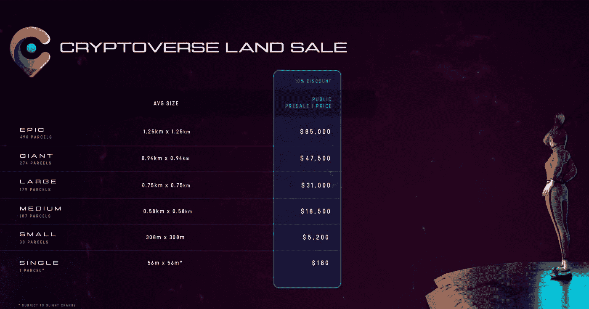

# Cryptoverse Land Minting 将于 6 月 20 日上线！

> 原文：<https://medium.com/coinmonks/cryptoverse-land-minting-goes-live-on-june-20th-135f3d7caf91?source=collection_archive---------50----------------------->

Cryptoverse 是一个建立在虚幻 5 中的沉浸式 3D 虚拟世界，由区块链技术支撑。在 Cryptoverse 中，用户将被授权使用$CGG 创建、拥有土地、管理和货币化体验，这也是 ChainGuardians 和 ChainBoost 生态系统的基础。

Cryptoverse 的一些特征是:

1.  *通过多链的互操作性:*利用 ChainGuardians 在多链开发方面的经验，Cryptoverse NFTs 将很容易从一个区块链转移到另一个。
2.  *跨现实:*实物和数字资产都将与 AR/VR/XR/MR 购物体验一起提供。
3.  *一个内部的 NFT 市场:*用户将能够在 Cryptoverse 市场上买卖他们的 NFT。资产将包括虚拟土地、车辆、物品等。
4.  土地分割和整理:土地所有者将会以不同的方式利用他们的土地。包括将他们的地块分割成小块出售，租用小块土地，在他们的土地上策划不同的体验。

出售虚拟土地的最初窗口已经关闭。从 6 月 20 日开始，土地所有者将可以铸造他们的土地。有 5 种不同类型的土地:**单块**单块土地是最小的一块土地。**单个**是多边形网络上唯一的土地类型，其他四种类型都会连接到以太坊区块链上。第二个尺寸是**小型**接着是**中型**、**大型**、**巨型**和**史诗**。

土地所有者将能够选择在不同的区域铸造他们的土地，例如中心区、教育区、娱乐区、商业区等等。如果你有兴趣阅读更多内容，请访问 https://www.cryptoverse.vip 或在这里阅读他们的文章

> 加入 Coinmonks [电报频道](https://t.me/coincodecap)和 [Youtube 频道](https://www.youtube.com/c/coinmonks/videos)了解加密交易和投资

# 另外，阅读

*   [AscendEx 保证金交易](https://coincodecap.com/ascendex-margin-trading) | [Bitfinex 赌注](https://coincodecap.com/bitfinex-staking) | [bitFlyer 审核](https://coincodecap.com/bitflyer-review)
*   [Bitget 回顾](https://coincodecap.com/bitget-review) | [双子座 vs BlockFi](https://coincodecap.com/gemini-vs-blockfi) cmd| [OKEx 期货交易](https://coincodecap.com/okex-futures-trading)
*   [AscendEx Staking](https://coincodecap.com/ascendex-staking)|[Bot Ocean Review](https://coincodecap.com/bot-ocean-review)|[最佳比特币钱包](https://coincodecap.com/bitcoin-wallets-india)
*   [霍比审核](https://coincodecap.com/huobi-review) | [OKEx 保证金交易](https://coincodecap.com/okex-margin-trading) | [期货交易](https://coincodecap.com/futures-trading)
*   [网格交易机器人](https://coincodecap.com/grid-trading) | [Cryptohopper 审查](/coinmonks/cryptohopper-review-a388ff5bae88) | [Bexplus 审查](https://coincodecap.com/bexplus-review)