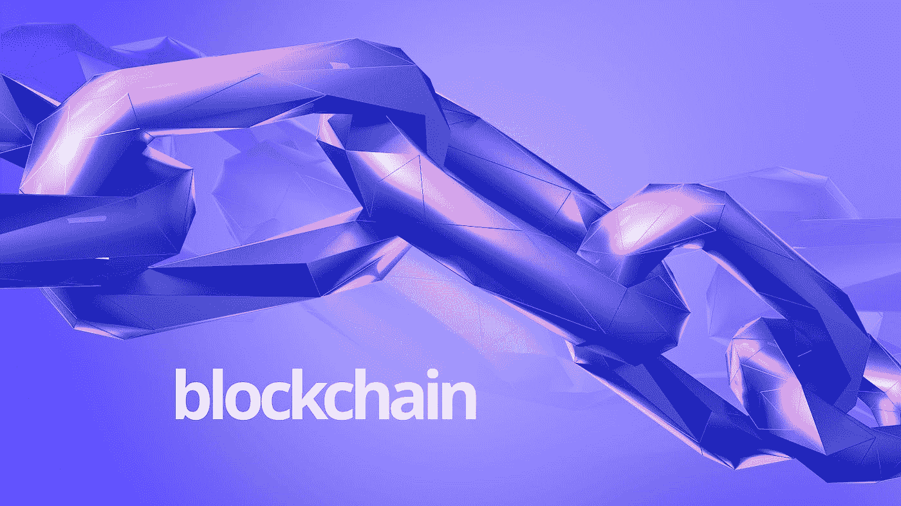

# Cryptoverse:加密货币、区块链及其用例的世界

> 原文：<https://medium.com/coinmonks/cryptoverse-world-of-blockchain-and-its-use-cases-af08472c1e36?source=collection_archive---------41----------------------->

Source: Pixabay

2021 年 11 月 09 日，加密货币[总市值达到 3 万亿美元。](https://www.bloomberg.com/news/articles/2021-11-08/crypto-world-hits-3-trillion-market-cap-as-ether-bitcoin-gain)对于不断发展的 cryptoverse 来说，这是一项重大成就，它见证了支撑数字资产的基础设施——区块链技术被推到聚光灯下。

加密货币和区块链技术的世界在不断发展。近年来，私人组织和机构团体已经看到加密货币和区块链技术用例的激增。

许多人仍然不确定什么是加密货币和区块链技术以及它们的用例。

我将解释什么是加密货币和区块链，常见的区块链术语，区块链层，区块链三难困境，以及加密货币和区块链技术在现实生活中的不同用途。

# 什么是加密货币？

一种**加密货币**是存在于互联网上的一种**虚拟货币形式**。与法定货币(美元、日元、英镑等)类似，它可以用作在线买卖商品和服务的交换媒介。

加密货币使用去中心化的区块链，利用不可变的分类账技术来记录所有交易。这确保了数据是防篡改的、安全的和透明的。

第一种形式的加密货币是[比特币](https://bitcoin.org/)，于 2009 年 1 月 3 日由一个匿名的人或一群人以“*中本聪”的名字创造。*“比特币是软件和硬件通过解决复杂的数学问题挖掘出来的。

自其诞生以来，其他几种[加密货币](https://coinmarketcap.com/all/views/all/)已经问世，如以太坊、莱特币、Ripple 和 Monero。这些其他硬币，目前为 10，000+，在加密货币领域被视为**替代硬币**(替代硬币)。

投资加密货币是一种投机行为，应该谨慎从事。加密货币的价格波动很大，可被视为高风险投资。

投资加密货币时，重要的是**自己做研究(DYOR)** 并了解所涉及的风险。加密货币的价格非常不稳定，可能会快速波动。

例如，比特币在前一个月(2021 年 11 月 10 日)达到 68，990.90 美元的历史高点(ATH)后，于 2021 年 12 月初跌至 49，243.39 美元。由于感知价值，比特币和其他加密货币的价格[根据需求和供应的力量](https://hackernoon.com/5-factors-that-affect-bitcoins-ups-and-downs-dbee777dd125)而变化。

# 什么是区块链技术？

区块链技术是一种分布式数据库，允许安全、透明和防篡改的记录保存。这意味着它可以创建数据或事务的[不可变记录](https://cryptomaniaks.com/cryptocurrency-glossary/i/immutable-ledger)。

顾名思义，区块链将数据或交易记录在*、*块中。这些块通过计算机节点“*”链接在一起，以保护数据或交易，并防止任何形式的篡改。*

*区块链技术最著名的应用是**比特币**，它使用区块链来追踪数字货币的所有权。然而，区块链技术还有许多其他潜在的应用，包括金融部门、医疗保健行业和供应链管理。*

*区块链技术的主要优势之一是它允许安全和透明的记录保存。这在需要长期跟踪交易或数据的行业中特别有用。*

*以下是区块链行业的几个重要概念:*

*   ***区块链挖掘:**区块链挖掘是对交易进行验证并添加到区块链的过程。矿工的努力会得到加密货币或其他好处的奖励。为了开采加密货币，矿工需要解决一个复杂的数学密码难题。*
*   ***智能合约:**智能合约是存储在区块链上的自动执行合约。它们允许安全、透明和防篡改的合同执行。*
*   ***工作证明:**工作证明(POW)系统使用竞争验证方法验证交易并向区块链添加新块。这个系统用于比特币和其他加密货币。*
*   ***股权证明**:股权证明(POS)系统使用一致同意的方法验证交易并向区块链添加新的区块。利益证明方法旨在缓解与工作证明(PoW)协议相关的可扩展性和环境可持续性问题。*
*   ***哈希算法:**哈希算法是用于创建数据或交易的唯一指纹的数学函数。这允许对区块链上的数据进行验证和认证。*

# *区块链架构的层次*

*谈到区块链架构，需要考虑五个关键层:*

1.  ***应用和表示层:**这一层包含智能合约、链码、去中心化应用和 UI。人们在这一层互动。这是人们下载应用程序使用的地方。*
2.  ***共识层:**这一层是工作证明、利害关系证明、委托利害关系证明、运行时间证明和实用拜占庭容错发挥作用的地方。验证发生在这一层。*
3.  ***网络层:**这是通过许多计算机节点传递信息和进行同步的层。这一层也称为 P2P 层。*
4.  ***数据层:**包括在每个交易块中生成列表的数据结构，以确保安全性、完整性和不可否认性。数字签名、加密、指向过去交易的链表都是数据层中的特征的例子。*
5.  ***硬件:**如前所述，数据和信息存储在物理服务器上，这些服务器可以在世界各地的许多数据中心找到，并保留区块链内容和数据的副本。因为区块链是一个点对点的网络，全世界数百万台电脑都可以访问这些数据。*

# *区块链三元悖论:*

*“*区块链困境*是指在区块链网络上同时实现**可扩展性、安全性、**和**去中心化**的挑战。这通常被视为区块链科技面临的关键挑战。*

*“三难困境”由以太坊的联合创始人 [Vitalik Buterin](https://twitter.com/vitalikbuterin) 在 2017 年的一篇博客文章中首次提出。在帖子中，Buterin 认为在区块链网络上不可能同时拥有所有三个功能，开发者需要从三个中选择两个。*

*Buterin 的提议在区块链社区引发了一场关于如何最好地解决三难问题的辩论。一些开发人员认为同时拥有这三个特性是可能的，而其他人则认为牺牲这三个特性中的一个来实现可伸缩性是必要的。*

# *区块链的 7 个真实世界用例*

*区块链技术的可能性是无限的。区块链技术有可能彻底改变我们的生活和工作方式。以下是该技术在现实世界中应用的几个例子:*

1.  ***追踪供应链:**像沃尔玛和 IBM 这样的公司正在使用区块链技术来追踪产品在供应链中的移动。区块链的可追溯性和透明度有助于确保食品安全和质量。它还通过允许员工扫描或输入一些条形码来跟踪食品的来源和运输历史，以及日期、时间和当前位置，从而增加了食品供应链的可见性、可追溯性和信任度。[哈佛商业评论(HBR)](https://hbr.org/2022/01/how-walmart-canada-uses-blockchain-to-solve-supply-chain-challenges) 报道沃尔玛加拿大公司如何运用区块链技术解决供应链管理问题。区块链的分布式分类账技术协助建立了一个自动系统，用于跟踪 70 家第三方货运公司的收支账单。*
2.  ***音乐版税追踪:**加拿大著名歌手贾斯汀比伯于 2021 年 11 月 19 日举办了一场 30 分钟的超宇宙演唱会，使用 Wave(一个虚拟音乐平台)。有了区块链技术，音乐家可以追踪他们的音乐版税。由 Etherium 区块链技术支持的 ConsenSys 软件允许 Ujo Music 的艺术家完全控制他们的音乐发行、销售和利润。这有助于确保艺术家的工作得到公平的报酬。**不可替代代币(NFT**)已被确定有助于分散艺术、音乐和数字收藏的所有权和控制权。受新冠肺炎余波影响的独立音乐人现在接受 NFTs 作为一个可行的选择来销售他们的唱片和音频并获得激励。*
3.  ***跨境支付:**区块链技术简化了跨境支付的流程。这有助于降低跨境支付的成本和时间。与传统的银行方式相比，你可以在几秒钟内以更低的费用汇出数万美元。跨境支付中存在的中介机构经常导致汇款延迟。这些延迟是为了阻止洗钱、贪污、盗窃和恐怖主义的发展。匿名和缺乏“**了解你的客户”(KYC)** 是全球采用加密货币的部分担忧。*
4.  ***实时物联网(IoT) OS:** 区块链技术用于创建物联网(IoT)的实时操作系统。这将有助于提高物联网设备的效率，并使它们更加安全。物联网是连接到互联网的设备，可以与其他设备或人进行交互。这些物联网设备包括家用电器、汽车、可穿戴设备和医疗植入物。区块链与物联网的相关性之一是对数据透明性和安全性的需求。预计未来几年将有数十亿设备连接到互联网，区块链支持的物联网操作系统可以在管理和保护这些设备方面发挥重要作用。*
5.  ***保护数字身份:**区块链技术还可以创建在线可用或有用的安全数字和个人身份。这将有助于降低身份盗窃和欺诈的风险。识别欺诈每年给企业和消费者带来巨大损失。[根据美国消费者新闻与商业频道的一份报告，2020 年消费者因身份欺诈损失了 560 亿美元。区块链的分布式分类帐技术可以通过提供个人身份信息的永久且不可更改的记录来帮助保护身份。](https://www.cnbc.com/2021/03/23/consumers-lost-56-billion-dollars-to-identity-fraud-last-year.html)*
6.  ***安全投票机制:**区块链技术协助打造安全透明的投票系统。它降低了欺诈的风险，并确保每个人的投票都被计算在内。在爱沙尼亚和加拿大等国家，区块链技术已经被用来更有效地进行选举。澳大利亚、日本、俄国、瑞士、韩国、丹麦和塞拉里昂是当今致力于区块链治理的国家。*
7.  ***管理病历:**医院和其他医疗机构可以利用区块链技术[高效地管理病历](https://www.forbes.com/sites/forbestechcouncil/2021/10/25/the-future-of-blockchain-in-healthcare/)。这将有助于确保患者数据的准确性和安全性。除了管理医疗和电子健康记录之外，区块链技术还被用于医疗服务，如医务人员证书验证、保险和供应链结算。*

# *最后的想法*

*区块链技术仍处于发展的初级阶段，要实现该技术的全部潜力还需要一段时间。然而，今天已经有许多区块链的实际应用在使用。随着技术的不断发展，我们可以期待在未来看到区块链更多的创新和转型用途。*

*我希望这篇文章有助于你理解区块链及其潜在的应用。如有疑问，欢迎在下方随意评论。我也想听听你可能知道的区块链的其他有趣的用途。感谢您的阅读！*