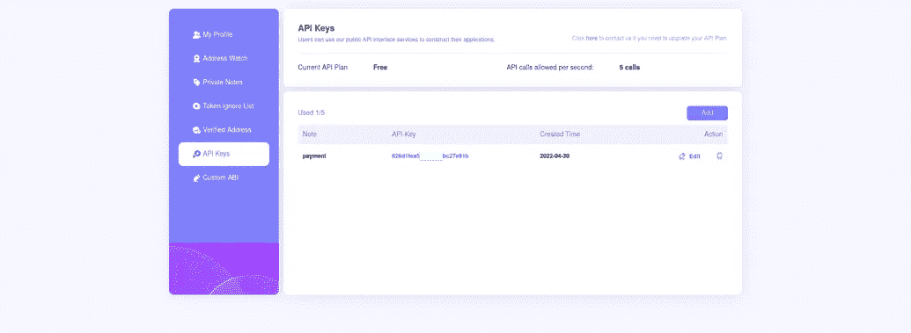
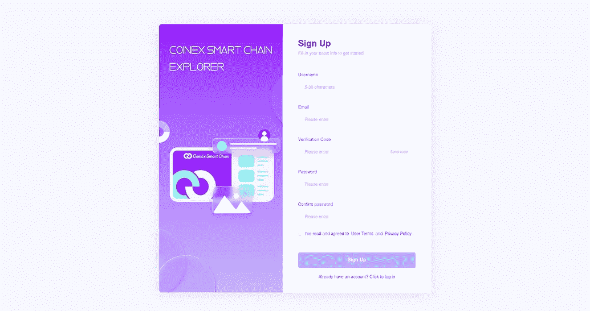

# 使用 Python3 和 Coinex.net API 的 CSC 支付网关

> 原文：<https://medium.com/coinmonks/csc-payment-gateway-using-python3-coinex-net-api-95ab8d3f6d2a?source=collection_archive---------38----------------------->

嘿嘿嘿！

0Xlive 在这里😃

在本教程中，我将教你如何使用 Python3 和 Coinex.net API 系统创建一个 CSC 支付网关



coinex.net/login

# **Coinex Explorer API 系统**

Coinex.net 是 Coinex 智能链浏览器，为 csc 提供 API 系统。

但是 api 是什么呢？

# 应用程序接口

一个**应用编程接口** ( **API** )是两个或多个计算机程序相互通信的一种方式。它是一种软件接口，为其他软件提供服务。描述如何构建或使用这种连接或接口的文档或标准称为 *API 规范*。符合这个标准的计算机系统被称为*实现*或*公开*一个 API。术语 API 既可以指规范，也可以指实现

与 coinex.net API 系统的交互需要一个我们称之为 api-key 的密钥，我们如何得到我们的密钥呢？我们开始吧



coinex.net/api

 [## CoinEx 智能链(CSC)浏览器

### coinex.net 帮助您探索和搜索交易，地址，代币和其他活动发生在 CoinEx…

testnet.coinex.net](https://testnet.coinex.net/register) 

> 交易新手？尝试[加密交易机器人](/coinmonks/crypto-trading-bot-c2ffce8acb2a)或[复制交易](/coinmonks/top-10-crypto-copy-trading-platforms-for-beginners-d0c37c7d698c)

首先，我们需要在[coinex.net](http://coinex.net)上创建一个帐户来获取我们的 api 密钥，然后转到 **API 密钥来**创建新的密钥，请看下面的例子:


API Keys

## 安装和使用请求

requests 是一个 python 库，用于处理 http 和 etc。我们使用 pip 来安装请求:

```
pip install requests
```

然后导入请求:

```
import requests
```

我们还将使用 json，因此我们导入 JSON:

```
import json
```

## JSON

JSON 是一种开放的标准文件格式和数据交换格式，它使用人类可读的文本来存储和传输由属性值对和数组组成的数据对象。它是一种常见的数据格式，在电子数据交换中有多种用途，包括带有服务器的 web 应用程序。

您可以在这里获得关于 json 的更多信息:

[](https://www.json.org/json-en.html) [## JSON

### 编辑描述

www.json.org](https://www.json.org/json-en.html) 

我们开始吧

```
api = requests.get("https://www.coinex.net/api/v1/statistics/cet", headers=headers).json()
```

在上面提到的代码中，我们定义了 api，但是 header 呢？请求头是什么？

在 url 中使用 api-key 存在很多安全隐患。您的 api 密钥可能会从您的浏览器历史记录中泄露，或者攻击者可以使用 MITM attak 窃取您的密钥。出于安全原因，coinex 建议在标头请求中使用 api-key。

 [## CSC 资源管理器开放 API

### 描述

www.coinex.net](https://www.coinex.net/api/docs/#/en-us/) 

我创建了一个名为 header 的变量来存储 api-key:

```
headers = {'apikey': 'YOU API KEY',} #put your api key here
```

现在我想从 api 获得 cet 价格:

```
print(api['data']['price'])
```

结果将返回 cet 价格

我们已经讨论了 cet，让我们了解链状态:

```
api = requests.get("https://www.coinex.net/api/v1/statistics/chain", headers=headers).json()
```

这提供了以下信息:

```
active
average_time
latest_height
staking
tx_count
tx_per_second
```

## **检查交易**

现在我们熟悉了 csc 链和 coinex.net API。让我们假设我们有一个网上商店。当客户支付 csc 作为付款方式时，我们必须检查:交易成功吗？首先，我们需要更新 api:

```
api = requests.get("https://www.coinex.net/api/v1/transactions/"+tx, headers=headers).json()
```

要获取 TX 哈希:

```
tx = input("Enter TX Hash")
```

它将提供以下信息:

```
data
error
fee
timestamp
value
```

我们需要检查响应:

```
if ( len(api['data']['error']) == 0 ):
    print("transaction was successfull")
else:
    print("something wrong!")
```

如果错误长度为 0，则表示交易成功，否则存在问题

祝贺🥳

我们已经创建了一个简单的 csc 支付功能使用 python 和 coinex.net API 系统