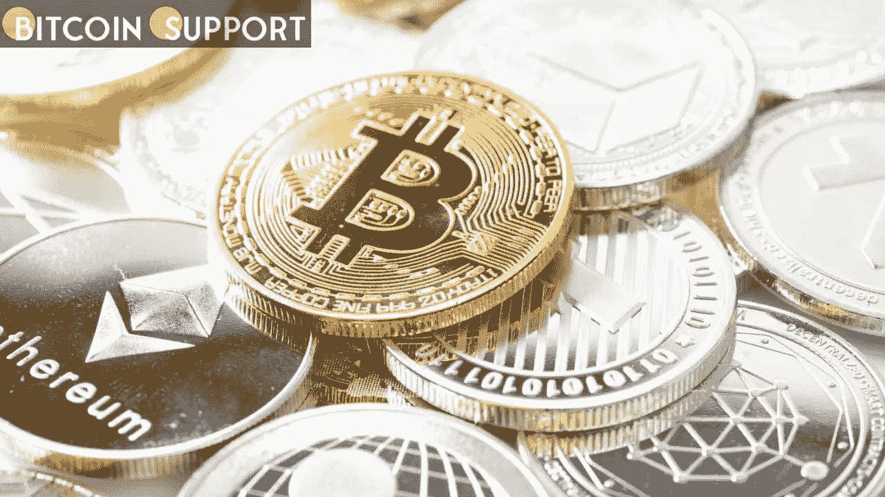

# CTFC 考虑扩大其监管加密货币的权限，以换取不到 10%的预算增长

> 原文：<https://medium.com/coinmonks/ctfc-considers-extending-its-authority-to-regulate-cryptocurrency-in-exchange-for-a-budget-increase-49616cd42b4?source=collection_archive---------57----------------------->

**Visit our website:-** [**https://bitcoinsupports.com/**](https://bitcoinsupports.com/)

计划中的 2023 财年预算为 3.65 亿美元，主要用于资助注册会计师和举报者。商品期货交易委员会，或称 CFTC，发布了 2023 财年的预算请求，要求 3.65 亿美元。这比上一年增长了 9.9%，比 2021 财年增长了 20%。该委员会监管该国的衍生品市场，近年来更多地参与执行包括加密货币在内的金融产品。

【CTFC】根据该机构的要求，重点关注数字资产托管风险、安全存储和会计。由于缺乏部门监督小组对数字资产会计的指导，该机构保留了自己的注册会计师工作人员。此外，该机构保证衍生品清算业务“使用严格的职责分离协议和程序来防范员工的抵押品盗窃”，并制定了大量计划来扩大培训活动。与 Rostin Behnam 委员的要求相比，这个要求很小。今年 2 月，他告诉参议院农业委员会，他的机构需要额外的 1 亿美元和更多的权力来监管比特币(BTC)和以太坊(ETH)，这两种加密货币被政府视为商品。在执法行动中，CFTC 现在严重依赖举报者。本月早些时候，贝南告诉期货行业协会的观众，该机构自 10 月以来已收到 600 多条提示，其中“大量指控加密货币欺诈，如泵转储计划，拒绝兑现提款请求，以及浪漫骗局”。3 月 18 日，该机构宣布奖励举报人 1000 万美元。

在数字资产领域，该机构似乎将被赋予更大的权力。参议员辛西娅·卢米斯(Cynthia Lummis)和克里斯汀·吉利布兰德(Kristen Gillibrand)表示，他们关于加密货币监管的法案在推出时将对 CFTC 起到关键作用，政府问责局(GAO)最近的一项研究批评了该机构的有限管辖权。周一发布的总统 2023 财年预算呼吁改革数字资产标准，以在未来十年产生 110 亿美元的税收。

**访问我们的网站:-**[**https://bitcoinsupports.com/**](https://bitcoinsupports.com/)

**免责声明:以上为作者观点，不应视为投资建议。读者应该自己做研究。**

> *加入 Coinmonks* [*电报频道*](https://t.me/coincodecap) *和* [*Youtube 频道*](https://www.youtube.com/c/coinmonks/videos) *了解加密交易和投资*

# 另外，阅读

*   [Bookmap 评论](https://coincodecap.com/bookmap-review-2021-best-trading-software) | [美国 5 大最佳加密交易所](https://coincodecap.com/crypto-exchange-usa)
*   最佳加密[硬件钱包](/coinmonks/hardware-wallets-dfa1211730c6) | [Bitbns 评论](/coinmonks/bitbns-review-38256a07e161)
*   [新加坡十大最佳加密交易所](https://coincodecap.com/crypto-exchange-in-singapore) | [购买 AXS](https://coincodecap.com/buy-axs-token)
*   [红狗赌场评论](https://coincodecap.com/red-dog-casino-review) | [Swyftx 评论](https://coincodecap.com/swyftx-review) | [CoinGate 评论](https://coincodecap.com/coingate-review)
*   [投资印度的最佳密码](https://coincodecap.com/best-crypto-to-invest-in-india-in-2021)|[WazirX P2P](https://coincodecap.com/wazirx-p2p)|[Hi Dollar Review](https://coincodecap.com/hi-dollar-review)