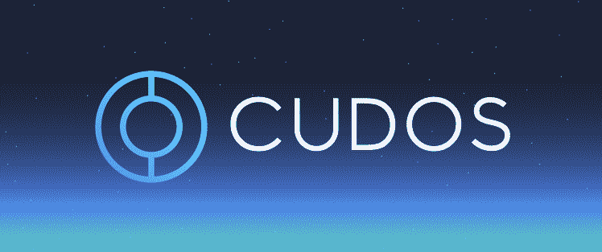
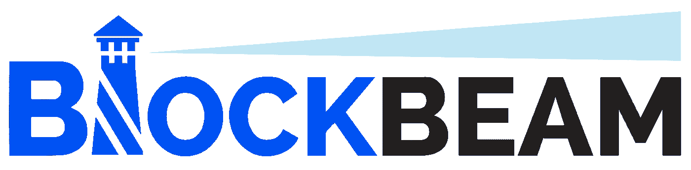

# Cudos:可持续计算的 Airbnb

> 原文：<https://medium.com/coinmonks/cudos-airbnb-for-sustainable-compute-b9b3f8fc41d1?source=collection_archive---------38----------------------->

通往 Algorand 合作伙伴亮点

Cudos 和 BlockBeam 将合作，通过“通往阿尔格兰德计划”向下一批区块链人才传授分散计算的可能性。

**问题**

***排放量与需求一起暴涨***

兰开斯特大学的研究人员认为，来自计算机和 ICT(信息和通信技术)的排放可能比以前想象的更糟糕。研究人员认为，考虑到 ICT 产品和基础设施的整个生命周期和供应链，排放量占全球温室气体排放量的 2.1%至 3.9%。作为背景，航空业仅占 2%左右。(来源:[兰卡斯特大学](https://www.lancaster.ac.uk/news/emissions-from-computing-and-ict-could-be-worse-than-previously-thought))这些排放很大一部分来自设备的生产而非实际使用。

全球温室气体排放的近 4%是一个惊人的数字。然而，这个数字只会变得更可怕，因为随着越来越多的强大应用程序出现，对计算的需求不仅在增加，而且呈指数级增长。像“元宇宙”这样的创新的出现只会加剧这个问题。Raja Koduri(英特尔加速计算系统总经理)在一篇文章中表示，大规模的元宇宙应用将需要“比目前的技术水平提高 1000 倍的计算效率”(来源:[英特尔](https://www.intel.com/content/www/us/en/newsroom/opinion/powering-metaverse.html#gs.qdg4d8))

乍一看，这个问题似乎不可能解决。对计算的需求将继续上升，导致越来越多设备的生产，因此这一类别的总排放量将继续飙升。

没有大量排放的生产，一个日益数字化的世界如何找到它不仅渴望而且最终需要的计算？

**解决方案**

***Cudos —面向可持续计算的 Airbnb***

Cudos 是一项创新技术，很容易用现实世界的类比来理解:Airbnb。

Airbnb 允许房主出租他们闲置的房屋作为度假场所。Cudos 允许每个企业和个人将他们设备中未使用的计算(处理能力、内存、网络、存储等)借出。)给需要的当事人。

结果是一个市场，需求方可以获得可持续的、便宜 10 倍的计算，而供应方只需按一下按钮就可以将多余的计算货币化。这创造了一个没有计算资源浪费的环境，减少了对新设备生产的需求，并显著降低了全球碳排放。

从可持续性和经济可行性的角度来看，这项技术的巨大影响都不为过。关于 Cudos 将会产生何种影响的早期案例研究可以在这里找到: [Cudos 和 Tingo 合伙公司](https://www.globenewswire.com/news-release/2021/11/17/2336106/0/en/Cudos-and-Tingo-Vow-to-End-the-Poverty-Premium-With-a-Huge-Partnership.html)

**关于 Cudos**

Cudos 正在为元宇宙提供动力，将 DeFi、NFTs 和游戏体验结合在一起，以实现去中心化 Web3.0 的愿景，使所有用户都能从网络的发展中受益。Cudos 是一个可互操作的开放平台发射台，将提供满足 1000 倍以上计算需求所需的基础设施，以创建完全沉浸式、游戏化的数字现实。Cudos 是一个第 1 层区块链和第 2 层社区管理的计算网络，旨在确保分散、无权限地访问大规模高性能计算。Cudos 本地实用令牌 CUDOS 是网络的命脉，为股东和持有人提供有吸引力的年收益率和流动性。

了解更多信息:

[**网站**](https://www.cudos.org/) **，** [**推特**](https://twitter.com/CUDOS_) **，** [**电报**](https://t.me/cudostelegram) **，**[**YouTube**](https://youtube.com/c/CUDOS)**，** [**不和**](https://discord.com/invite/VnkutnU3) **，******，****

******关于闭塞梁******

****BlockBeam 创建并运营一些项目，将人才引入区块链和金融科技领域。每个项目都侧重于展示具有重塑世界潜力的新兴技术的适用性和商业价值。该公司将在 2022 年推出更多合作项目，以培养 Web3 技术和业务方面的人才。该公司将很快推出一个平台，让企业有效地寻找前沿人才。****

****了解更多信息:****

****[网站](https://www.blockbeam.io/)，[推特](https://twitter.com/blockbeamio)， [Instagram](https://www.instagram.com/blockbeam/) ， [LinkedIn](https://www.linkedin.com/company/blockbeam/) ，[不和谐](https://discord.gg/ah8zTgNc)，[媒介](/@BlockBeamio)，[抽动](https://www.twitch.tv/blockbeam)****

******Cudos Algorand 生态系统参与度******

*******直接从算法中访问 Cudos 计算*******

****Cudos 是 Algorand 合作伙伴链。开发人员(因此也是应用程序的用户)将很快能够通过 Algorand 智能合同直接访问 Cudos 的可持续计算。(链接:[algrand Cudos Partnership](https://www.algorand.com/ecosystem/use-cases/cudo))Cudos 可持续计算是围绕 algrand 形成的#greencrypto 生态系统的另一个迷人组成部分。****

****此外，Cudos 与阿尔格兰建造的 ClimateTrade 建立了伙伴关系，Cudos 投资于 ClimateTrade 审核的气候项目，以换取碳信用额，抵消 Cudos 区块链的排放量。(链接:[climat ade Cudos Partnership](https://www.yahoo.com/now/cudos-partner-climatetrade-become-carbon-123000249.html))****

******通往阿尔格兰德合作伙伴关系的大门******

****Cudos 与 BlockBeam 合作，教育下一批区块链人才了解分散计算的价值和影响。****

****BlockBeam 开发了一个名为“通往阿尔格兰德”的项目，旨在向大学生介绍区块链可持续发展应用、这些创新的商业价值以及产生的积极气候影响。****

****该计划的目标是培养杰出的业务区块链候选人，并加快区块链可持续发展和气候弹性应用的采用。在“通往阿尔格兰德”期间，与会者将了解改变游戏规则的分散计算模式和彻底改变气候影响投资、空气质量监测等的区块链应用。****

****Cudos 适合这个创新的计划是完美的。可持续发展一直是 Cudos 使命的核心。Cudos 分散计算模式将避免对超大规模数据中心的需求，并允许利用闲置的计算能力——否则其中许多可能会进入破坏环境的电子垃圾潮。除此之外，Cudos 还带来了对全球社区意义重大的被动加密机会。请在文章末尾找到有关这些机会的更多信息。****

****“BlockBeam 很高兴与 Cudos 合作，Cudos 是分散云计算模式的先驱，并通过这一创新产生积极的气候影响，”BlockBeam 联合创始人 Drew Cousin 评论道。****

****作为该计划的一部分，Cudos 团队成员将审查教育材料，向“通往阿尔格兰德群组”讲述可持续计算的重要性，并提供宝贵的交流机会。****

******要了解 Cudos 对环境的积极影响，请查看以下资源:******

****[https://www . cudos . org/blog/green washing-the-cloud-hyperscale-providers-and-the-climate-crisis/](https://www.cudos.org/blog/greenwashing-the-cloud-hyperscale-providers-and-the-climate-crisis/)****

****[https://www . cudos . org/blog/cracking-the-environmental-costs-of-the-NFT-boom/](https://www.cudos.org/blog/tackling-the-environmental-costs-of-the-nft-boom/)****

******要了解 Cudos 在全球范围内支持被动加密收入的更多信息，请参阅以下资源:******

****[https://coin telegraph . com/press-releases/cudos-and-tingo-vow-to-end-the-poverty-premium-with-a-big-partnership](https://cointelegraph.com/press-releases/cudos-and-tingo-vow-to-end-the-poverty-premium-with-a-huge-partnership)****

****[https://www . cudos . org/blog/cudos-and-kam pay-to-make-crypto-passive-earning-a-opportunity-across-Africa/](https://www.cudos.org/blog/cudos-and-kampay-to-make-crypto-passive-earning-an-opportunity-across-africa/)****

********

> ****加入 Coinmonks [电报频道](https://t.me/coincodecap)和 [Youtube 频道](https://www.youtube.com/c/coinmonks/videos)了解加密交易和投资****

# ****另外，阅读****

*   ****[如何开始通过加密贷款赚取被动收入](https://coincodecap.com/passive-income-crypto-lending)****
*   ****[BigONE 交易所点评](/coinmonks/bigone-exchange-review-64705d85a1d4) | [电网交易 Bot](https://coincodecap.com/grid-trading)****
*   ****[氹欞侊贸易评论](https://coincodecap.com/anny-trade-review) | [CoinSpot 评论](https://coincodecap.com/coinspot-review)****
*   ****[新加坡十大最佳加密交易所](https://coincodecap.com/crypto-exchange-in-singapore) | [购买 AXS](https://coincodecap.com/buy-axs-token)****
*   ****[投资印度的最佳加密软件](https://coincodecap.com/best-crypto-to-invest-in-india-in-2021) | [WazirX P2P](https://coincodecap.com/wazirx-p2p)****
*   ****[7 个最佳零费用加密交易平台](https://coincodecap.com/zero-fee-crypto-exchanges)****
*   ****[最佳网上赌场](https://coincodecap.com/best-online-casinos) | [期货交易机器人](/coinmonks/futures-trading-bots-5a282ccee3f5)****