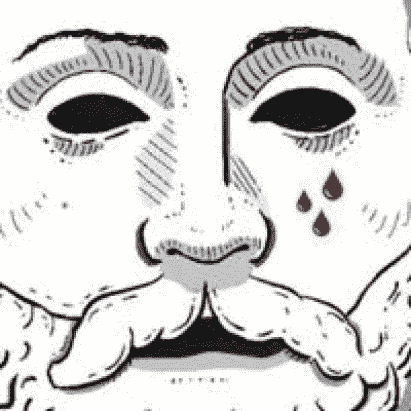

# 邪教刀币——你需要知道的一切

> 原文：<https://medium.com/coinmonks/cult-dao-coin-everything-you-need-to-know-35c19c51592d?source=collection_archive---------1----------------------->

道邪教是一个由一群人组成的邪教，他们的目标是授权和资助建设，并为分散的未来做出贡献。他们反对集权，希望彻底改变去中心化的未来。

同时，被投资者代币被转化为 CULT，因为它创造了额外的交易，以及市场中额外的购买压力。

**又念:** [*即付即投 2022*](/coinmonks/airdrops-that-pay-instantly-2022-aaacbb36251f?source=your_stories_page-------------------------------------)

支付率由被投资方协议提供，一旦提案被拒绝，可以再次提出，因此，如果拒绝的原因被认为是由于支付提议不充分，被投资方协议可以确定并做出这些修正。

因此，这篇文章是所有关于邪教刀你需要知道的一切。同时，知道什么是道也是非常重要的。所以，在我们讨论邪教刀的其他细节之前，让我们先深入探讨一下什么是刀。

# 道是什么？

道是一个分散的自治组织。在左翼政治中，几乎同样多的人在争论这个词的定义。

一把最纯粹的刀是邪教刀所创造的，它将永远发挥作用，除了它所受的编码影响之外，没有人的干预，那就是它的持有者的投票。没有人能拆除代码，也没有人能阻止它收集资金并把它们送给那些促进我们事业的人，只要代币被交易&只要人们通过提案，邪教就会继续存在。

# 什么是邪教？

[CULT](https://cultdao.io/) 是 CULT DAO 的可交易和流动代币，交易 CULT 将通过缓慢填充 DAO 金库来签署协议，以资助对分散技术的投资。这是通过对所有邪教交易收取 0.4%的费用实现的。

邪教一旦被押入邪教刀，就成了邪教。dCULT 只是 CULT 的“股权凭证”。当你把你的祭礼押在刀上时，你会得到一个祭礼，这个祭礼可以在任何时候换回你最初押的祭礼数量，加上在你拥有祭礼期间给予刀的任何补偿。

邪教道及其资助过程是完全分散的。它无法被阻止。只要人们与邪教打交道，监护人提出建议，用户投票，邪教道将继续资助革命者，分权倡导者和那些愿意打破社会的枷锁。

建议只能由监护人提出。这些是前 50 名持有者。监护人不能投票，因此他们的决定不能完全被破坏。这些提案必须符合以下三个标准中的全部或大部分:

*   反对集权
*   进一步推动权力下放的事业
*   直接有益于一项崇高的事业。

这些提案可以来自任何地方，风投，社区成员，政治家，无政府主义者，社会主义者，左翼或右翼，只要他们符合上述指导，并且是监护人提交的，任何提案都可以由许多人投票表决。提出的建议必须包含:

被投资方协议令牌的总供应量

为回报第 13 次投资而提供的总供应量的百分比

令牌组学

令牌和任何合同(如果已构建)的审核

燃烧和分配计划。

燃烧和比率计划是被投资方协议令牌的授权花名册。对于这个例子，让我们使用一个伪协议 ABC DAO。授予时间表可以是每天、每周、每两周或每月，但最多不能超过 18 个月。

假设农行道承诺 1.2%的美元农行令牌，每月一次，为期 12 个月。在还款日，被投资公司不是像正常的风险投资资助协议那样发送被投资公司协议的令牌，而是将其供应的 0.1%(12 个月内 1.2%)的美元 ABC 换成美元 CULT。然后，ABC DAO 将一半的祭礼发送到一个燃烧的钱包，另一半发送到 DAO，支付给 dCULT 持有者。

邪教加速了旧金融体系的崩溃，终结了主权国家和央行的暴政。当前的金融体系是为了让人民保持贫困，一个建立在债务基础上的社会需要通货膨胀才能运转，而通货膨胀是为了掠夺穷人，让他们永远无法赶上他们在统治阶级中的霸主。

**也可阅读:** [Fantom (FTM)币——你不知道的 Fantom 币](https://bulliscoming.com/fantom-ftm-coin/)

# 邪教背后的理念是什么，它是如何开始的？

邪教加速了旧金融体系的崩溃，终结了主权国家和央行的暴政。当前的金融体系是为了让人民保持贫困，一个建立在债务基础上的社会需要通货膨胀才能运转，而通货膨胀是为了掠夺穷人，让他们永远无法赶上他们在统治阶级中的霸主。

对它的崇拜始于瓦斯科·德·伽马绕过好望角并发现了通往印度的路线。当 1526 年第一次跨大西洋奴隶航行在巴西抛锚时，这种崇拜就开始了。邪教起源于压迫，毫无意义的生活，束缚你和我们每一个人的奴役和枷锁，如果你读了这篇文章，并相信你是自由的，那么你比我们更受束缚，真正的自由来自于意识到并接受你作为一个功能和一个中央银行理想经济功能中的一个齿轮而存在。

一个中央银行的首要关注点是最大限度的就业，然而我们自动化工作的速度如此之快，以至于我们正在创造狗屁工作，只是为了让我们继续被奴役，巴拉克奥巴马在 2009 年为坚持美国私人医疗保险系统明确辩护，否则，数百万填表工作将会失去？

工作的自动化应该意味着自由。然而，在当前的经济和金融体系下，自由是不可能存在的。我再说一遍，真正的自由来自于意识到并接受你是作为一个功能存在的，是央行理想经济功能中的一个齿轮。

这个系统是设计来让我们被奴役的，我们不能逃出去住在树林里，嗯，不是我们所有人，我们的身体仍然被束缚着，但我们的心现在是自由的，所以使用邪教，每一笔交易，存款和代币的移动都允许你贡献&快速推进经济和社会的变化。你可以从内部斗争，直到你出来

# 谁是守护者，他们的目的是什么？

守护者是前 50 名代币持有者，他们的任务是保护哪些提案被发送给许多人进行投票。由于他们更大的权重和象征性的份额，他们不被允许影响他们向许多人提出的建议，他们可以尽可能多地支持这些建议，但只有他们的声音可以影响其他人，而不是他们的财富。

# 邪教如何获得收入，他们的赌注如何工作？

用户与代币正常互动和交易，每笔交易收取 0.4%的税(在邪教代币中)，这意味着几乎所有交易都应在标准 DEX 滑点设置中结算

*   这种税是在 Cult DAOs 国库中征收的，累积起来的美元价值相当于 15.5 以太币的市场价值。
*   邪教可以被判死刑。前 50 名持有人是监护人。监护人以下的所有持有人都有投票权，这是很多
*   这些提案可以来自任何地方，风投、社区成员、政治家、无政府主义者、社会主义者或右翼，只要他们符合上述指导，并且是监护人提交的，任何提案都可以由许多人投票表决。
*   提案必须包含:被投资方协议令牌的总供应量、为换取 13 ETH 投资而提供的总供应量的百分比、令牌组学、令牌和任何合同(如果已建立)的审计、刻录和分配计划
*   燃烧和分配计划*1 是投资对象协议令牌的授予计划。对于这个例子，让我们使用一个伪协议 ABC DAO。授予时间表可以是每天、每周、每两周或每月，但最多不能超过 18 个月。
*   如果某项提案已获批准，并且达到了 15.5 的邪教 ETH 值，它将自动向所提供的提案钱包地址发送 13 个 ETH，并向正在燃烧的钱包发送 2.5 个 ETH。
*   如果一个提议没有被批准，邪教将继续建立超过 15.5 ETH 水平，但将自动发送一旦提议最终被批准

# 邪教道 NFTs

邪教刀推出了收藏刀通过销售 NFT 收集的三维化身。会员卡从来没有这么爽过！

*   收藏道让收藏者可以做自己一个人做不到的事。它们允许他们通过安全的分散协议购买、拥有和出售决策。
*   收藏道可以发现加密货币艺术的新人才，早期投资，投资其他收藏道。
*   或许在未来，所有顶级的 NFT 收藏品都将由收藏道控制。
*   **还看:** [幸运足球评论—没看这个就不要投资幸运足球平台！！！](https://bulliscoming.com/lucky-football-review/)

# 结论

邪教的合同和代币被全面审计，流动性被锁定，钥匙被烧毁，合同不可升级。与此同时，一些投资者目前正在投资这个项目，因为他们相信这个术语的目的是反对中央集权，把权力还给人民。

同时，本文不是任何投资建议，因为牛市长期不是一个财务顾问。

加入我们的电报社区，获取加密新闻、加密宝石、支持和加密教程；

电报链接:【https://t.me/+6ek5FpdVW89jNjE0 

> *加入 Coinmonks* [*电报频道*](https://t.me/coincodecap) *和* [*Youtube 频道*](https://www.youtube.com/c/coinmonks/videos) *了解加密交易和投资*

# 另外，阅读

*   [支持卡审核](https://coincodecap.com/uphold-card-review) | [信任钱包 vs MetaMask](https://coincodecap.com/trust-wallet-vs-metamask)
*   [Exness 回顾](https://coincodecap.com/exness-review)|[moon xbt Vs bit get Vs Bingbon](https://coincodecap.com/bingbon-vs-bitget-vs-moonxbt)
*   [如何开始用加密贷款赚取被动收入](https://coincodecap.com/passive-income-crypto-lending)
*   [加密货币储蓄账户](/coinmonks/cryptocurrency-savings-accounts-be3bc0feffbf) | [加密交易机器人](https://coincodecap.com/best-crypto-trading-bots)
*   [BigONE 交易所评论](/coinmonks/bigone-exchange-review-64705d85a1d4) | [CEX。IO 审查](https://coincodecap.com/cex-io-review) | [Swapzone 审查](/coinmonks/swapzone-review-crypto-exchange-data-aggregator-e0ad78e55ed7)