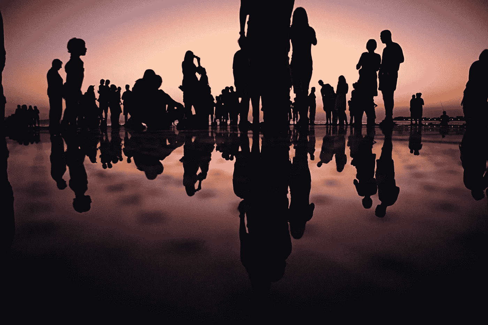

# 管理列表—支持加密的社区

> 原文：<https://medium.com/coinmonks/curated-lists-crypto-enabled-communities-3bd819f83138?source=collection_archive---------39----------------------->

Photo by [Mario Purisic](https://unsplash.com/es/@mariopurisic?utm_source=unsplash&utm_medium=referral&utm_content=creditCopyText) on [Unsplash](https://unsplash.com/s/photos/community?utm_source=unsplash&utm_medium=referral&utm_content=creditCopyText)

今天的另一个策划名单😉。自 2009 年比特币诞生以来，加密一直是一种趋势。这是一个快速致富的计划，但它慢慢变成了建立你的社区的一种方式。我说的对吗😅？还是我们还在追逐金钱💸？

✍️今天的话题是*！*

*先从 a16z 说起吧。*