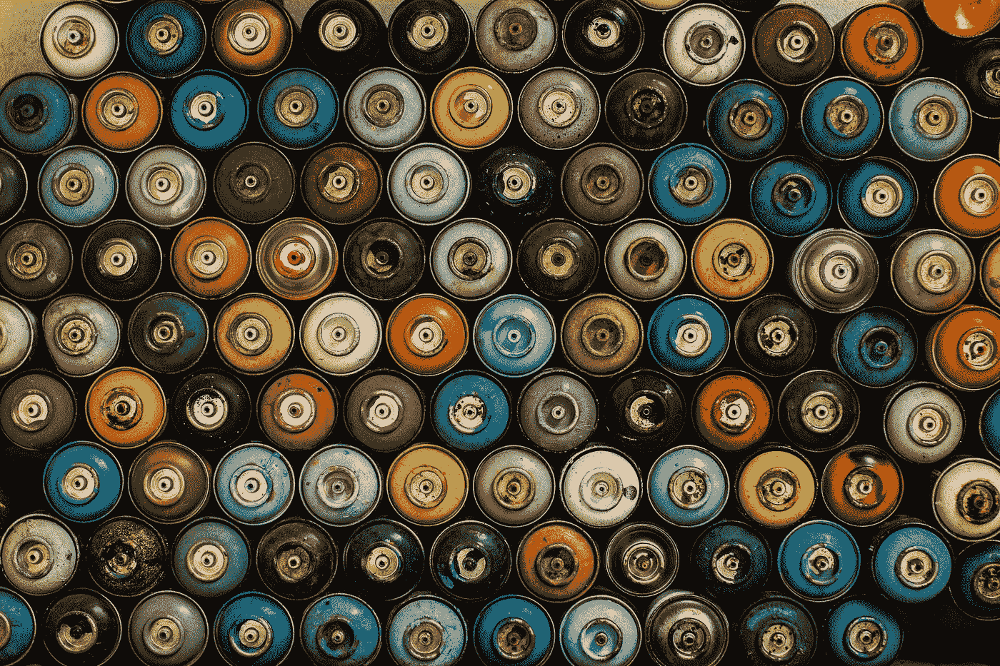

# 策划列表— Web3 文化

> 原文：<https://medium.com/coinmonks/curated-lists-web3-culture-f1c01155adda?source=collection_archive---------39----------------------->

Photo by [Joey Huang](https://unsplash.com/@onice?utm_source=unsplash&utm_medium=referral&utm_content=creditCopyText) on [Unsplash](https://unsplash.com/s/photos/cultures?utm_source=unsplash&utm_medium=referral&utm_content=creditCopyText)

我开始体验一种编写 Web3 的新方法。如果你在太空呆的时间足够长，你会注意到信息每天都在更新，而你的想法可能在下个月、下个星期或下个白天就过时了。所以我会练习一些关于当前话题趋势的体验式写作，尽量不要成为该领域的专家😉。

✍️今天的话题是网络 3 文化！