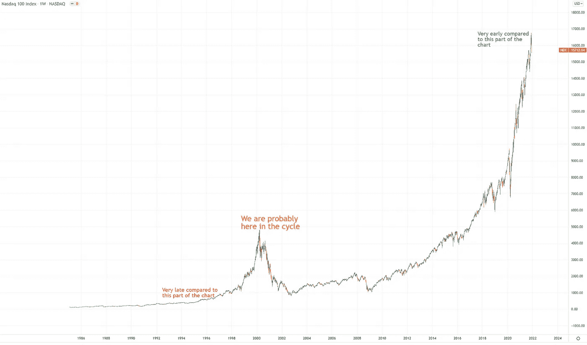

# 2022 年 Q1 的当前市场评估

> 原文：<https://medium.com/coinmonks/current-market-evaluation-of-2022-q1-1b5d0de90066?source=collection_archive---------28----------------------->

嗨！

这是 deneth.eth，一个加密货币& NFT 爱好者，前咖啡师和一个可怕的作家。观点是我自己的，不反映任何财务建议，请 dyor lol

这是我的第一个媒体出版物..是啊。有点压力。无论如何

我想提一下，我们目前正面临俄罗斯-乌克兰危机，市场最近一直在波动。战争没有赢家，我为此刻正经历艰难时刻的人们祈祷。

2021 年的总结会很狂野。一切都在变得抛物线，著名品牌如维萨收购朋克，阿迪达斯收购 Bored Ape 和 Crypto.com 收购斯台普斯中心是我们在这个领域看到的最大的事情之一。去年，公司和对加密和 NFT 空间的认识发生了巨大的转变。虽然我们离 2022 年第一季度结束还有一个多月的时间，但我的观点将是关于前一个周期，并反映市场将如何表现。

我想把它分成三部分。第一部分将是密码，在这里，我们可能都在生命的某个时刻相遇，并成为准时间层和共识层的书呆子。

**第一层生态系统**

去年，我们看到了第 1 层生态系统的巨大增长，尽管它们将趋于零，但仍优于大多数市场。这些大多是雪崩，索拉纳，绿洲网络，Fantom，和谐和附近。这 6 个星期中最长的是 100 美元.令人惊讶的是，就公司权力而言，最强的合伙关系中，罗斯是最强的。我认为，随着周期的结束，这些加密货币在不同方面变得更加有效。例如，Avax 适合游戏，Solana 适合复杂的金融产品，Luna 将从稳定的货币增长中受益最大。这仍然是不确定的，但这些“以太坊杀手层-1”将在市场上找到自己的路。

我不认为这些第一层会被遗忘和抛弃，即使我们经历了可怕的熊市。2017 年的空间与今天大不相同，当时几乎没有使用加密技术。我的观点只对我提到的 6 个第 1 层有效，因为他们成功地创造了一个生态系统(目前除了 rose ),并创造了一些东西的实际用途。

我们来查一下 **ETH，AVAX，ROSE，SOL，ONE，FTM，和 NEAR** 的图表。

图表从 2021 年 1 月 1 日开始，到 2022 年 2 月 25 日结束。我没有把$ **露娜**包括在这个图表中，也没有包括在上面的段落中，因为我真的不知道它在做什么。在涨到 100 美元之前，它花了大约 3 个月的时间进行整合。让我从另一个子堆栈中添加这一点，“Luna 拥有所有 L1 中最好的令牌组学，因为它是唯一一个内置分散稳定币的链。UST 的设计是，随着对 UST 的需求增加，会有一些机制来满足这种需求，并维持 UST 与 1 美元的联系。”-blknoiz06

这里有一张 ETH 上“趋势”的额外图片，给你们我所有的想法。我会高兴的买 2200 美元，幸运的买 1800 美元，脸上带着痛苦的微笑放低 ETH。

**looks are**

$looks 以巨大的市场进入市场，空投了很多，并给予巨额赌注奖励，它成为一个“东西”太快了。“开放海洋黑仔”叙事的想法就像第一层是以太坊杀手，所以这不太可能以两种方式发生。Looksrare 已经失去了它的势头，当球队通过龙卷风兑现他们的钱的谣言推动了看起来可怕的下跌趋势，推到 1 美元以下。这个项目背后的想法很酷，团队没有被束缚，而是继续工作，象征经济学也很好。唯一的成功只有在交易量减少、用户转移增加的情况下才能实现，只有到那时，我们才有可能看到价格波动。我不想把它写得太长，所以你们可以看看 twitter/cobie 的子堆栈，它包含了很多关于$looks 的内容。【https://cobie.substack.com/p/incentives-structures? utm_source=url

**NFT 的**

NFT 在 2021 年迎来了第一次繁荣，并从加密发生了巨大转变。人们开始购买。jpeg 的，而不是右键单击保存它们(jk)

**我把市场分成三类，**

1-有可能得到大型服装品牌或公司支持的项目

2-为做一些很酷的事情筹集资金的项目

3-拥有社区并为其提供公用设施的项目

每一个都有好的和坏的结果。

**第一个**，可能由大型服装品牌或公司支持的项目，如 Catblox(由彪马支持)、RTFKT、阿迪达斯 Originals into the 元宇宙等。这些项目有时会由公司直接推出，或者如果艺术家很出名，会得到公司的支持。在我看来，如果你来得早或者行动得早，这些都是不错的玩法。否则，在 NFT 熊市中，没错，与其他市场参与者相比，他们确实储存了自己的价值，但由于缺乏群体性，他们很脆弱。

**第二个**，正在募资的项目很多。这些是很好的翻转，并使那些“薄荷 2 卖一个两个价格，留一个免费”的发挥之一。由于项目是新的，缺乏资金，他们需要一些时间来建设。正如人们所预料的，很少有人成功，但是那些回报。“罗马不是一天建成的”对吗？

第三种是有社区的项目，为持有者提供公用设施。忍者小队是这种叙事的完美例子。一个名为忍者交易员的交易社区成立于 2017 年，建立了他们的 NFT 项目忍者小队。市场的波动也打击了这些项目，但与其他项目相比，它们更强大，因为它们有一个社区。卑鄙的吸血鬼辛迪加也是一个很好的例子，他们有一个坚实的社区，他们推出了几个项目。在前两个例子中，你可以预期一个项目在造币日会低于造币价，但这些项目有这样一个社区，造币价不太可能在造币后很快被看到。如果你正在寻找长期投资，想要感觉属于一个社区，这些是最好的玩法。

**总体视图&概要**

我认为，无论是在加密领域还是在 NFT，我们都不会经历像前几次那样漫长的牛熊周期。两家公司和个人的收购推动整个市场进入一个相互关联的系统，这个系统受到很多因素的影响。从大公司到知名艺术家，每个人都在试图加入元宇宙，人们的注意力可能会不断转向这个领域。

天然气、电力和大宗商品很可能会持续上涨一段时间。然而，我预计黄金或白银将继续表现良好，但这可能需要 3-4 年才能达到 5 倍。所以，如果你在加密或 NFT 的，你可能不会去找他们。就我个人而言，我确实会买一些这个，买一些那个，来做一个更安全的包。我们见证了黄金的上涨和 BTC 的下跌，所以分散你的投资组合总是好的。

这是我从 twitter.com/sss4321_s 拿的一张图表，它给我们所有人带来了一点热情和紧张。

感谢每一个坚持到最后的人。赞赏！

德内思

> 加入 Coinmonks [电报频道](https://t.me/coincodecap)和 [Youtube 频道](https://www.youtube.com/c/coinmonks/videos)了解加密交易和投资

## 另外，阅读

*   [折叠 App 审核](https://coincodecap.com/fold-app-review) | [Kucoin 交易机器人](/coinmonks/kucoin-trading-bot-automate-your-trades-8cf0ca2138e0) | [Probit 审核](https://coincodecap.com/probit-review)
*   [如何匿名购买比特币](https://coincodecap.com/buy-bitcoin-anonymously) | [比特币现金钱包](https://coincodecap.com/bitcoin-cash-wallets)
*   [币安 vs FTX](https://coincodecap.com/binance-vs-ftx) | [最佳(SOL)索拉纳钱包](https://coincodecap.com/solana-wallets)
*   [比诺莫评论](https://coincodecap.com/binomo-review) | [斯多葛派 vs 3Commas vs TradeSanta](https://coincodecap.com/stoic-vs-3commas-vs-tradesanta)
*   [Capital.com 评论](https://coincodecap.com/capital-com-review) | [香港的加密借贷平台](https://coincodecap.com/crypto-lending-hong-kong)
*   [如何在 Uniswap 上交换加密？](https://coincodecap.com/swap-crypto-on-uniswap) | [A-Ads 审查](https://coincodecap.com/a-ads-review)
*   [WazirX vs CoinDCX vs bit bns](/coinmonks/wazirx-vs-coindcx-vs-bitbns-149f4f19a2f1)|[block fi vs coin loan vs Nexo](/coinmonks/blockfi-vs-coinloan-vs-nexo-cb624635230d)
*   [本地比特币评论](/coinmonks/localbitcoins-review-6cc001c6ed56) | [加密货币储蓄账户](https://coincodecap.com/cryptocurrency-savings-accounts)
*   什么是融资融券交易
*   [支持卡审核](https://coincodecap.com/uphold-card-review) | [信任钱包 vs MetaMask](https://coincodecap.com/trust-wallet-vs-metamask)