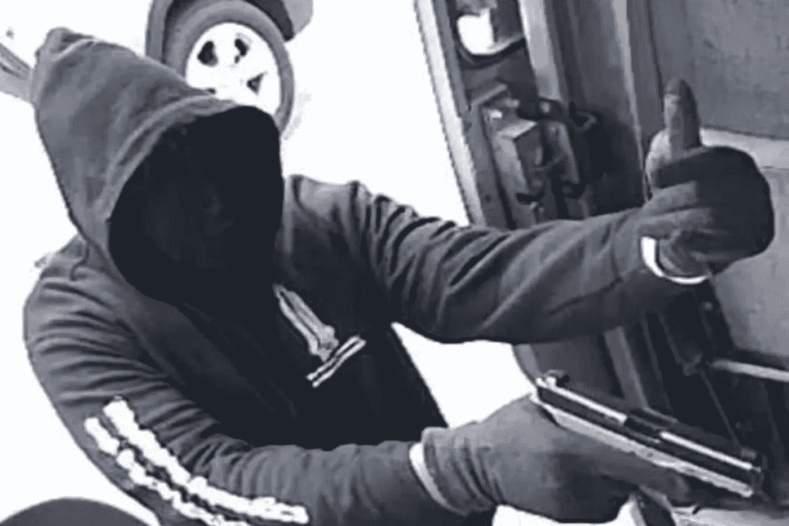

# 目前的市场形势迫使男子在泰国抢劫黄金

> 原文：<https://medium.com/coinmonks/current-market-situation-forces-man-to-rob-gold-in-thailand-28ceed77c3a4?source=collection_archive---------67----------------------->

在过去几周吞噬加密货币市场的混乱中，许多投资者，甚至那些持有大量比特币的投资者，都遭受了重大损失，这促使一些人采取极端手段。

其中一人是名为“蒙特里”的泰国枪手，曼谷警方在周一抢劫一家金店 11 小时后逮捕了他，抢走了重约 31.6 盎司、价值超过 5 万美元的金项链。

根据执法人员的说法，嫌疑人承认实施了抢劫，因为他的加密投资损失造成了财务压力。为了维护他的合法权利，他的完整身份是保密的。

蒙特里面临武装抢劫的指控。

# 抢劫金店追回比特币损失

在警方审讯期间，34 岁的嫌疑人说，他将摩托车停在 Wang Burapha 的 Buan Lee 金店门前，持枪进入店内，带着珠宝逃走。

在警方审讯期间，34 岁的嫌疑人说，他将摩托车停在 Wang Burapha 的 Buan Lee 金店门前，持枪进入店内，带着珠宝逃走。

根据警方的报告，枪手告诉调查人员，他偷了金店，因为在当前的市场动荡中，他的加密投资遭受了巨大损失，他非常紧张，非常需要这笔钱。

商店的经营者 Kornrawik Wangcharoenrung 和一些员工和顾客跑到商店的里屋。枪手在逃跑前偷走了金项链。其中两条项链后来在商店前的人行道上被发现。

# 比特币出现复苏迹象

加密货币的全球价值近日大幅下降，市值最大的比特币达到 2020 年以来的最低点。

在当前的加密市场环境下，比特币在七天内损失了 3700 亿美元，跌破了 2 万美元，但在周二略有回升，交易价格一度超过 21000 美元，促使一些分析师预测将出现牛市飙升。

然而，市场似乎正在复苏，在过去 24 小时内，其市值增加了近 700 亿美元。

点击这里，关注我们的更多故事。

> 加入 Coinmonks [电报频道](https://t.me/coincodecap)和 [Youtube 频道](https://www.youtube.com/c/coinmonks/videos)了解加密交易和投资

# 另外，阅读

*   [Bookmap 点评](https://coincodecap.com/bookmap-review-2021-best-trading-software) | [美国 5 大最佳加密交易所](https://coincodecap.com/crypto-exchange-usa)
*   最佳加密[硬件钱包](/coinmonks/hardware-wallets-dfa1211730c6) | [Bitbns 评论](/coinmonks/bitbns-review-38256a07e161)
*   [新加坡十大最佳加密交易所](https://coincodecap.com/crypto-exchange-in-singapore) | [购买 AXS](https://coincodecap.com/buy-axs-token)
*   [红狗赌场评论](https://coincodecap.com/red-dog-casino-review) | [Swyftx 评论](https://coincodecap.com/swyftx-review) | [CoinGate 评论](https://coincodecap.com/coingate-review)
*   [投资印度的最佳密码](https://coincodecap.com/best-crypto-to-invest-in-india-in-2021)|[WazirX P2P](https://coincodecap.com/wazirx-p2p)|[Hi Dollar Review](https://coincodecap.com/hi-dollar-review)
*   [加拿大最佳加密交易机器人](https://coincodecap.com/5-best-crypto-trading-bots-in-canada) | [库币评论](https://coincodecap.com/kucoin-review)