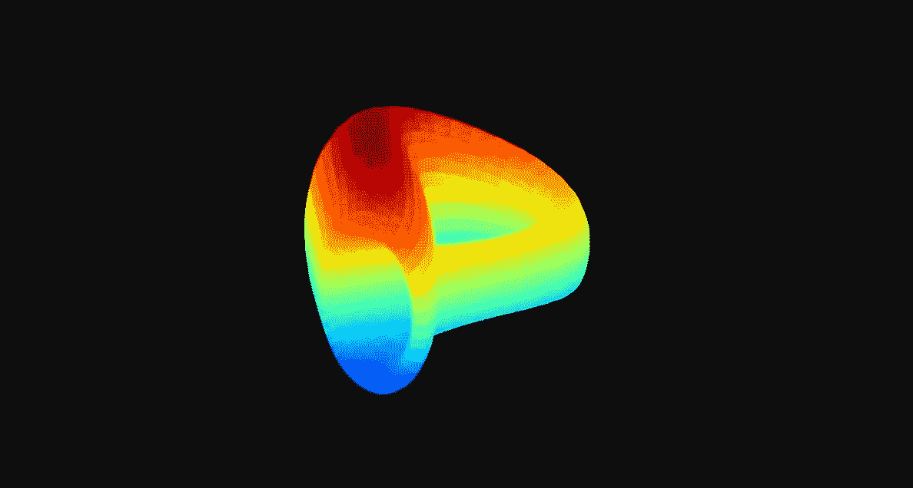
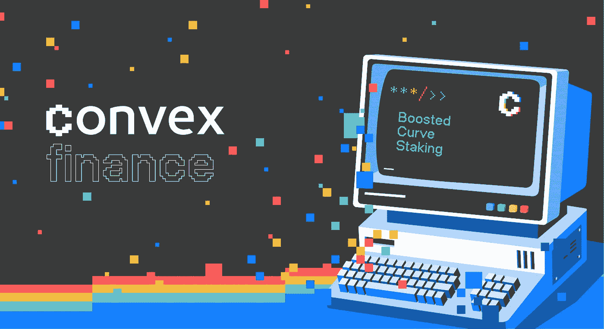

# 曲线金融和 veCRV

> 原文：<https://medium.com/coinmonks/curve-finance-and-vecrv-8490d51537c5?source=collection_archive---------7----------------------->

良好的记号组学设计如何为曲线创造价值，以及为什么 DeFi 协议希望成为曲线治理的一部分



Curve Finance Logo. Source: [Asia Crypto Today](http://asiacryptotoday.com)

Curve Finance 是一家总部位于 AMM 的指数公司，专注于类似价值的资产互换。这对生态系统是有益的，因为大多数 [DeFi](https://www.coindesk.com/learn/what-is-defi/) 应用程序都围绕着这些[包装的](https://www.coindesk.com/learn/what-are-wrapped-tokens/)和[合成的](https://coinmarketcap.com/alexandria/glossary/synthetic-asset)令牌的使用，这些令牌旨在模拟基础资产的价格。无论是像这样的[稳币](https://www.coindesk.com/learn/what-is-a-stablecoin/)、[、](https://coinmarketcap.com/hu/currencies/tether/)、[戴](https://coinmarketcap.com/currencies/multi-collateral-dai/)、[、](https://coinmarketcap.com/currencies/terrausd/)裹币 / [合成](https://coinmarketcap.com/alexandria/glossary/synthetic-asset)的如 sBTC、renBTC 或 wBTC。

Curve 稳定了[稳定资产](https://www.coindesk.com/learn/what-is-a-stablecoin/)和[综合资产](https://coinmarketcap.com/alexandria/glossary/synthetic-asset) / [打包资产](https://www.coindesk.com/learn/what-are-wrapped-tokens/)的价格，并允许用户用流动性较差的资产换取那些在 [DeFi](https://www.coindesk.com/learn/what-is-defi/) 中更广泛使用的资产。当前曲线(2021/3/4)在所有 [DeFi](https://www.coindesk.com/learn/what-is-defi/) 协议中锁定了最高[总值](https://coinmarketcap.com/alexandria/glossary/total-value-locked-tvl)(来源: [Defillama](https://defillama.com/) )。高的 TVL 提供了低的滑点，也就是说你支付的每笔掉期交易更少。

# 流动性问题

Curve 拥有所有相似价值资产的池，但是协议为什么要使用它呢？ [DeFi](https://www.coindesk.com/learn/what-is-defi/) 协议需要[流动性](https://coinmarketcap.com/alexandria/glossary/liquidity)否则无法扩展。大多数流动性提供者不是慈善机构，他们是来赚钱的，所以他们向协议和资金池提供资金，为他们赚取最高收益。

流动性提供者从费用中获得的[收益](https://www.coindesk.com/learn/what-is-yield-farming-the-rocket-fuel-of-defi-explained/)、T2 是不够的，所以项目通常会奖励[有限合伙人](https://coinmarketcap.com/alexandria/glossary/liquidity-provider)一份来自他们本地令牌的高额 [APY](https://www.investopedia.com/terms/a/apy.asp) 来激励他们。这带来了一系列问题，如代币价格的抛售压力和代币供应的膨胀。一个 [DeFi](https://www.coindesk.com/learn/what-is-defi/) 协议如何应对？这就是曲线与激励一致的地方。


Hm.. that’s not exactly a liquidity pool. Photo by [Enis Yavuz](https://unsplash.com/@enisyavuz) from [Unsplash](https://unsplash.com/)

# 曲线刀令牌

为了理解 Curve 如何帮助协议和 [LP](https://coinmarketcap.com/alexandria/glossary/liquidity-provider) s，我们必须首先理解 [Curve DAO 令牌](https://coinmarketcap.com/hu/currencies/curve-dao-token/)。 [CRV](https://resources.curve.fi/base-features/understanding-crv) 令牌的目的是激励流动性提供者使用协议，并让尽可能多的用户参与治理。

## CRV 的三个主要用例是

*   [**治理**](https://resources.curve.fi/guides/voting)
*   [**打桩**](https://resources.curve.fi/guides/staking-your-crv)
*   [**助推**](https://resources.curve.fi/guides/boosting-your-crv-rewards)

要使用这些功能，您必须锁定您的 [CRV](https://resources.curve.fi/base-features/understanding-crv) 以获得 [veCRV](https://resources.curve.fi/faq/vote-locking-boost) ，这是一种不可转让的令牌。你锁定你的 [CRV](https://resources.curve.fi/base-features/understanding-crv) 的时间越长，你通过 [veCRV](https://resources.curve.fi/faq/vote-locking-boost) 获得的投票权和提升就越多。锁定奖励看起来像这样:

```
Lock 1000 CRV for 1 years = get 250 veCRV
Lock 1000 CRV for 4 years = get 1000 veCRV
```

CRV 令牌最重要的用例是治理。为什么参与者会关心治理？投票权最符合 [DeFi](https://www.coindesk.com/learn/what-is-defi/) 协议的利益，我来解释一下原因。

## 估计

[标尺权重](https://resources.curve.fi/faq/gauge-weights)是奖励给特定[流动性池](https://www.gemini.com/cryptopedia/what-is-a-liquidity-pool-crypto-market-liquidity)的 [CRV](https://resources.curve.fi/base-features/understanding-crv) 排放的百分比。每周，治理参与者可以通过 [veCRV](https://resources.curve.fi/faq/vote-locking-boost) 对[量表权重](https://resources.curve.fi/faq/gauge-weights)进行投票。获得最多票数的人获得最多奖励。曲线治理是有价值的，因为协议可以投票给他们自己的池(或对他们最有利的池)，所以他们可以获得更多的回报。



Convex Finance. Source: [Shrimpy Academy](https://academy.shrimpy.io/)

# 治理之战

曲线治理的力量如此宝贵，以至于当几个协议开始投资于 [veCRV](https://resources.curve.fi/faq/vote-locking-boost) 时，它们之间出现了一场争夺最大投票权的战争。 [**凸财**](https://www.convexfinance.com/) 目前掌握着大部分的投票权，这是一个为获得曲线 [LP](https://coinmarketcap.com/alexandria/glossary/liquidity-provider) s 资金的最高 [ROI](https://www.investopedia.com/terms/r/returnoninvestment.asp) 而创建的协议。

> 不管怎样，最大的赢家是 Curve，这要归功于他们的令牌设计。
> 
> 加入 Coinmonks [电报频道](https://t.me/coincodecap)和 [Youtube 频道](https://www.youtube.com/c/coinmonks/videos)了解加密交易和投资

# 另外，阅读

*   [无聊猿游艇俱乐部(BAYC)回顾](https://coincodecap.com/bored-ape-yacht-club-bayc-review) | [拜比特 vs 比特币基地](https://coincodecap.com/bybit-vs-coinbase)
*   [5 款最佳加密交易终端](https://coincodecap.com/crypto-trading-terminals) | [最佳 DeFi 应用](https://coincodecap.com/best-defi-apps)
*   [比特币基地 vs 瓦济克斯](https://coincodecap.com/coinbase-vs-wazirx) | [比特鲁点评](https://coincodecap.com/bitrue-review) | [波洛涅克斯 vs 比特鲁](https://coincodecap.com/poloniex-vs-bittrex)
*   [德国最佳加密交易所](https://coincodecap.com/crypto-exchanges-in-germany) | [Arbitrum:第二层解决方案](https://coincodecap.com/arbitrum)
*   [币安交易机器人](/coinmonks/binance-trading-bots-d0d57bb62c4c) | [OKEx 审查](/coinmonks/okex-review-6b369304110f) | [Atani 审查](https://coincodecap.com/atani-review)
*   [最佳加密交易信号电报](/coinmonks/best-crypto-signals-telegram-5785cdbc4b2b) | [MoonXBT 评论](/coinmonks/moonxbt-review-6e4ab26d037)
*   [如何在 Bitbns 上购买柴犬(SHIB)币？](https://coincodecap.com/buy-shiba-bitbns) | [买弗洛基](https://coincodecap.com/buy-floki-inu-token)
*   [CoinFLEX 评论](https://coincodecap.com/coinflex-review) | [AEX 交易所评论](https://coincodecap.com/aex-exchange-review) | [UPbit 评论](https://coincodecap.com/upbit-review)