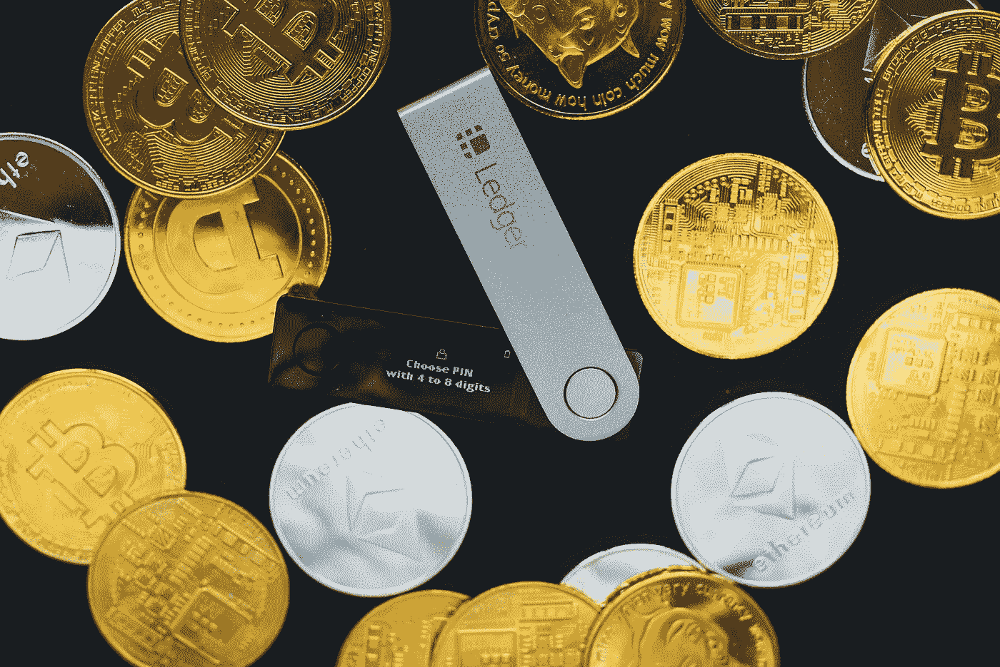
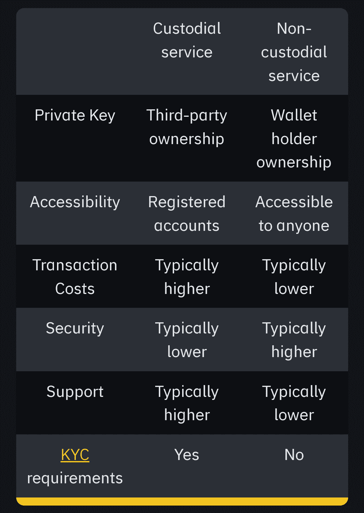

# 保管与非保管加密钱包:哪一个最适合你？

> 原文：<https://medium.com/coinmonks/custodial-vs-non-custodial-crypto-wallets-which-one-is-best-for-you-4c6b5d967731?source=collection_archive---------42----------------------->

## 选择正确的加密钱包来保护您的资金。

Ledger Wallet: Source [Unsplash](https://unsplash.com/photos/aFdTdWYXFd0?utm_source=unsplash&utm_medium=referral&utm_content=creditShareLink)

自比特币诞生以来，加密货币行业一直在快速发展。从散户投资者到企业和一些政府都对区块链技术表现出热情。

但大多数非技术人员仍然不知道在哪里存储加密货币，如比特币、以太币、索拉纳，甚至不可替代的代币。

因此，在这篇文章中，我将向您详细介绍不同类型的加密钱包及其使用案例。

要了解迪菲和区块链，你不应该错过这篇文章。

## 什么是加密钱包？

加密钱包是存储加密的地方。技术上来说，钱包不能保存你的硬币。它保存你的私人和公共密钥。现在有许多不同类型的钱包。虽然有许多解决方案，但钱包主要有两种类型，保管型和非保管型。

## 私钥与公钥。

*   **私钥:**用于交易签名。没有这些密钥，你就无法访问你的密码。一句名言是**“不是你的钥匙，也不是你的硬币。”**因此，如果你不妥善保管，你可能会丢失硬币。
*   **公钥:**用于接收密码。当您收到任何加密时，您使用的是公钥，而不是私钥。如果您丢失了您的公钥，您不必担心，因为它们可以通过种子短语恢复。

## 什么是种子短语？

在 crypto 的早期阶段，没有种子短语的概念。要找回钱包，你应该有复杂的私钥。为了解决这个问题，开发者提出了隐藏短语的想法。

现如今，当你打开一个非保管钱包，你会得到一些随机的话。这些单词被称为 Sheed 短语。

在这些短语的帮助下，您可以恢复包含公钥和私钥的加密钱包。这些比复杂钥匙更容易记住。

## 保管钱包是什么意思？

这是一个集中的解决方案，从名字保管，你可以理解它很容易使用。你可以在保管钱包中存储你的数字资产，而不用携带私人钥匙。

既然你不需要保存私钥，你应该依赖第三方服务，比如币安、比特币基地和 CoinDcx。他们会安全地存储您的私钥。

当您需要进行任何交易时，第三方将代表您签署交易。虽然它们可以安全地存储您的数据，但不如非托管安全。

而要打开保管钱包，你就要提供必要的文件给 KYC(了解你的客户)。

使用保管钱包的主要好处是，如果您丢失了密码，您可以在客户支持的帮助下找回您的资金。

## 非保管钱包是什么意思？

您拥有非保管钱包中的公钥和私钥。换句话说，你是你银行的主人。它为您提供了完全的所有权。

既然你有完全的权利承担私钥，就不需要信任任何第三方的解决方案。它们比集中式的更安全。

使用这些钱包的主要好处是完全所有权，高度安全，不需要提供 KYC，从任何设备，你可以用你的种子短语和私钥访问你的密码。

虽然他们提供完全的所有权，但如果你丢失了种子短语，你可能会失去你的资金。

非保管钱包可以是冷、热或纸质钱包，如 Metamask(热软件钱包)和 Ledger Nano S(冷硬件钱包)。任何地方的任何人都可以打开这些类型的钱包，而不需要任何文件。

## 保管与非保管加密钱包

Source: [Binance academy](https://academy.binance.com/en/articles/custodial-vs-non-custodial-wallets-what-s-the-difference)

> 您可以通过在 [**【币安环球】**](https://accounts.binance.me/en/register?ref=77987641) (代码: **77987641** )或 [**CoinDCX**](https://join.coindcx.com/invite/qKJk) 上开户来支持我的工作进一步继续。(代码: **DCXMPDHC** )(附属链接)

## 什么是冷钱包？

冷钱包是最安全的加密钱包，你可以安全地存储你的硬币。这些可能是硬件或纸钱包。

## 什么是硬件钱包？

硬件钱包是最安全的加密钱包，你可以存储你的密码，没有妥协的压力。

他们让你的私钥离线。对于新投资者来说，这些钱包不容易使用，尽管它们是 100%安全的。一些冷钱包是莱杰纳米 S，安全的朋友，和 Tezor。

## 什么是纸钱包？

这是一种冷加密钱包，但不是硬件或软件。这是一张纸，你可以用书面文本形式或二维码存储你的私人密钥。

它像硬件钱包一样安全，但不易于使用。虽然很安全，但你应该把它放在安全的地方。否则，风险因素总是存在的。例如水渍或虫害。

## 什么是热门钱包？

这些应用可能是移动应用、chrome 扩展，甚至是网络应用。但它们不像硬件钱包那样 100%安全。尽管如此，如果它不是集中的，你是你的钥匙的主人。

几个去中心化的热门钱包是 ***Metamask*** 、Trust-wallet 和比特币基地(非保管)。这些是目前最安全的软件加密钱包。

热钱包最适合短期投资，交易，买 NFT，玩区块链游戏。

## 哪个是最适合你的加密钱包？

大多数交易者和投资者使用保管和非保管的组合。所以这个要看你的经验了。

如果你是初学者，像币安、比特币基地和 CoinDcx 这样的集中保管钱包可能最适合你。

但如果你有经验，资金庞大，那么硬件钱包最适合你。

反正在选择一个之前，别忘了研究一下它是否提供 2FA，保额，受监管与否。

*如果你发现它对你有帮助，* ***请鼓掌 50 次。*** *你的拍手会帮助别人安全他们的资金。*

> 加入 Coinmonks [电报频道](https://t.me/coincodecap)和 [Youtube 频道](https://www.youtube.com/c/coinmonks/videos)了解加密交易和投资

# 另外，阅读

*   [如何在 Uniswap 上交换加密？](https://coincodecap.com/swap-crypto-on-uniswap) | [A-Ads 审查](https://coincodecap.com/a-ads-review)
*   [WazirX vs CoinDCX vs bit bns](/coinmonks/wazirx-vs-coindcx-vs-bitbns-149f4f19a2f1)|[block fi vs coin loan vs Nexo](/coinmonks/blockfi-vs-coinloan-vs-nexo-cb624635230d)
*   [本地比特币评论](/coinmonks/localbitcoins-review-6cc001c6ed56) | [加密货币储蓄账户](https://coincodecap.com/cryptocurrency-savings-accounts)
*   什么是融资融券交易
*   [支持卡审核](https://coincodecap.com/uphold-card-review) | [信任钱包 vs MetaMask](https://coincodecap.com/trust-wallet-vs-metamask)
*   [Exness 评测](https://coincodecap.com/exness-review)|[moon xbt Vs bit get Vs Bingbon](https://coincodecap.com/bingbon-vs-bitget-vs-moonxbt)