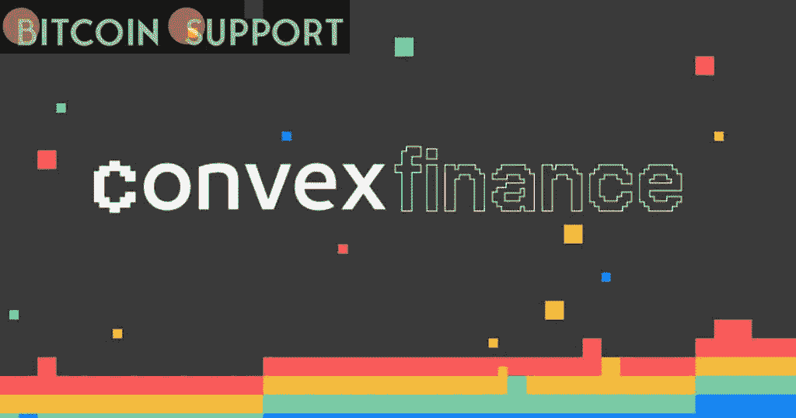

# CVX 令牌由于凸金融错误而下沉

> 原文：<https://medium.com/coinmonks/cvx-token-sinks-due-to-convex-finance-bug-838898f94023?source=collection_archive---------28----------------------->

**Visit our website:-** [**https://bitcoinsupports.com/**](https://bitcoinsupports.com/)

在智能合约被利用后，锁定的 CVX 代币涌入市场，压低了价格。

由于智能合约问题，一个团队被迫提前释放了一大块其令牌的流通供应，导致市场变得混乱。

Convex Finance 团队周五在 Twitter 上表示，在发现一个会让某些用户获得不相称回报的问题后，他们已经重新部署了负责投票锁定治理机制的合同。

[https://Twitter . com/convex finance/status/1499759919943372800](https://twitter.com/ConvexFinance/status/1499759919943372800)

“在部署新的 vlCVX 合同之前，没有被使用的实例。然而，由于凸金融契约的不变性和不可升级性，必须推出新的契约。在未来，新的 vlCVX 合同将包括对这一潜在问题的修复，”该团队在一篇博客文章中指出。这是分散化金融(DeFi)高风险实验性质的最新例证，这是一个 2000 亿美元的市场，其特点是供应冲击、智能合同故障和不可预测的价格。

Convex 的投票锁定机制对该项目的代币经济至关重要，它使用户能够从其他协议中收取“贿赂”，并将流动性直接转移到另一个协议 Curve Finance 中，但前提是他们将其代币锁定 16 周。

这种技术在另一个协议的令牌——Curve Finance 的 CRV——复杂、多面的投票权之战中至关重要，通常被称为“曲线战争”

此外，投票锁定机制对管理 CVX 的流通供应量至关重要，周五早些时候超过 72%的供应量被锁定。经常交易的 CVX 交易员会密切关注重要的解锁日期，因为它们可能会引起供应和价格的变化。

由于上周五数百万代币的快速、意外解锁，引发了一场大供应冲击。

价格在几个小时内下降了 20%，从 19.10 美元降至 15.22 美元。然而，尽管乌克兰危机造成了宏观经济的不确定性，但重要的持有者已经介入以支撑他们的头寸，许多用户选择重新锁定他们的代币而不是出售。

[https://twitter.com/mcasto_/status/1499788236184600583](https://twitter.com/mcasto_/status/1499788236184600583)

尽管价格在整个下午都保持不稳定，但 CVX 目前的交易价格为 16.55 美元，当天下跌了 15%。

**访问我们的网站:-**[**https://bitcoinsupports.com/**](https://bitcoinsupports.com/)

**免责声明:以上为作者观点，不应视为投资建议。读者应该自己做研究。**