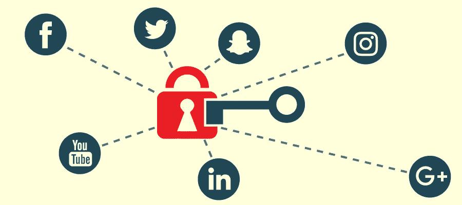

# CyberEd #10 隐私导向的社交媒体实践

> 原文：<https://medium.com/coinmonks/cybered-10-privacy-oriented-social-media-practice-ac9ec49ae3e1?source=collection_archive---------22----------------------->

社交媒体是与朋友和家人保持联系的绝佳工具。此外，人们越来越依赖 it 来处理业务。因此，人们关注社交网络安全是可以理解的。这种增强的关联导致网络犯罪分子出于恶意目的将社交媒体应用作为目标。恶意活动包括网络钓鱼…