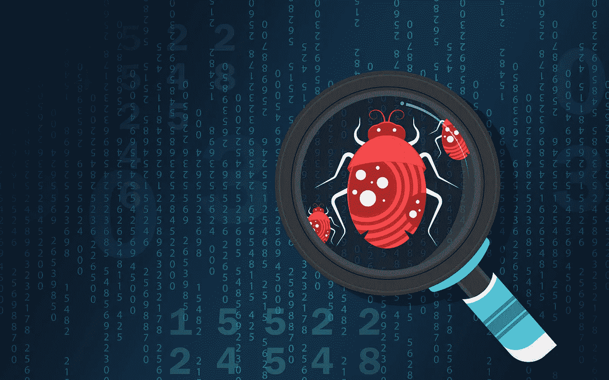

# CyberEd #14 恶意软件分析简介

> 原文：<https://medium.com/coinmonks/cybered-14-introduction-to-malware-analysis-5e9bc20a7f66?source=collection_archive---------32----------------------->

恶意软件分析是分析师用来确定恶意文件的意图和行为的一种方法。安全团队可以丰富任何恶意软件分析的结果，以识别和防止组织内的潜在威胁。

这是一个实用的方法来理解不同的功能，目的，起源和恶意软件及其相关的潜在后果…