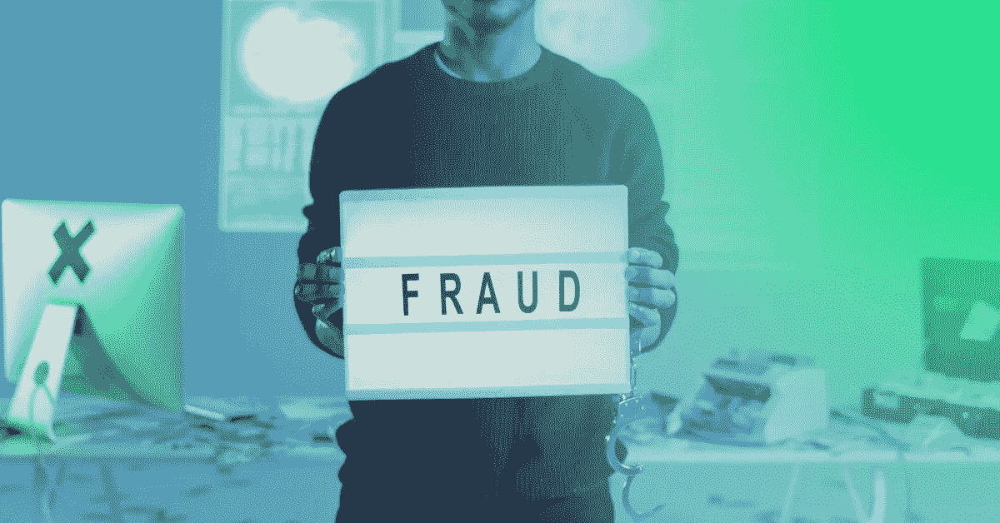

# 网络欺诈#17 欺诈即服务？(FaaS)

> 原文：<https://medium.com/coinmonks/cybered-17-fraud-as-a-service-faas-57deddc666cc?source=collection_archive---------56----------------------->

只需点击一下，你现在就可以购买分布式拒绝服务(DDoS)攻击和僵尸网络租赁、被盗支付卡、医疗记录和社交媒体账户。随着 deep web 不断增长的需求和竞争，一些网络犯罪分子正在提供客户服务保证，例如购买前先试选项和对“有问题”商品(如坏的支付卡)的退货，这是他们服务的一个关键优势。

